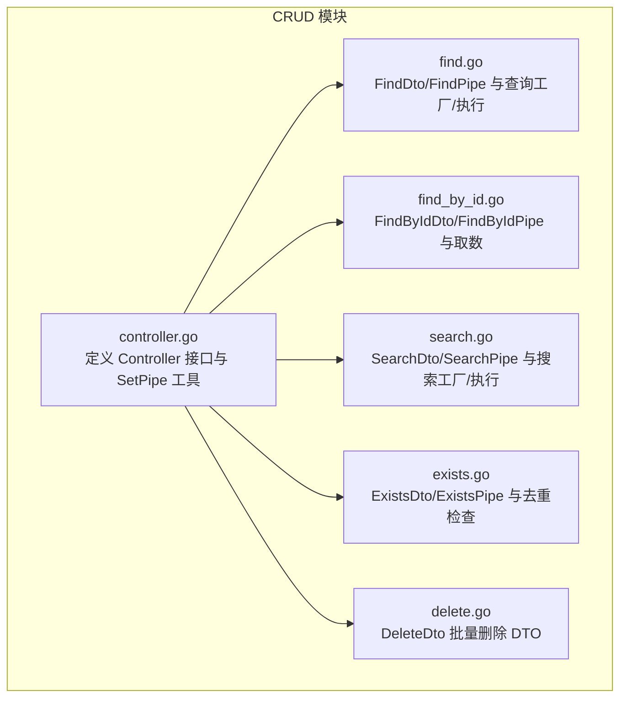
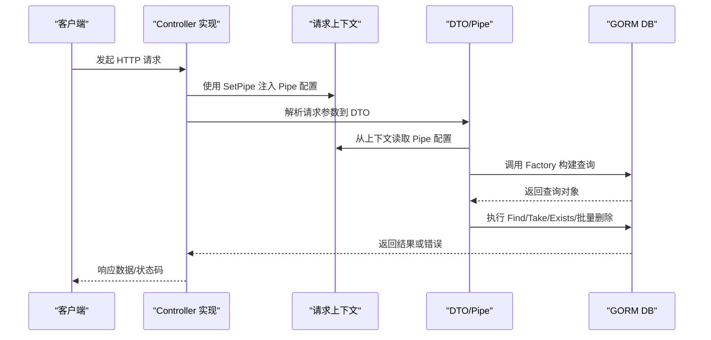
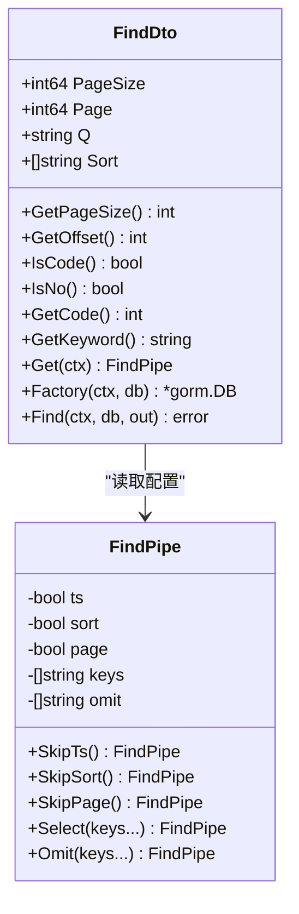
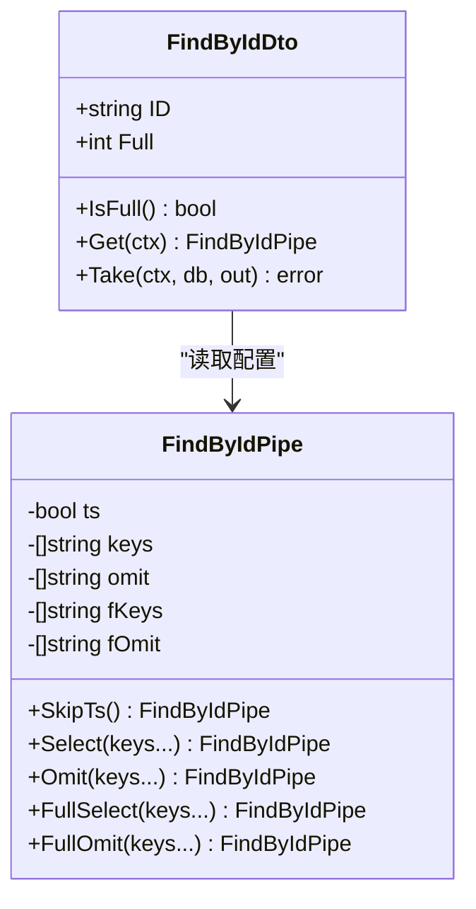
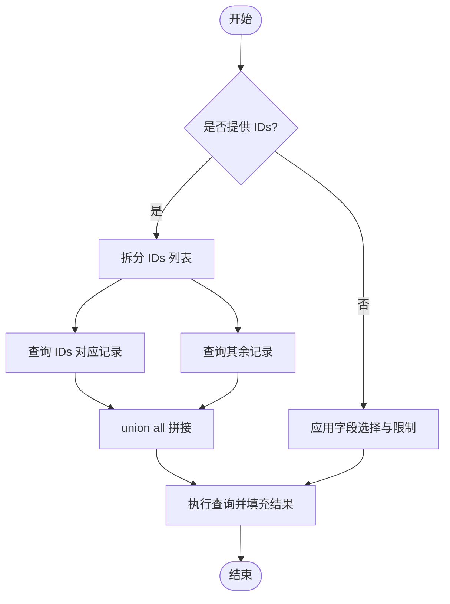
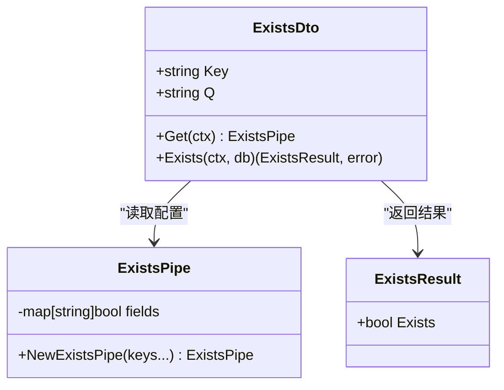
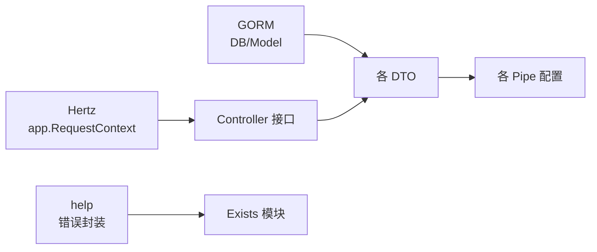

# API 参考

<cite>
**本文引用的文件**
- [controller.go](file://controller.go)
- [find.go](file://find.go)
- [find_by_id.go](file://find_by_id.go)
- [search.go](file://search.go)
- [exists.go](file://exists.go)
- [delete.go](file://delete.go)
- [go.mod](file://go.mod)
</cite>

## 目录
1. [简介](#简介)
2. [项目结构](#项目结构)
3. [核心组件](#核心组件)
4. [架构总览](#架构总览)
5. [详细组件分析](#详细组件分析)
6. [依赖关系分析](#依赖关系分析)
7. [性能考量](#性能考量)
8. [故障排查指南](#故障排查指南)
9. [结论](#结论)

## 简介
本文件为 go-crud 库的完整 API 参考，覆盖所有公开接口与结构体。重点围绕控制器接口 Controller 的五个方法（Create、Find、FindById、Update、Delete）进行说明，并对每个操作模块（Find、FindById、Search、Exists、Delete）对应的 DTO 与 Pipe 结构体进行逐项解析，包括字段含义、行为规则、默认策略与可选配置。同时提供调用流程图与典型参数组合，帮助开发者快速理解并正确使用各 API。

## 项目结构
该仓库采用按功能模块划分的扁平式组织：每个 CRUD 操作对应一个独立文件，包含对应的 DTO 与 Pipe 配置对象，以及工厂方法与执行方法。公共控制器接口定义在 controller.go 中，上下文注入工具 SetPipe 用于在请求上下文中传递 Pipe 配置。

图表来源
- [controller.go](file://controller.go#L11-L30)
- [find.go](file://find.go#L13-L154)
- [find_by_id.go](file://find_by_id.go#L9-L103)
- [search.go](file://search.go#L13-L111)
- [exists.go](file://exists.go#L12-L66)
- [delete.go](file://delete.go#L3-L7)

章节来源
- [controller.go](file://controller.go#L11-L30)
- [find.go](file://find.go#L13-L154)
- [find_by_id.go](file://find_by_id.go#L9-L103)
- [search.go](file://search.go#L13-L111)
- [exists.go](file://exists.go#L12-L66)
- [delete.go](file://delete.go#L3-L7)

## 核心组件
- Controller 接口：定义标准 CRUD 入口方法，实现类负责处理 HTTP 请求并调用相应 DTO/Pipe 组合完成数据库操作。
- SetPipe：将 Pipe 配置写入请求上下文，供各操作模块从上下文中读取配置。
- OrderBy：排序方向映射，支持升序与降序。

章节来源
- [controller.go](file://controller.go#L11-L30)

## 架构总览
下图展示一次典型的 HTTP 请求如何通过 Controller 方法进入各操作模块，并由 DTO/Pipe 完成查询构建与执行。

图表来源
- [controller.go](file://controller.go#L26-L30)
- [find.go](file://find.go#L117-L154)
- [find_by_id.go](file://find_by_id.go#L77-L103)
- [search.go](file://search.go#L80-L101)
- [exists.go](file://exists.go#L48-L66)
- [delete.go](file://delete.go#L3-L7)

## 详细组件分析

### Controller 接口与上下文注入
- 方法签名与职责
  - Create(ctx, c): 处理资源创建
  - Find(ctx, c): 处理多资源查询（分页、过滤）
  - FindById(ctx, c): 按 ID 获取单个资源
  - Update(ctx, c): 修改现有资源
  - Delete(ctx, c): 删除一个或多个资源
- 上下文注入
  - SetPipe(ctx, i): 将 Pipe 配置存入上下文键值，供各操作模块读取
- 排序映射
  - OrderBy: 将字符串方向映射为 SQL 排序关键字

章节来源
- [controller.go](file://controller.go#L11-L30)

### Find 模块（分页查询）
- DTO 字段
  - PageSize: 每页记录数，默认最大 1000；未设置时默认 1000
  - Page: 当前页（0 基），默认 0
  - Q: 关键词过滤
  - Sort: 排序规则数组，格式为 "字段:方向"，方向支持 1（升序，默认）、-1（降序）
- 行为与默认策略
  - 分页：当启用分页时，按 PageSize 与 Page 计算偏移量
  - 排序：若未显式指定 Sort 且开启时间戳处理，则默认按创建时间降序
  - 字段选择：默认排除 create_time、update_time；可通过 Pipe 的 Select/Omit 控制
- Pipe 配置
  - FindPipe: 支持跳过时间戳处理、跳过排序、跳过分页、指定 Select/Omit 字段
- 工厂与执行
  - Factory(ctx, db): 应用 Pipe 与 DTO 规则，返回 GORM 查询对象
  - Find(ctx, db, out): 执行查询并将结果写入 out
- 辅助方法
  - IsCode/IsNo/GetCode/GetKeyword: 识别与转换关键词模式

图表来源
- [find.go](file://find.go#L13-L154)

章节来源
- [find.go](file://find.go#L13-L154)

#### Find 参数与调用示例（文字版）
- 常见参数组合
  - 分页查询：设置 Page 与 PageSize；Sort 可选
  - 关键词过滤：设置 Q；可结合 IsCode/IsNo 判断是否为编号/编号前缀
  - 自定义字段：通过 Pipe.Select 或 Pipe.Omit 控制返回字段
  - 排序：Sort 数组中每项形如 "字段:方向"，方向为 1 或 -1
- 典型调用步骤
  - 在控制器中解析请求参数到 FindDto
  - 使用 SetPipe(ctx, NewFindPipe()) 注入 Pipe
  - 调用 FindDto.Find(ctx, db, &results) 执行查询

### FindById 模块（按 ID 查询）
- DTO 字段
  - ID: 资源唯一标识
  - Full: 是否开启“全字段模式”，1 表示包含关联数据
- 行为与默认策略
  - 正常模式：默认排除 create_time、update_time；可通过 Pipe.Select/Omit 控制
  - 全字段模式：优先使用 Pipe.FullSelect/FullOmit；否则按 fOmit 控制
- Pipe 配置
  - FindByIdPipe: 支持跳过时间戳处理、Select/Omit、FullSelect/FullOmit
- 执行
  - Take(ctx, db, out): 按 ID 查询单条记录并写入 out

图表来源
- [find_by_id.go](file://find_by_id.go#L9-L103)

章节来源
- [find_by_id.go](file://find_by_id.go#L9-L103)

#### FindById 参数与调用示例（文字版）
- 常见参数组合
  - 普通查询：仅传 ID
  - 全字段模式：Full=1，配合 Pipe.FullSelect/FullOmit 控制返回字段
  - 字段裁剪：Normal 模式下使用 Pipe.Select/Omit
- 典型调用步骤
  - 解析路径参数到 FindByIdDto
  - 使用 SetPipe(ctx, NewFindByIdPipe()) 注入 Pipe
  - 调用 FindByIdDto.Take(ctx, db, &result)

### Search 模块（搜索）
- DTO 字段
  - M: 查询模式，1 表示简化字段用于异步返回
  - Q: 关键词
  - IDs: 已知 ID 列表，用于优先置顶
- 行为与默认策略
  - 异步限制：默认限制返回数量（async 模式）
  - 字段选择：默认返回 ["id","name"]，可通过构造函数自定义
  - 优先级：当提供 IDs 时，先返回这些 ID 的记录，再拼接其余结果
- Pipe 配置
  - SearchPipe: 支持 SkipAsync 与自定义 keys
- 工厂与执行
  - Factory(ctx, db): 应用 async 限制与字段选择
  - Find(ctx, db, out): 若提供 IDs，使用 union all 拼接优先与剩余结果

图表来源
- [search.go](file://search.go#L80-L101)

章节来源
- [search.go](file://search.go#L13-L111)

#### Search 参数与调用示例（文字版）
- 常见参数组合
  - 简化字段：M=1，返回精简字段集合
  - 关键词搜索：设置 Q；可结合 IsCode/IsNo 判断模式
  - 优先置顶：设置 IDs，使这些 ID 的记录排在前面
- 典型调用步骤
  - 解析查询参数到 SearchDto
  - 使用 SetPipe(ctx, NewSearchPipe("id","name")) 注入 Pipe
  - 调用 SearchDto.Find(ctx, db, &results)

### Exists 模块（重复检查）
- DTO 字段
  - Key: 待检查的字段名
  - Q: 待检查的值
- 行为与默认策略
  - 白名单校验：仅允许在 ExistsPipe 中显式声明的字段参与检查
  - 计数判断：存在即 Exists=true
- Pipe 配置
  - ExistsPipe: 通过构造函数传入允许的字段集合
- 执行
  - Exists(ctx, db): 返回 ExistsResult

图表来源
- [exists.go](file://exists.go#L12-L66)

章节来源
- [exists.go](file://exists.go#L12-L66)

#### Exists 参数与调用示例（文字版）
- 常见参数组合
  - 指定字段与值：Key 为允许字段，Q 为待查值
- 典型调用步骤
  - 解析查询参数到 ExistsDto
  - 使用 SetPipe(ctx, NewExistsPipe("username","email")) 注入白名单
  - 调用 ExistsDto.Exists(ctx, db) 获取 ExistsResult

### Delete 模块（批量删除）
- DTO 字段
  - IDs: 待删除的资源标识列表
- 行为与默认策略
  - 批量删除：将 IDs 作为条件批量删除
  - 注意：具体删除策略（硬删/软删）取决于上层业务与模型定义

章节来源
- [delete.go](file://delete.go#L3-L7)

## 依赖关系分析
- 外部依赖
  - Hertz: 请求上下文类型 app.RequestContext
  - GORM: 数据库操作与查询构建
  - kainonly/go/help: 错误封装工具
- 内部耦合
  - 各操作模块通过 SetPipe 将 Pipe 配置注入上下文，避免在控制器中直接管理复杂逻辑
  - DTO 与 Pipe 之间为松耦合：DTO 仅读取 Pipe 的配置，不关心实现细节

图表来源
- [controller.go](file://controller.go#L11-L30)
- [exists.go](file://exists.go#L48-L66)
- [go.mod](file://go.mod#L1-L12)

章节来源
- [go.mod](file://go.mod#L1-L12)

## 性能考量
- 分页与排序
  - Find 模块默认按创建时间降序，避免无索引排序导致的性能问题
  - Sort 显式指定字段与方向，建议为常用排序字段建立索引
- 字段裁剪
  - 默认排除 create_time/update_time，减少网络传输与序列化开销
  - 使用 Pipe.Select/Omit 精准控制返回字段，避免 SELECT *
- 搜索限制
  - SearchPipe 默认限制返回数量，防止前端一次性获取过多数据
- 并发与上下文
  - SetPipe 将 Pipe 写入上下文，避免在控制器中重复构造配置，提升复用性与性能

## 故障排查指南
- 重复检查失败
  - 现象：调用 Exists 返回字段不允许的错误
  - 排查：确认 ExistsPipe 中已包含该字段
- 排序无效
  - 现象：Sort 设置后未生效
  - 排查：确认 Sort 格式为 "字段:方向"，方向为 1 或 -1；检查是否被 SkipSort 抑制
- 分页异常
  - 现象：PageSize 超出范围或 Page 为负
  - 排查：PageSize 最大 1000；Page 必须非负
- 字段缺失
  - 现象：期望字段未出现在结果中
  - 排查：检查是否被默认排除或被 Omit 覆盖；必要时使用 Select 显式指定

## 结论
go-crud 提供了统一的 CRUD 接口与可配置的 Pipe 模式，使得分页、排序、字段裁剪、搜索与重复检查等能力以模块化方式复用。通过 SetPipe 将 Pipe 注入上下文，控制器无需关心底层细节即可完成复杂查询构建与执行。建议在实际项目中：
- 为高频查询字段建立索引
- 明确各模块的 Pipe 默认策略，并在控制器中按需调整
- 使用 DTO 的辅助方法（如 IsCode/IsNo/GetKeyword）提升关键词匹配的准确性