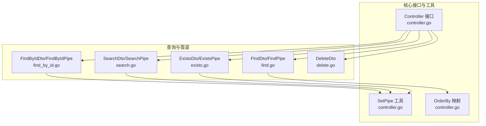
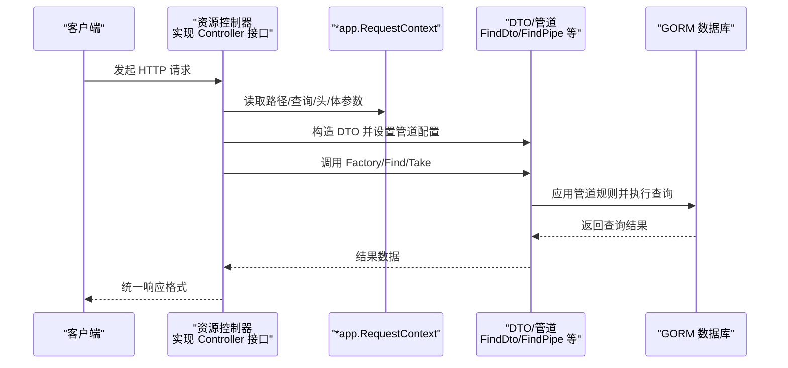
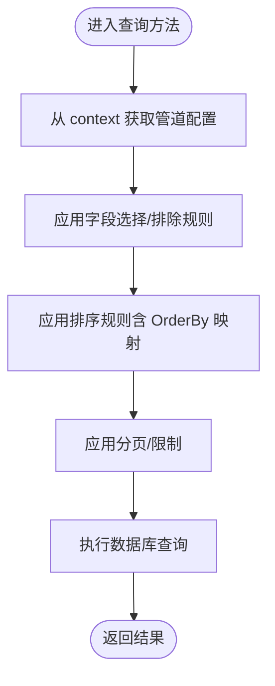
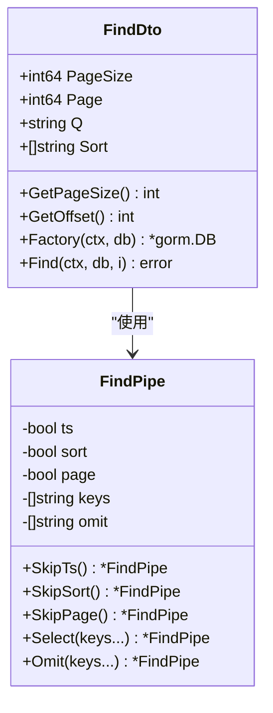
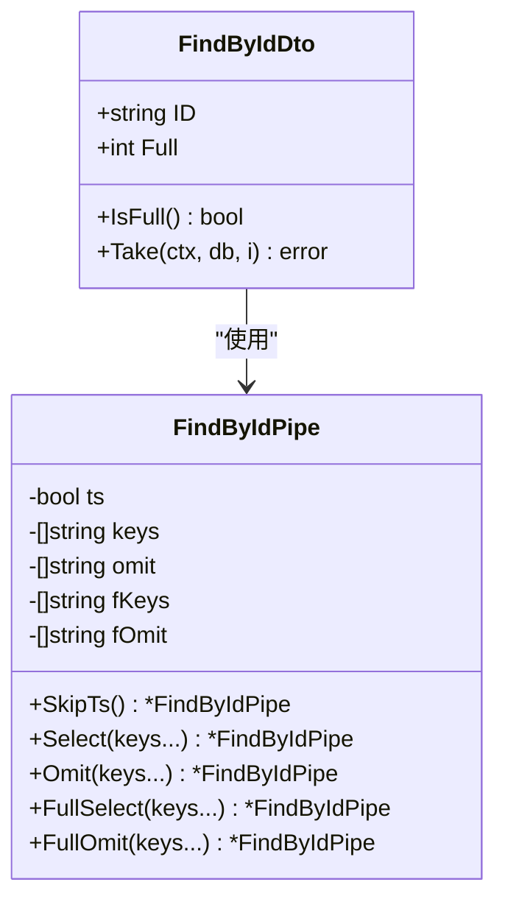
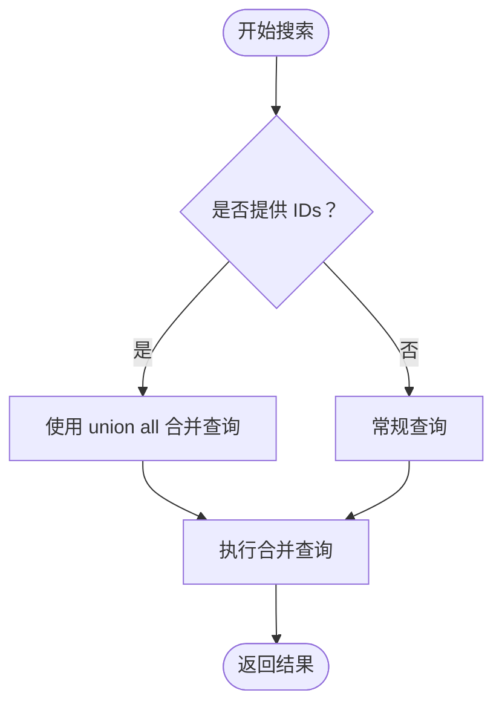
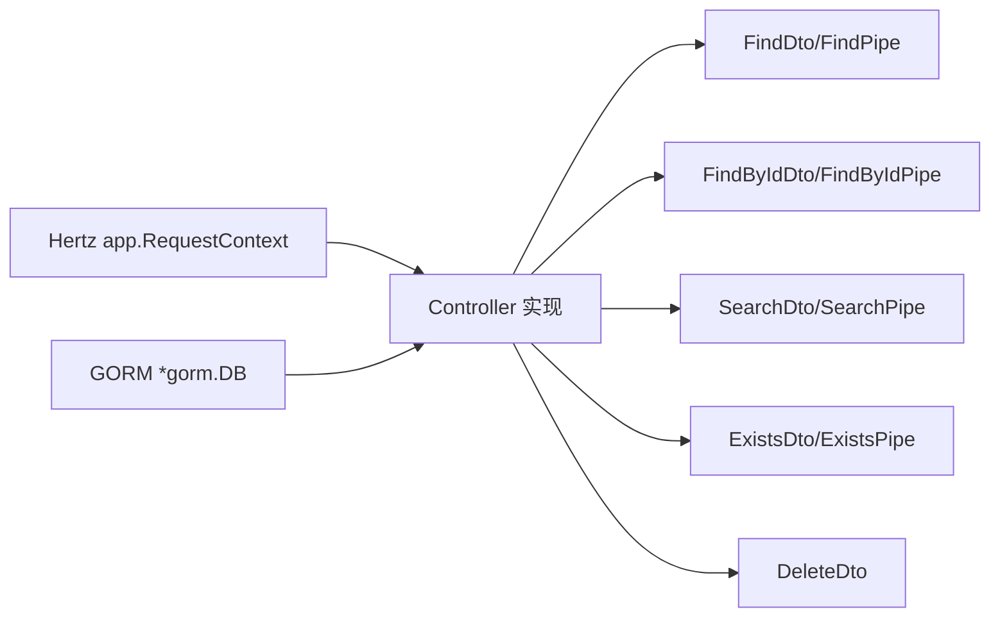

# Controller 接口

<cite>
**本文引用的文件**
- [controller.go](file://controller.go)
- [find.go](file://find.go)
- [find_by_id.go](file://find_by_id.go)
- [delete.go](file://delete.go)
- [exists.go](file://exists.go)
- [search.go](file://search.go)
- [go.mod](file://go.mod)
</cite>

## 目录
1. [简介](#简介)
2. [项目结构](#项目结构)
3. [核心组件](#核心组件)
4. [架构总览](#架构总览)
5. [详细组件分析](#详细组件分析)
6. [依赖关系分析](#依赖关系分析)
7. [性能考量](#性能考量)
8. [故障排查指南](#故障排查指南)
9. [结论](#结论)
10. [附录](#附录)

## 简介
本文件面向 go-crud 库中的 Controller 接口，系统性地阐述其设计目标与使用方式。该接口为基于 Hertz 框架与 GORM ORM 的 RESTful API 提供统一的 CRUD 契约，要求实现类在 context.Context 与 *app.RequestContext 的协作下完成资源的创建、查询、按 ID 查找、更新与删除操作。同时，本文将解释如何通过 SetPipe 注入查询配置，以及 OrderBy 变量如何将排序方向映射为 SQL 关键字，帮助读者快速在具体资源控制器中落地实现。

## 项目结构
仓库采用“按功能模块划分”的组织方式，围绕 CRUD 核心能力拆分为多个独立文件：
- controller.go 定义 Controller 接口及通用工具（SetPipe、OrderBy）
- find.go 定义分页查询 DTO 与管道配置（FindDto、FindPipe），并提供工厂方法与执行逻辑
- find_by_id.go 定义按 ID 查询 DTO 与管道配置（FindByIdDto、FindByIdPipe），并提供取数逻辑
- delete.go 定义批量删除 DTO
- exists.go 定义重复检查 DTO 与管道配置（ExistsDto、ExistsPipe），并提供存在性判断
- search.go 定义搜索 DTO 与管道配置（SearchDto、SearchPipe），并提供优先级合并查询与结果结构
- go.mod 描述模块与依赖

图表来源
- [controller.go](file://controller.go#L11-L38)
- [find.go](file://find.go#L13-L154)
- [find_by_id.go](file://find_by_id.go#L9-L103)
- [search.go](file://search.go#L13-L111)
- [exists.go](file://exists.go#L12-L66)
- [delete.go](file://delete.go#L1-L8)

章节来源
- [controller.go](file://controller.go#L11-L38)
- [find.go](file://find.go#L13-L154)
- [find_by_id.go](file://find_by_id.go#L9-L103)
- [search.go](file://search.go#L13-L111)
- [exists.go](file://exists.go#L12-L66)
- [delete.go](file://delete.go#L1-L8)
- [go.mod](file://go.mod#L1-L13)

## 核心组件
- Controller 接口：定义 Create、Find、FindById、Update、Delete 五种方法，作为资源控制器的标准契约。
- SetPipe：将查询配置（如字段选择、排序、分页等）以上下文值的形式注入，供各查询方法读取与应用。
- OrderBy：将排序方向字符串映射为 SQL ORDER 子句的关键字（升序为空串，降序为“desc”）。

章节来源
- [controller.go](file://controller.go#L11-L38)

## 架构总览
Controller 接口作为上层控制器的抽象，向下依赖各 DTO 与其对应的管道配置（FindPipe、FindByIdPipe、SearchPipe、ExistsPipe）。查询流程通常遵循如下步骤：
- 在控制器方法中，从 *app.RequestContext 中解析请求参数，构造对应 DTO
- 使用 SetPipe 将管道配置写入 context
- 调用 DTO 的 Factory 或 Find/Take 方法，结合 GORM 执行数据库操作
- 将结果封装后返回给客户端

图表来源
- [controller.go](file://controller.go#L11-L38)
- [find.go](file://find.go#L116-L154)
- [find_by_id.go](file://find_by_id.go#L76-L103)
- [search.go](file://search.go#L79-L102)
- [exists.go](file://exists.go#L47-L66)

## 详细组件分析

### Controller 接口定义与职责
- Create：处理资源创建，通常从请求体解析数据，调用 ORM 创建记录，并返回创建后的资源或状态码。
- Find：处理多资源查询，支持分页、过滤与排序；常通过 FindDto 与 FindPipe 配置查询行为。
- FindById：按唯一标识检索单条记录，可选“全量模式”，通过 FindByIdDto 与 FindByIdPipe 控制字段选择与排除。
- Update：处理资源修改，通常结合路径参数与请求体，定位并更新目标记录。
- Delete：处理删除操作，支持单条与批量删除，DeleteDto 提供 IDs 列表。

章节来源
- [controller.go](file://controller.go#L11-L24)

### SetPipe 与 OrderBy 的作用机制
- SetPipe：将任意管道配置对象存入 context，后续查询方法通过 DTO 的 Get(ctx) 获取并应用。
- OrderBy：将排序方向字符串映射为 SQL ORDER 关键字，用于动态拼接 ORDER BY 子句。

图表来源
- [controller.go](file://controller.go#L26-L38)
- [find.go](file://find.go#L116-L145)

章节来源
- [controller.go](file://controller.go#L26-L38)
- [find.go](file://find.go#L116-L145)

### 分页查询（Find）与管道配置
- FindDto：包含分页参数（页码、每页数量）、关键词过滤与排序规则。
- FindPipe：控制是否包含时间戳字段、是否启用排序、是否启用分页，以及字段选择/排除策略。
- Factory：根据管道配置与 DTO 参数，组装 GORM 查询链（字段选择、排序、分页）。
- Find：执行查询并将结果写入目标切片。

图表来源
- [find.go](file://find.go#L13-L154)

章节来源
- [find.go](file://find.go#L13-L154)

### 按 ID 查询（FindById）与管道配置
- FindByIdDto：包含路径参数 ID 与“全量模式”开关。
- FindByIdPipe：在普通模式与全量模式下分别支持字段选择/排除。
- Take：根据 DTO 与管道配置执行单条记录查询。

图表来源
- [find_by_id.go](file://find_by_id.go#L9-L103)

章节来源
- [find_by_id.go](file://find_by_id.go#L9-L103)

### 搜索（Search）与优先级合并
- SearchDto：支持模式标志、关键词与已知 ID 列表，用于优先展示某些结果。
- SearchPipe：控制默认字段集合与异步模式限制。
- Factory：应用字段选择与异步限制。
- Find：当提供 IDs 时，使用 union all 将已知 ID 的结果置于前部，再拼接其余匹配项。

图表来源
- [search.go](file://search.go#L13-L111)

章节来源
- [search.go](file://search.go#L13-L111)

### 重复检查（Exists）
- ExistsDto：指定检查字段与值。
- ExistsPipe：限定允许检查的字段集合。
- Exists：校验字段值是否存在，若不允许则返回错误。

章节来源
- [exists.go](file://exists.go#L12-L66)

### 批量删除（Delete）
- DeleteDto：提供待删除的 ID 列表。

章节来源
- [delete.go](file://delete.go#L1-L8)

## 依赖关系分析
- 外部依赖：Hertz（app.RequestContext）、GORM（*gorm.DB）
- 内部依赖：各 DTO 与其管道配置之间存在强耦合，通过 SetPipe 注入的上下文值进行解耦
- 设计要点：接口仅定义方法签名，不强制实现细节；查询行为由 DTO 与管道共同决定

图表来源
- [controller.go](file://controller.go#L11-L24)
- [find.go](file://find.go#L13-L154)
- [find_by_id.go](file://find_by_id.go#L9-L103)
- [search.go](file://search.go#L13-L111)
- [exists.go](file://exists.go#L12-L66)
- [delete.go](file://delete.go#L1-L8)
- [go.mod](file://go.mod#L5-L12)

章节来源
- [go.mod](file://go.mod#L5-L12)

## 性能考量
- 分页与限制：Find 与 Search 默认提供分页与异步限制，避免一次性返回大量数据；建议在高并发场景下合理设置每页大小与上限。
- 字段选择：通过管道的 Select/Omit 控制返回字段，减少网络传输与序列化开销。
- 排序与索引：OrderBy 将排序方向映射为 SQL 关键字，应确保排序字段建立合适索引以提升查询效率。
- 批量删除：DeleteDto 支持批量 ID 删除，注意控制批量规模，避免长事务与锁竞争。

## 故障排查指南
- 上下文未注入管道：若查询方法未通过 SetPipe 注入管道配置，可能导致字段选择、排序或分页规则未生效。请确认在控制器中正确调用 SetPipe。
- 排序方向非法：OrderBy 仅识别特定方向字符串，非法值可能导致排序异常。请确保 Sort 规则符合约定格式。
- 允许字段检查失败：Exists 检查时若 Key 不在允许列表内，会直接返回错误。请核对 ExistsPipe 的字段白名单。
- 查询结果为空：分页偏移过大或过滤条件过严可能导致空结果。请检查分页参数与关键词匹配逻辑。

章节来源
- [controller.go](file://controller.go#L26-L38)
- [find.go](file://find.go#L116-L145)
- [exists.go](file://exists.go#L47-L66)

## 结论
Controller 接口为基于 Hertz 与 GORM 的 RESTful API 提供了清晰一致的 CRUD 契约。通过 SetPipe 与各类 DTO/管道的组合，开发者可以灵活定制查询行为，兼顾性能与可维护性。OrderBy 与管道配置共同保证了排序与字段控制的可预期性。建议在实际项目中，将控制器实现与 DTO/管道分离，遵循单一职责原则，便于测试与扩展。

## 附录
- 接口方法调用时机与职责
  - Create：请求到达时解析请求体，调用 ORM 创建资源并返回响应
  - Find：解析分页与过滤参数，应用管道配置，执行查询并返回列表
  - FindById：解析路径参数与全量模式，应用管道配置，执行单条查询并返回
  - Update：解析路径参数与请求体，定位并更新资源，返回更新后的状态
  - Delete：解析批量 ID 列表，执行删除并返回删除结果

- 实现参考路径
  - 接口定义与工具：[controller.go](file://controller.go#L11-L38)
  - 分页查询与管道：[find.go](file://find.go#L13-L154)
  - 按 ID 查询与管道：[find_by_id.go](file://find_by_id.go#L9-L103)
  - 搜索与优先级合并：[search.go](file://search.go#L13-L111)
  - 重复检查：[exists.go](file://exists.go#L12-L66)
  - 批量删除：[delete.go](file://delete.go#L1-L8)