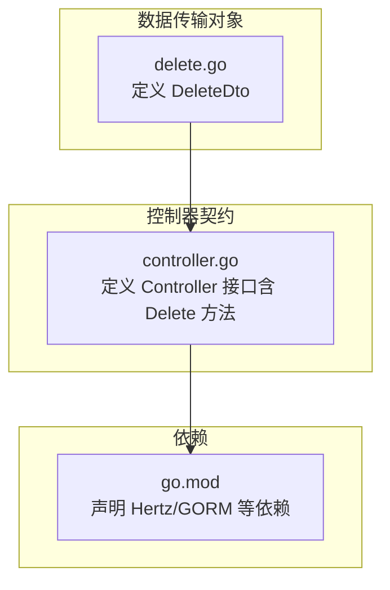
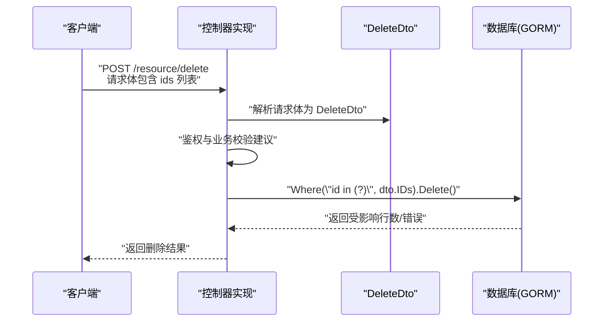
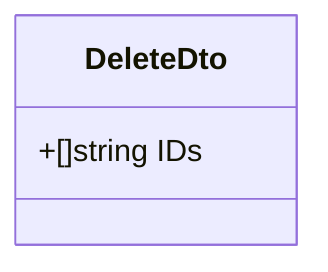
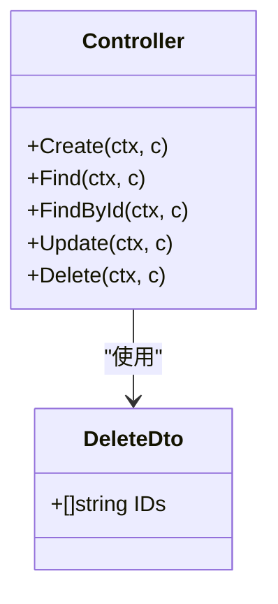
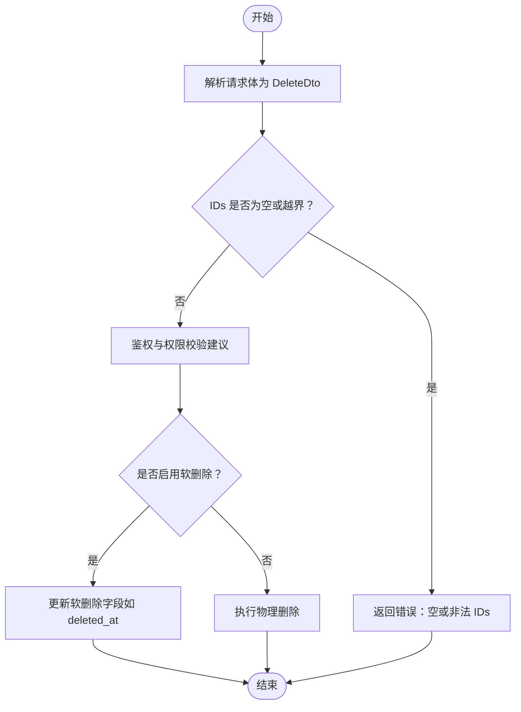
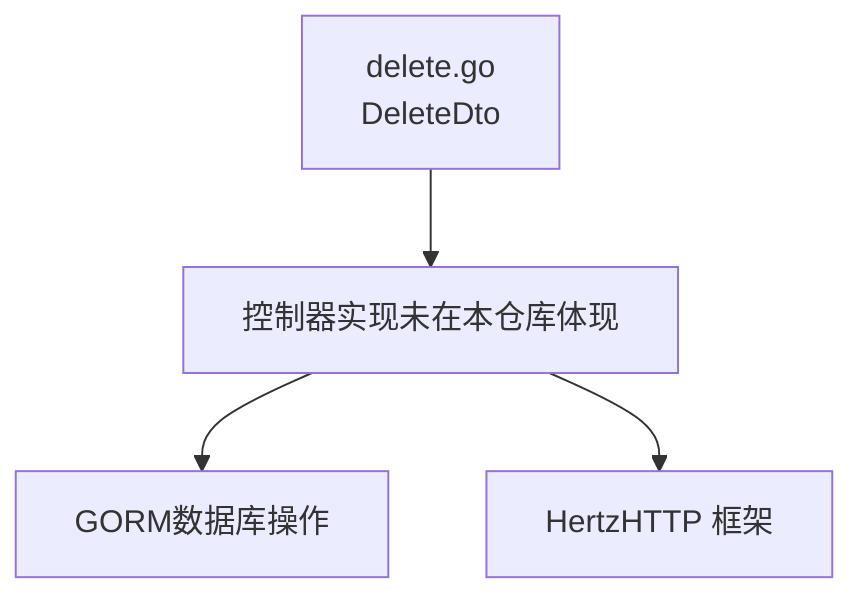

# 删除操作

<cite>
**本文引用的文件**
- [delete.go](file://delete.go)
- [controller.go](file://controller.go)
- [go.mod](file://go.mod)
</cite>

## 目录
1. [简介](#简介)
2. [项目结构](#项目结构)
3. [核心组件](#核心组件)
4. [架构总览](#架构总览)
5. [详细组件分析](#详细组件分析)
6. [依赖关系分析](#依赖关系分析)
7. [性能考量](#性能考量)
8. [故障排查指南](#故障排查指南)
9. [结论](#结论)

## 简介
本章节面向“删除操作”模块，重点文档化 DeleteDto 结构体及其典型使用方式。DeleteDto 的设计极简，仅包含一个 IDs 字段（字符串切片），用于接收需要批量删除的资源 ID 列表。该设计使得一次请求即可触发对多个资源的删除，满足常见的批量删除场景。

尽管当前仓库未提供 Delete 方法的具体实现细节，但本文将基于现有结构与通用实践，给出 DeleteDto 的使用流程、安全注意事项与扩展建议（如权限校验、软删除等）。

## 项目结构
本仓库采用按功能分层的组织方式：
- 数据传输对象（DTO）：定义于独立文件，职责单一，便于复用与测试。
- 控制器接口：统一声明 CRUD 操作契约，便于实现层遵循一致的调用约定。
- 依赖声明：通过 go.mod 声明外部依赖（如 Hertz、GORM）。

图表来源
- [delete.go](file://delete.go#L1-L8)
- [controller.go](file://controller.go#L1-L38)
- [go.mod](file://go.mod#L1-L13)

章节来源
- [delete.go](file://delete.go#L1-L8)
- [controller.go](file://controller.go#L1-L38)
- [go.mod](file://go.mod#L1-L13)

## 核心组件
- DeleteDto：承载批量删除所需的资源 ID 列表，字段为 IDs（[]string）。该结构体仅包含一个字段，设计简洁，便于序列化/反序列化与后续数据库操作。
- Controller 接口：统一声明 Delete(ctx, c) 方法，作为删除操作的入口契约。实现层负责解析请求体、进行鉴权与业务校验，并最终调用数据库层执行删除。

章节来源
- [delete.go](file://delete.go#L1-L8)
- [controller.go](file://controller.go#L11-L24)

## 架构总览
下图展示了从 HTTP 请求到数据库删除的整体流程，以及 DeleteDto 在其中的角色定位。

图表来源
- [controller.go](file://controller.go#L11-L24)
- [delete.go](file://delete.go#L1-L8)

## 详细组件分析

### DeleteDto 结构体
- 字段
  - IDs：字符串切片，表示待删除资源的唯一标识集合。
- 设计意图
  - 极简：仅一个字段，降低解析与传输成本。
  - 明确：明确表达“批量删除”的输入形态。
- 典型使用场景
  - 在控制器的 Delete 方法中，先解析请求体为 DeleteDto，再基于 IDs 执行批量删除。
  - 可结合权限校验与软删除策略，提升安全性与可恢复性。

图表来源
- [delete.go](file://delete.go#L1-L8)

章节来源
- [delete.go](file://delete.go#L1-L8)

### Controller 接口中的 Delete 方法
- 契约
  - Delete(ctx, c)：统一的删除入口，实现层负责完成鉴权、参数校验、调用数据访问层等。
- 与 DeleteDto 的关系
  - 实现层通常会将请求体绑定为 DeleteDto，随后根据 IDs 进行批量删除。

图表来源
- [controller.go](file://controller.go#L11-L24)
- [delete.go](file://delete.go#L1-L8)

章节来源
- [controller.go](file://controller.go#L11-L24)

### 典型删除流程（概念流程）
以下流程图描述了典型的批量删除过程，包括输入解析、鉴权与业务校验、数据库删除以及结果返回。

说明
- 鉴权与权限校验：建议在实现层对用户身份与资源范围进行校验，避免越权删除。
- 软删除：当存在级联约束或审计需求时，优先考虑软删除；否则直接物理删除。
- 错误处理：对空 IDs、越界 IDs、数据库异常等情况进行统一处理并返回。

## 依赖关系分析
- 外部依赖
  - Hertz：HTTP 框架，用于处理请求与响应。
  - GORM：ORM，用于数据库操作（如批量删除）。
- 内部耦合
  - DeleteDto 与 Controller 接口之间无直接依赖，通过实现层进行组合使用。
  - 控制器实现与数据库层通过 GORM 进行交互。

图表来源
- [delete.go](file://delete.go#L1-L8)
- [controller.go](file://controller.go#L1-L38)
- [go.mod](file://go.mod#L1-L13)

章节来源
- [go.mod](file://go.mod#L1-L13)

## 性能考量
- 批量删除的效率
  - 使用 “id in (?)” 的批量删除通常比循环逐条删除更高效，但需注意数据库索引与 SQL 参数上限。
- 安全与一致性
  - 对超大 IDs 列表进行分批处理，避免一次性传入过多参数导致性能问题或 SQL 限制。
  - 在高并发场景下，建议配合事务与锁策略，确保一致性。
- 软删除的权衡
  - 软删除可保留历史与审计线索，但会增加查询复杂度与存储开销；需根据业务需求选择。

## 故障排查指南
- 常见问题
  - 请求体未正确绑定 DeleteDto：检查请求体格式与 Content-Type，确认 JSON 字段名与结构体标签一致。
  - IDs 为空或越界：在实现层增加判空与长度限制，避免无效或过大的批量删除。
  - 权限不足：在控制器实现中加入鉴权逻辑，确保仅授权用户可删除目标资源。
  - 数据库异常：捕获 GORM 错误并返回统一的错误码与消息，便于前端与日志系统定位问题。
- 建议的日志与监控
  - 记录删除操作的用户、时间、IDs 列表与影响行数，便于审计与回溯。
  - 对批量删除的耗时与失败率进行监控，及时发现性能瓶颈或异常。

## 结论
DeleteDto 以极简设计实现了批量删除的核心输入形态，配合 Controller 接口的 Delete 方法，可在实现层完成鉴权、校验与数据库操作。建议在实际实现中补充权限校验与软删除支持，并对超大批量删除进行分批与限流，以兼顾性能与安全。