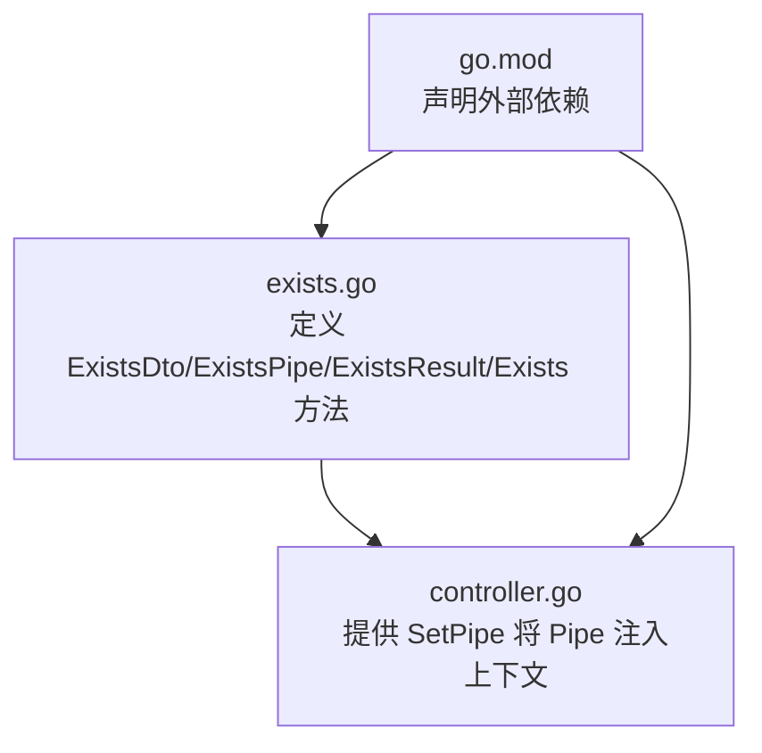
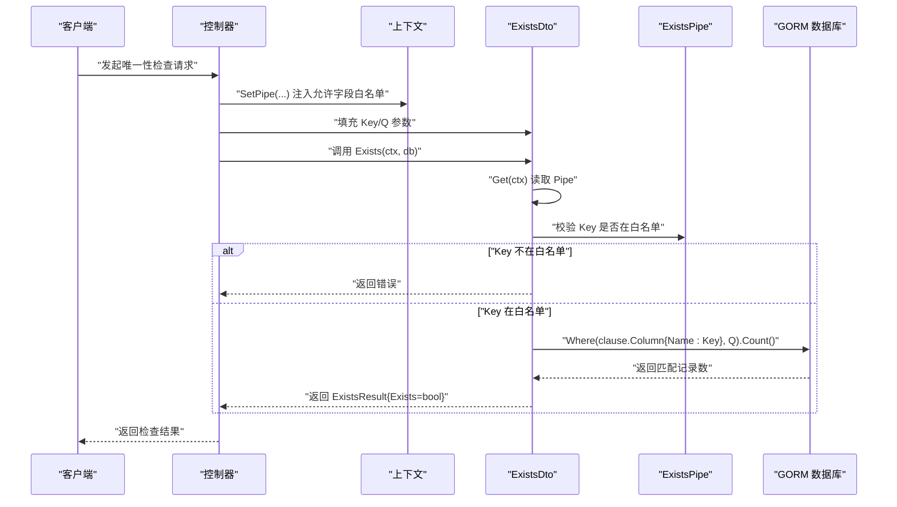
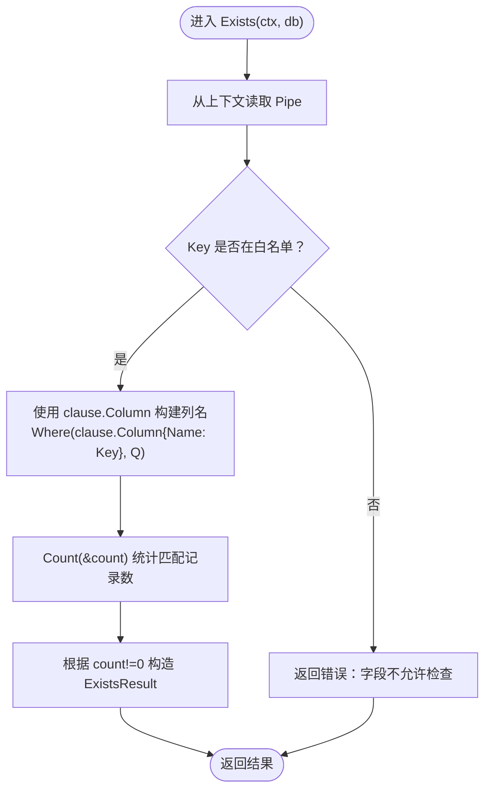
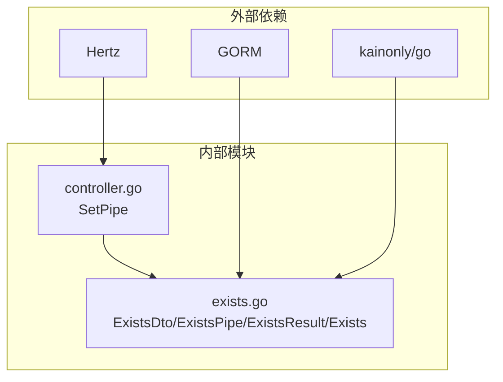

# Exists 操作

<cite>
**本文引用的文件**
- [exists.go](file://exists.go)
- [controller.go](file://controller.go)
- [go.mod](file://go.mod)
</cite>

## 目录
1. [简介](#简介)
2. [项目结构](#项目结构)
3. [核心组件](#核心组件)
4. [架构总览](#架构总览)
5. [详细组件分析](#详细组件分析)
6. [依赖关系分析](#依赖关系分析)
7. [性能考量](#性能考量)
8. [故障排查指南](#故障排查指南)
9. [结论](#结论)
10. [附录](#附录)

## 简介
本文件系统化文档化 Exists 操作模块，用于检查数据库中某字段值的唯一性。该模块通过以下关键点保障安全与可用：
- ExistsDto 的 Key（检查字段名）与 Q（检查值）参数，分别指定被检查的字段与目标值。
- ExistsPipe 通过 NewExistsPipe 定义“允许检查的字段白名单”，在执行 Exists 前进行字段合法性校验，防止任意字段探测攻击。
- Exists 方法内部使用 GORM clause.Column 动态构建查询条件，并通过 Count 统计匹配记录数量，最终返回 ExistsResult 结构体（Exists bool）表示值是否存在。

此外，本文提供在用户注册场景下检查邮箱或用户名是否已存在的使用示例，说明如何在 Controller 中设置允许字段的 Pipe 配置，以确保仅对白名单内的字段进行唯一性检查。

## 项目结构
本仓库围绕 CRUD 能力提供通用工具，其中与 Exists 相关的核心文件如下：
- exists.go：定义 ExistsDto、ExistsPipe、ExistsResult 及 Exists 方法，实现唯一性检查逻辑。
- controller.go：提供 SetPipe 工具函数，用于将 Pipe 配置注入到请求上下文中，供各 DTO 在运行时读取。
- go.mod：声明依赖（Hertz、GORM、kainonly/go 等），为 Exists 模块提供运行环境支持。

图表来源
- [exists.go](file://exists.go#L1-L66)
- [controller.go](file://controller.go#L1-L38)
- [go.mod](file://go.mod#L1-L13)

章节来源
- [exists.go](file://exists.go#L1-L66)
- [controller.go](file://controller.go#L1-L38)
- [go.mod](file://go.mod#L1-L13)

## 核心组件
- ExistsDto
  - 字段 Key：指定要检查重复性的字段名。
  - 字段 Q：指定要检查的目标值。
- ExistsPipe
  - 通过 NewExistsPipe(keys...) 构造白名单映射，仅允许在白名单中的字段参与唯一性检查。
- ExistsResult
  - 字段 Exists：布尔值，指示目标值在数据库中是否存在。
- Exists 方法
  - 从上下文中读取 Pipe，校验 Key 是否在白名单中；若不在则返回错误。
  - 使用 GORM clause.Column 动态构造列名，结合 Where 条件与 Count 统计匹配记录数。
  - 返回 ExistsResult 表示结果。

章节来源
- [exists.go](file://exists.go#L12-L66)

## 架构总览
下图展示了 Exists 检查在请求生命周期中的调用链路与数据流。

图表来源
- [controller.go](file://controller.go#L25-L30)
- [exists.go](file://exists.go#L36-L66)

## 详细组件分析

### ExistsDto 与 ExistsResult
- ExistsDto
  - Key：查询参数 key，代表被检查的字段名。
  - Q：查询参数 q，代表要检查的目标值。
- ExistsResult
  - Exists：布尔值，true 表示存在，false 表示不存在。

章节来源
- [exists.go](file://exists.go#L12-L46)

### ExistsPipe 与 NewExistsPipe
- ExistsPipe
  - 内部维护一个字段名到布尔值的映射，用于快速判断字段是否允许被检查。
- NewExistsPipe(keys...)
  - 接收可变参数，将每个键加入白名单映射，返回新的 ExistsPipe 实例。

章节来源
- [exists.go](file://exists.go#L19-L34)

### Exists 方法实现流程
- 步骤一：从上下文中读取 Pipe（通过 ExistsDto.Get(ctx)）。
- 步骤二：校验 Key 是否在 Pipe 白名单中；若不在，返回错误。
- 步骤三：使用 GORM clause.Column 动态构建列名，配合 Where 条件与 Count 统计匹配记录数。
- 步骤四：根据统计结果构造 ExistsResult，返回给调用方。

图表来源
- [exists.go](file://exists.go#L47-L66)

章节来源
- [exists.go](file://exists.go#L47-L66)

### 在控制器中设置允许字段的 Pipe 配置
- 使用 SetPipe(ctx, pipe) 将 ExistsPipe 注入到请求上下文中，供 ExistsDto 在运行时读取。
- 示例（概念性说明，不包含具体代码内容）：
  - 在用户注册接口中，创建一个新的 ExistsPipe 并允许检查邮箱与用户名字段。
  - 将该 Pipe 通过 SetPipe 注入到当前请求上下文。
  - 用户提交注册表单时，前端传入 key 与 q，后端使用 ExistsDto.Exists(ctx, db) 执行唯一性检查。

章节来源
- [controller.go](file://controller.go#L25-L30)
- [exists.go](file://exists.go#L36-L46)

## 依赖关系分析
- 外部依赖
  - Hertz：HTTP 框架，用于接收请求与响应。
  - GORM：ORM 框架，提供数据库访问能力与 clause.Column 支持。
  - kainonly/go：提供帮助函数（如错误封装）。
- 内部耦合
  - ExistsDto 依赖上下文中的 Pipe（由 SetPipe 注入）。
  - Exists 方法依赖 GORM 的 Where 与 Count 能力。
  - controller.go 提供 SetPipe，作为 Pipe 注入的统一入口。

图表来源
- [go.mod](file://go.mod#L1-L13)
- [controller.go](file://controller.go#L1-L38)
- [exists.go](file://exists.go#L1-L66)

章节来源
- [go.mod](file://go.mod#L1-L13)
- [controller.go](file://controller.go#L1-L38)
- [exists.go](file://exists.go#L1-L66)

## 性能考量
- 查询策略
  - Exists 仅使用 Count 统计匹配记录数，避免加载完整记录，降低网络与内存开销。
- 字段白名单
  - 通过白名单限制可检查字段，减少不必要的索引扫描与锁竞争。
- 索引建议
  - 对需要检查唯一性的字段建立合适索引，可显著提升 Exists 查询性能。
- 错误处理
  - 若数据库层发生错误，Exists 方法会直接返回错误，避免无意义的重复查询。

[本节为通用性能建议，不直接分析具体文件]

## 故障排查指南
- 常见问题
  - 字段未在白名单中：当 Key 不在 Pipe 白名单时，Exists 会返回错误。请确认在 SetPipe 时正确传入允许检查的字段集合。
  - 数据库连接或权限异常：若 Count 步骤报错，请检查数据库连接、权限与表结构。
  - 参数为空：Key 或 Q 为空可能导致查询条件异常，应在上层做好参数校验。
- 排查步骤
  - 确认 Pipe 注入是否成功（SetPipe 是否在控制器中调用）。
  - 确认白名单中包含目标字段。
  - 观察数据库日志，确认生成的 WHERE 条件是否符合预期（clause.Column 动态列名）。
  - 检查是否存在并发写入导致的短暂不一致（可通过事务隔离级别调整或重试策略缓解）。

章节来源
- [exists.go](file://exists.go#L47-L66)
- [controller.go](file://controller.go#L25-L30)

## 结论
Exists 操作模块通过“字段白名单 + GORM clause.Column + Count”的组合，提供了安全且高效的唯一性检查能力。其核心价值在于：
- 明确的白名单控制，有效防止任意字段探测攻击。
- 简洁的 API 设计，便于在用户注册等场景中快速集成。
- 与 Hertz/GORM 生态无缝衔接，具备良好的可扩展性。

[本节为总结性内容，不直接分析具体文件]

## 附录

### 使用示例（用户注册场景）
- 场景目标：在用户注册时检查邮箱与用户名是否已存在。
- 实施要点：
  - 控制器中创建 ExistsPipe 并允许检查邮箱与用户名字段。
  - 使用 SetPipe 将 Pipe 注入上下文。
  - 前端传入 key 与 q，后端调用 ExistsDto.Exists(ctx, db) 获取 ExistsResult。
- 注意事项：
  - 仅在白名单内的字段才允许检查，避免越权探测。
  - 对高频检查的字段建立索引，保证查询性能。

[本节为概念性示例，不直接分析具体文件]