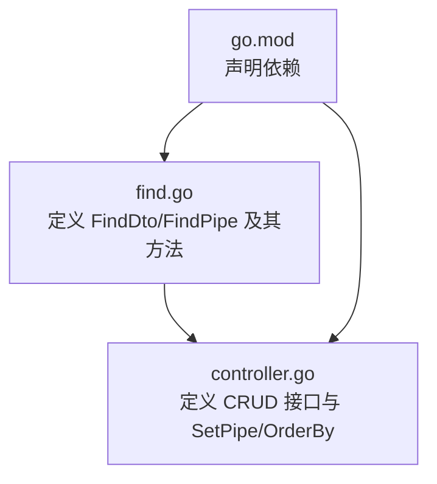
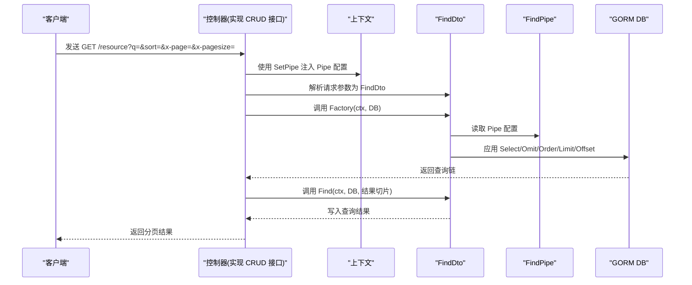
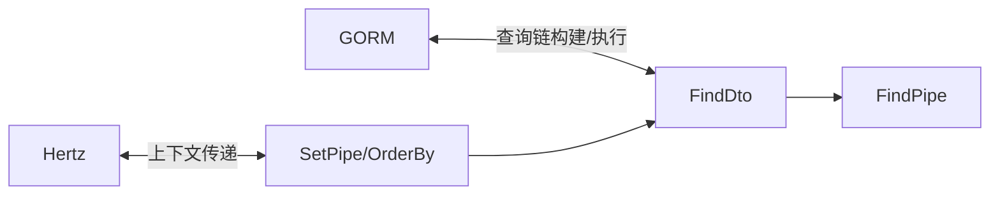
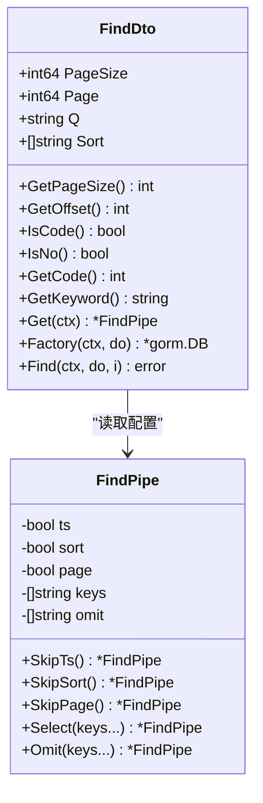
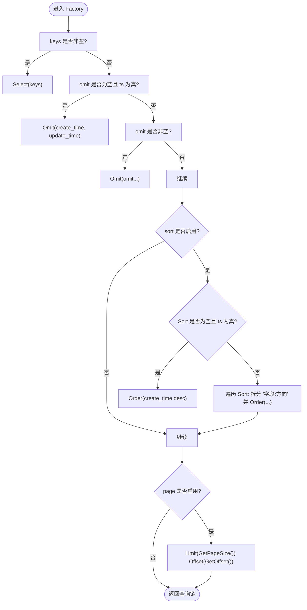

# Find 操作

<cite>
**本文引用的文件列表**
- [find.go](file://find.go)
- [controller.go](file://controller.go)
- [go.mod](file://go.mod)
</cite>

## 目录
1. [简介](#简介)
2. [项目结构](#项目结构)
3. [核心组件](#核心组件)
4. [架构总览](#架构总览)
5. [组件详解](#组件详解)
6. [依赖关系分析](#依赖关系分析)
7. [性能考量](#性能考量)
8. [故障排查指南](#故障排查指南)
9. [结论](#结论)
10. [附录](#附录)

## 简介
本章节系统性地文档化“Find 操作”模块，聚焦于两个核心结构体：FindDto 和 FindPipe。FindDto 负责接收分页查询参数（每页条数、页码、关键词、排序规则），并提供一系列辅助方法用于解析与处理查询条件；FindPipe 则负责对查询行为进行链式配置（是否包含时间戳字段、是否启用排序、是否启用分页、字段选择与排除等）。通过 FindDto 的 Factory 方法，结合 Pipe 配置，可构建出符合业务需求的 GORM 查询链，并最终由 Find 执行查询并将结果写入目标切片或结构体。

## 项目结构
该模块位于一个通用 CRUD 工具包中，主要文件如下：
- find.go：定义 FindDto、FindPipe 及其相关方法（含 Factory 与 Find）
- controller.go：定义通用 CRUD 接口、上下文管道注入工具与排序方向映射
- go.mod：声明依赖（Hertz、GORM 等）

图表来源
- [find.go](file://find.go#L1-L154)
- [controller.go](file://controller.go#L1-L38)
- [go.mod](file://go.mod#L1-L12)

章节来源
- [find.go](file://find.go#L1-L154)
- [controller.go](file://controller.go#L1-L38)
- [go.mod](file://go.mod#L1-L12)

## 核心组件
- FindDto：封装分页查询输入参数与辅助方法，支持默认值、偏移量计算、关键词匹配与包装等。
- FindPipe：封装查询行为配置，支持链式设置字段选择/排除、跳过时间戳/排序/分页等。
- Factory：将 FindDto 与 FindPipe 的配置应用到 GORM 查询链，统一处理字段选择、排序与分页。
- Find：在 Factory 基础上执行查询并将结果写入目标接口。

章节来源
- [find.go](file://find.go#L1-L154)
- [controller.go](file://controller.go#L1-L38)

## 架构总览
下图展示了从 HTTP 请求到数据库查询的整体流程，以及 FindDto 与 FindPipe 在其中的角色：

图表来源
- [controller.go](file://controller.go#L25-L38)
- [find.go](file://find.go#L116-L154)

## 组件详解

### FindDto：分页查询参数与辅助方法
- 字段
  - PageSize：每页记录数，默认最大 1000（若未指定则默认使用 1000）
  - Page：页码（0 起始）
  - Q：搜索关键词
  - Sort：排序规则数组，格式为 “字段:方向”，方向映射见下节
- 辅助方法
  - GetPageSize：返回当前每页条数（默认 1000）
  - GetOffset：基于 Page 与 PageSize 计算数据库偏移量
  - IsCode：判断 Q 是否为至少 3 位数字的代码模式
  - IsNo：判断 Q 是否以 N-、B- 或 M- 开头的编号模式
  - GetCode：将 Q 转换为整型代码
  - GetKeyword：将 Q 包裹为 SQL LIKE 通配符形式（前后加百分号）
- 关键实现位置
  - 参数定义与默认值约束
  - 偏移量与默认页大小
  - 正则匹配与转换
  - 关键词包装

章节来源
- [find.go](file://find.go#L13-L23)
- [find.go](file://find.go#L25-L60)

### FindPipe：查询行为配置与链式方法
- 配置项
  - ts：是否包含时间戳字段（默认包含 create_time、update_time）
  - sort：是否启用排序（默认启用）
  - page：是否启用分页（默认启用）
  - keys：选择字段列表（若设置，则忽略 omit）
  - omit：排除字段列表
- 链式方法
  - SkipTs：关闭默认时间戳处理
  - SkipSort：禁用排序
  - SkipPage：禁用分页
  - Select(keys...)：设置仅返回指定字段
  - Omit(keys...)：设置排除指定字段
- 默认行为
  - NewFindPipe 创建时默认开启 ts、sort、page
- 关键实现位置
  - 配置结构体定义
  - Get(ctx) 从上下文中获取 Pipe
  - NewFindPipe 默认配置
  - Skip* 与 Select/Omit 链式方法

章节来源
- [find.go](file://find.go#L61-L115)
- [find.go](file://find.go#L70-L74)
- [find.go](file://find.go#L75-L83)
- [find.go](file://find.go#L85-L114)

### Factory：构建 GORM 查询链
- 字段选择/排除
  - 若 keys 非空：仅选择 keys 中的字段
  - 否则：若 omit 为空且 ts 为真：默认排除 create_time、update_time
  - 若 omit 非空：排除 omit 中的字段
- 排序
  - 若开启 sort：
    - 若 Sort 为空且 ts 为真：默认按 create_time 降序
    - 遍历 Sort 数组，按 “字段:方向” 解析，方向映射见下节
- 分页
  - 若开启 page：Limit(GetPageSize())、Offset(GetOffset())
- 返回
  - 返回已配置好的 *gorm.DB 查询链

章节来源
- [find.go](file://find.go#L116-L145)

### Find：执行查询
- 在 Factory 基础上执行 Find(i)，并将结果写入目标接口
- 错误透传

章节来源
- [find.go](file://find.go#L147-L154)

### 排序方向映射与上下文管道
- OrderBy 映射
  - "1" -> 升序（空字符串，即默认升序）
  - "-1" -> 降序（"desc"）
- 上下文管道
  - SetPipe(ctx, pipe) 将 Pipe 注入到上下文中，供 FindDto.Get(ctx) 获取
- 关键实现位置
  - OrderBy 定义
  - SetPipe 注入
  - FindDto.Get(ctx) 读取

章节来源
- [controller.go](file://controller.go#L25-L38)
- [find.go](file://find.go#L70-L74)

### 调用示例（在控制器中使用）
以下为在控制器中使用 NewFindPipe 创建配置并执行查询的完整调用流程（步骤说明，不直接展示代码内容）：
1. 在控制器的 Find 方法中，先通过 SetPipe(ctx, NewFindPipe()) 将 Pipe 注入上下文。
2. 从请求中解析 FindDto（包含 q、sort、x-page、x-pagesize 等）。
3. 调用 FindDto.Factory(ctx, db) 构建查询链。
4. 调用 FindDto.Find(ctx, db, &结果切片) 执行查询并将结果写入目标变量。
5. 返回分页结果给客户端。

章节来源
- [controller.go](file://controller.go#L25-L38)
- [find.go](file://find.go#L116-L154)

## 依赖关系分析
- 外部依赖
  - GORM：用于构建与执行查询链
  - Hertz：用于 HTTP 请求上下文（控制器接口中使用）
- 内部依赖
  - FindDto 依赖 FindPipe 的配置
  - FindPipe 通过上下文注入被 FindDto 读取
  - OrderBy 作为排序方向映射被 FindDto.Factory 使用

图表来源
- [find.go](file://find.go#L116-L154)
- [controller.go](file://controller.go#L25-L38)
- [go.mod](file://go.mod#L1-L12)

章节来源
- [find.go](file://find.go#L116-L154)
- [controller.go](file://controller.go#L25-L38)
- [go.mod](file://go.mod#L1-L12)

## 性能考量
- 分页限制
  - PageSize 最大为 1000，避免一次性返回过多数据导致内存压力与网络开销。
- 排序优化
  - 若未显式提供 Sort，且启用了 ts，将默认按 create_time 降序排序，建议在高频查询场景下为常用排序字段建立索引。
- 字段选择
  - 优先使用 Select 指定必要字段，减少不必要的列传输与序列化成本。
- 异步/搜索场景
  - 对于搜索类操作，建议配合 SearchPipe 的异步限制策略，避免超大数据集扫描。
- 并发与上下文
  - 使用 WithContext 与上下文管道传递 Pipe 配置，确保并发安全与可测试性。

## 故障排查指南
- 问题：PageSize 超过 1000
  - 现象：参数校验失败或被截断
  - 处理：确保 PageSize 不超过 1000
- 问题：排序方向无效
  - 现象：排序未生效或报错
  - 处理：确认 Sort 规则使用 "字段:方向"，方向仅支持 "1"（升序）与 "-1"（降序）
- 问题：未设置 Pipe 导致查询异常
  - 现象：FindDto.Get(ctx) 返回空指针
  - 处理：在控制器中务必先 SetPipe(ctx, NewFindPipe())
- 问题：字段选择与排除冲突
  - 现象：Select 与 Omit 同时存在但效果不符合预期
  - 处理：Select(keys...) 会忽略 Omit；若需排除字段，请仅设置 Omit
- 问题：分页偏移过大
  - 现象：数据库查询慢或返回空
  - 处理：检查 Page 与 PageSize 的组合，确保 Offset 合理

章节来源
- [find.go](file://find.go#L13-L23)
- [find.go](file://find.go#L116-L145)
- [controller.go](file://controller.go#L25-L38)

## 结论
Find 操作模块通过 FindDto 与 FindPipe 的清晰分离，实现了“输入参数 + 行为配置”的解耦设计。FindDto 负责参数解析与辅助逻辑，FindPipe 负责查询行为的可插拔配置，Factory 将两者整合为可复用的 GORM 查询链，Find 则完成最终执行。借助 SetPipe 与 OrderBy，开发者可在控制器中以最小成本实现灵活的分页、排序与字段控制。

## 附录

### 类图：FindDto 与 FindPipe 的关系

图表来源
- [find.go](file://find.go#L13-L154)

### 流程图：Factory 的字段选择与排序逻辑

图表来源
- [find.go](file://find.go#L116-L145)