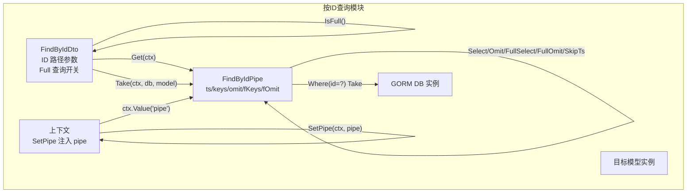
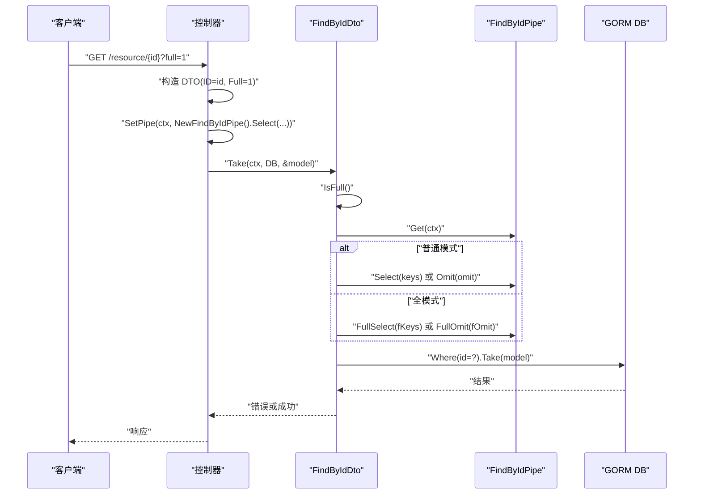
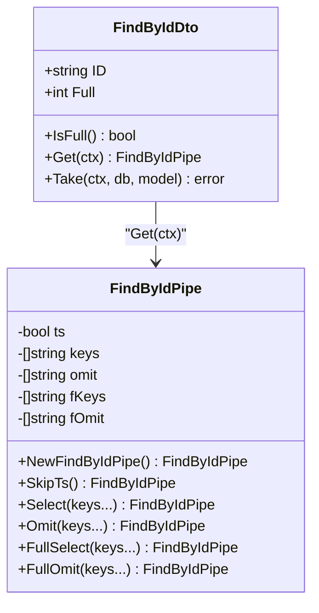
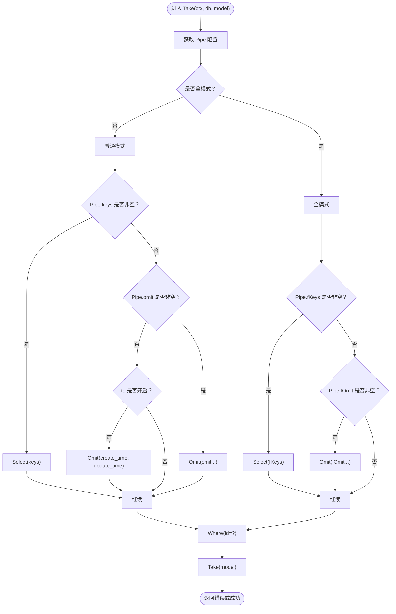
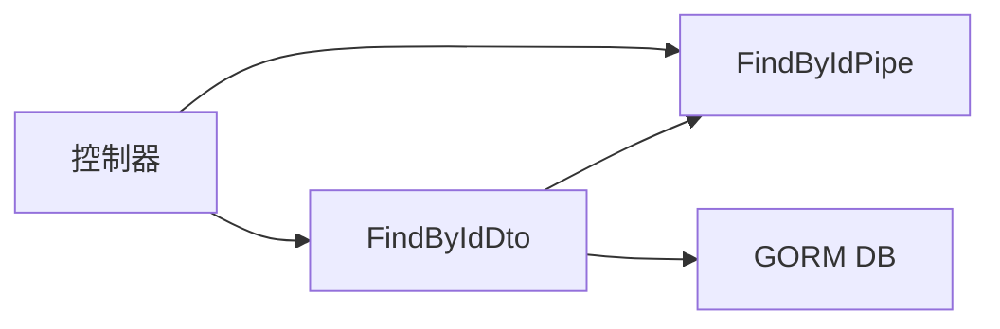

# FindById 操作

<cite>
**本文引用的文件**
- [find_by_id.go](file://find_by_id.go)
- [controller.go](file://controller.go)
- [find.go](file://find.go)
</cite>

## 目录
1. [简介](#简介)
2. [项目结构](#项目结构)
3. [核心组件](#核心组件)
4. [架构总览](#架构总览)
5. [详细组件分析](#详细组件分析)
6. [依赖关系分析](#依赖关系分析)
7. [性能考量](#性能考量)
8. [故障排查指南](#故障排查指南)
9. [结论](#结论)
10. [附录](#附录)

## 简介
本文件聚焦于“按ID查找单条记录”的操作模块，系统性文档化以下内容：
- FindByIdDto 的字段与行为：ID（路径参数）、Full（全字段模式开关），以及 IsFull 方法用于判断是否启用全量查询。
- FindByIdPipe 的配置能力：ts（时间戳处理）、keys/omit（普通模式字段控制）、fKeys/fOmit（全模式字段控制），以及 SkipTs、Select、Omit、FullSelect、FullOmit 等配置方法。
- Take 方法的实现逻辑：根据 Full 模式状态应用不同的字段选择策略，并通过 ID 精确查询单条记录。
- 使用示例：在 Controller 的 FindById 方法中根据 Full 参数动态配置 Pipe 并执行查询，实现灵活的数据暴露控制。

## 项目结构
该模块位于独立文件中，围绕“按ID查询”这一核心场景，提供 DTO 与 Pipe 两部分能力，并通过上下文传递 Pipe 配置，最终由 Take 执行数据库查询。

图表来源
- [find_by_id.go](file://find_by_id.go#L9-L14)
- [find_by_id.go](file://find_by_id.go#L22-L28)
- [find_by_id.go](file://find_by_id.go#L31-L33)
- [find_by_id.go](file://find_by_id.go#L37-L41)
- [find_by_id.go](file://find_by_id.go#L44-L47)
- [find_by_id.go](file://find_by_id.go#L50-L54)
- [find_by_id.go](file://find_by_id.go#L57-L60)
- [find_by_id.go](file://find_by_id.go#L64-L67)
- [find_by_id.go](file://find_by_id.go#L70-L73)
- [find_by_id.go](file://find_by_id.go#L76-L101)
- [controller.go](file://controller.go#L26-L30)

章节来源
- [find_by_id.go](file://find_by_id.go#L9-L14)
- [find_by_id.go](file://find_by_id.go#L22-L28)
- [controller.go](file://controller.go#L26-L30)

## 核心组件
- FindByIdDto
  - 字段
    - ID：路径参数，唯一标识待查询资源。
    - Full：查询开关，用于指示是否启用“全字段模式”。
  - 方法
    - IsFull：当 Full 等于 1 时返回真，否则为假。
    - Get：从上下文中取出 FindByIdPipe。
    - Take：根据 Full 状态与 Pipe 配置，对 GORM 查询进行字段选择或排除，并以 ID 精确查询单条记录。
- FindByIdPipe
  - 字段
    - ts：是否包含时间戳字段（默认开启）。
    - keys/omit：普通模式下的字段选择与排除规则；若 keys 非空，则忽略 omit。
    - fKeys/fOmit：全模式下的字段选择与排除规则；若 fKeys 非空，则忽略 fOmit。
  - 方法
    - NewFindByIdPipe：创建默认开启 ts 的 Pipe。
    - SkipTs：关闭默认时间戳处理。
    - Select：设置普通模式下要选择的字段（覆盖 omit）。
    - Omit：设置普通模式下要排除的字段。
    - FullSelect：设置全模式下要选择的字段（覆盖 fOmit）。
    - FullOmit：设置全模式下要排除的字段。

章节来源
- [find_by_id.go](file://find_by_id.go#L9-L14)
- [find_by_id.go](file://find_by_id.go#L17-L19)
- [find_by_id.go](file://find_by_id.go#L31-L33)
- [find_by_id.go](file://find_by_id.go#L37-L41)
- [find_by_id.go](file://find_by_id.go#L44-L47)
- [find_by_id.go](file://find_by_id.go#L50-L54)
- [find_by_id.go](file://find_by_id.go#L57-L60)
- [find_by_id.go](file://find_by_id.go#L64-L67)
- [find_by_id.go](file://find_by_id.go#L70-L73)
- [find_by_id.go](file://find_by_id.go#L76-L101)

## 架构总览
FindById 操作的调用链路如下：
- 控制器接收请求，读取路径参数 id 与查询参数 full。
- 将 Pipe 注入到上下文，供后续查询使用。
- 调用 FindByIdDto.Take，内部根据 Full 切换普通/全模式，应用 Select/Omit 或 FullSelect/FullOmit，最后以 Where(id=?) Take 单条记录。

图表来源
- [find_by_id.go](file://find_by_id.go#L17-L19)
- [find_by_id.go](file://find_by_id.go#L31-L33)
- [find_by_id.go](file://find_by_id.go#L50-L54)
- [find_by_id.go](file://find_by_id.go#L57-L60)
- [find_by_id.go](file://find_by_id.go#L64-L67)
- [find_by_id.go](file://find_by_id.go#L70-L73)
- [find_by_id.go](file://find_by_id.go#L76-L101)
- [controller.go](file://controller.go#L26-L30)

## 详细组件分析

### FindByIdDto 分析
- 字段设计
  - ID：来源于路由路径，作为精确查询条件。
  - Full：来源于查询参数，用于切换字段选择策略。
- 行为要点
  - IsFull：将 Full 与 1 做等值判断，决定是否进入“全模式”。
  - Get：从上下文中取出 FindByIdPipe，作为后续查询配置的依据。
  - Take：核心查询入口，按模式应用字段选择/排除，并以 Where(id=?) 精确取一条记录。

图表来源
- [find_by_id.go](file://find_by_id.go#L9-L14)
- [find_by_id.go](file://find_by_id.go#L17-L19)
- [find_by_id.go](file://find_by_id.go#L31-L33)
- [find_by_id.go](file://find_by_id.go#L37-L41)
- [find_by_id.go](file://find_by_id.go#L44-L47)
- [find_by_id.go](file://find_by_id.go#L50-L54)
- [find_by_id.go](file://find_by_id.go#L57-L60)
- [find_by_id.go](file://find_by_id.go#L64-L67)
- [find_by_id.go](file://find_by_id.go#L70-L73)

章节来源
- [find_by_id.go](file://find_by_id.go#L9-L14)
- [find_by_id.go](file://find_by_id.go#L17-L19)
- [find_by_id.go](file://find_by_id.go#L31-L33)
- [find_by_id.go](file://find_by_id.go#L37-L41)
- [find_by_id.go](file://find_by_id.go#L44-L47)
- [find_by_id.go](file://find_by_id.go#L50-L54)
- [find_by_id.go](file://find_by_id.go#L57-L60)
- [find_by_id.go](file://find_by_id.go#L64-L67)
- [find_by_id.go](file://find_by_id.go#L70-L73)
- [find_by_id.go](file://find_by_id.go#L76-L101)

### FindByIdPipe 配置能力
- ts（时间戳处理）
  - 默认开启；可通过 SkipTs 关闭。
- 普通模式字段控制
  - Select(keys...)：指定要选择的字段；若设置，则忽略 Omit。
  - Omit(keys...)：指定要排除的字段。
- 全模式字段控制
  - FullSelect(keys...)：指定全模式下要选择的字段；若设置，则忽略 FullOmit。
  - FullOmit(keys...)：指定全模式下要排除的字段。
- 默认行为
  - NewFindByIdPipe 返回默认开启 ts 的 Pipe。

章节来源
- [find_by_id.go](file://find_by_id.go#L22-L28)
- [find_by_id.go](file://find_by_id.go#L37-L41)
- [find_by_id.go](file://find_by_id.go#L44-L47)
- [find_by_id.go](file://find_by_id.go#L50-L54)
- [find_by_id.go](file://find_by_id.go#L57-L60)
- [find_by_id.go](file://find_by_id.go#L64-L67)
- [find_by_id.go](file://find_by_id.go#L70-L73)

### Take 方法实现逻辑
- 步骤概览
  - 获取上下文中的 Pipe。
  - 若非全模式：
    - 若 Pipe.keys 非空，则仅选择 keys 指定字段。
    - 否则：
      - 若未设置 Pipe.omit 且 ts 开启，则默认排除时间戳字段。
      - 若 Pipe.omit 非空，则排除 omit 指定字段。
  - 若全模式：
    - 若 Pipe.fKeys 非空，则仅选择 fKeys 指定字段。
    - 否则，若 Pipe.fOmit 非空，则排除 fOmit 指定字段。
  - 最终以 Where(id=?) Take 单条记录。
- 复杂度与性能
  - 查询复杂度主要取决于索引命中情况与所选字段数量；Select/Omit 可减少网络与序列化开销。
  - 默认排除时间戳可降低响应体积，但需确保业务不需要这些字段。

图表来源
- [find_by_id.go](file://find_by_id.go#L76-L101)

章节来源
- [find_by_id.go](file://find_by_id.go#L76-L101)

### 在 Controller 中的使用示例
- 示例思路
  - 在控制器的 FindById 方法中：
    - 从 RequestContext 解析路径参数 id 与查询参数 full。
    - 构造 FindByIdDto。
    - 根据 full 动态配置 Pipe（例如 Select/Omit/FullSelect/FullOmit/SkipTs）。
    - 调用 SetPipe(ctx, pipe) 将 Pipe 注入上下文。
    - 调用 dto.Take(ctx, db, &model) 执行查询。
- 代码片段路径
  - 控制器接口定义与上下文注入工具：[controller.go](file://controller.go#L11-L24), [controller.go](file://controller.go#L26-L30)
  - FindByIdDto 与 FindByIdPipe 的定义与方法：[find_by_id.go](file://find_by_id.go#L9-L14), [find_by_id.go](file://find_by_id.go#L17-L19), [find_by_id.go](file://find_by_id.go#L31-L33), [find_by_id.go](file://find_by_id.go#L37-L41), [find_by_id.go](file://find_by_id.go#L44-L47), [find_by_id.go](file://find_by_id.go#L50-L54), [find_by_id.go](file://find_by_id.go#L57-L60), [find_by_id.go](file://find_by_id.go#L64-L67), [find_by_id.go](file://find_by_id.go#L70-L73), [find_by_id.go](file://find_by_id.go#L76-L101)

章节来源
- [controller.go](file://controller.go#L11-L24)
- [controller.go](file://controller.go#L26-L30)
- [find_by_id.go](file://find_by_id.go#L9-L14)
- [find_by_id.go](file://find_by_id.go#L17-L19)
- [find_by_id.go](file://find_by_id.go#L31-L33)
- [find_by_id.go](file://find_by_id.go#L37-L41)
- [find_by_id.go](file://find_by_id.go#L44-L47)
- [find_by_id.go](file://find_by_id.go#L50-L54)
- [find_by_id.go](file://find_by_id.go#L57-L60)
- [find_by_id.go](file://find_by_id.go#L64-L67)
- [find_by_id.go](file://find_by_id.go#L70-L73)
- [find_by_id.go](file://find_by_id.go#L76-L101)

## 依赖关系分析
- 组件耦合
  - FindByIdDto 依赖上下文中的 FindByIdPipe；通过 Get(ctx) 获取配置。
  - FindByIdPipe 提供字段选择/排除与时间戳处理能力，被 FindByIdDto 的 Take 使用。
- 外部依赖
  - GORM：用于构建查询、执行 Where(id=?) Take。
  - Hertz：通过 RequestContext 传递上下文，控制器层负责解析参数与注入 Pipe。
- 潜在循环依赖
  - 当前文件间无循环导入；模块职责清晰，耦合点集中在上下文传递。

图表来源
- [controller.go](file://controller.go#L26-L30)
- [find_by_id.go](file://find_by_id.go#L31-L33)
- [find_by_id.go](file://find_by_id.go#L76-L101)

章节来源
- [controller.go](file://controller.go#L26-L30)
- [find_by_id.go](file://find_by_id.go#L31-L33)
- [find_by_id.go](file://find_by_id.go#L76-L101)

## 性能考量
- 字段选择
  - 明确使用 Select/FullSelect 可显著减少网络传输与序列化成本。
  - 在普通模式下优先使用 keys 而非 omit，避免遗漏敏感字段。
- 时间戳处理
  - 默认开启 ts 可简化排序与审计需求；如不必要可调用 SkipTs 减少字段。
- 索引与查询
  - Where(id=?) 依赖主键索引；确保 id 字段建立合适索引以提升查询性能。
- 上下文传递
  - 通过 SetPipe 注入 Pipe，避免在多处重复构造配置，提高一致性与可维护性。

## 故障排查指南
- 常见问题
  - 查询不到数据：确认 ID 是否正确传入，以及数据库中是否存在该记录。
  - 字段缺失：检查是否在普通/全模式下设置了 Select/FullSelect，或是否误用了 Omit/FullOmit 导致字段被排除。
  - 时间戳字段异常：若业务不需要时间戳，可在构造 Pipe 时调用 SkipTs。
  - 上下文未注入 Pipe：确保在调用 Take 前已通过 SetPipe(ctx, pipe) 注入 Pipe。
- 定位建议
  - 在 Take 执行前后打印关键信息（如使用的 keys/fKeys、omit/fOmit、Where 条件）以辅助定位。
  - 对比普通/全模式下的字段差异，确认 IsFull 的判断逻辑与传参一致。

章节来源
- [find_by_id.go](file://find_by_id.go#L17-L19)
- [find_by_id.go](file://find_by_id.go#L31-L33)
- [find_by_id.go](file://find_by_id.go#L44-L47)
- [find_by_id.go](file://find_by_id.go#L50-L54)
- [find_by_id.go](file://find_by_id.go#L57-L60)
- [find_by_id.go](file://find_by_id.go#L64-L67)
- [find_by_id.go](file://find_by_id.go#L70-L73)
- [find_by_id.go](file://find_by_id.go#L76-L101)
- [controller.go](file://controller.go#L26-L30)

## 结论
FindById 模块通过 FindByIdDto 与 FindByIdPipe 的协作，提供了灵活而可控的“按ID查询单条记录”能力。其核心优势在于：
- 以 Full 参数驱动普通/全模式切换，满足不同场景的数据暴露需求。
- 通过 Select/FullSelect 与 Omit/FullOmit 精准控制字段集合，兼顾安全与性能。
- 默认开启时间戳处理并在必要时可关闭，平衡审计与体积。
- 通过上下文注入 Pipe，使配置复用与一致性得到保障。

## 附录
- 与其他查询模块的关系
  - 与 FindPipe 的对比：FindPipe 面向分页/排序/分页等多记录场景，FindByIdPipe 面向单条记录的字段选择与排除。
  - 两者共享“Select/Omit/FullSelect/FullOmit/SkipTs”的配置思想，便于统一风格。

章节来源
- [find.go](file://find.go#L60-L68)
- [find.go](file://find.go#L70-L73)
- [find.go](file://find.go#L75-L83)
- [find.go](file://find.go#L85-L101)
- [find.go](file://find.go#L103-L114)
- [find.go](file://find.go#L116-L145)
- [find.go](file://find.go#L147-L153)
- [find_by_id.go](file://find_by_id.go#L22-L28)
- [find_by_id.go](file://find_by_id.go#L37-L41)
- [find_by_id.go](file://find_by_id.go#L44-L47)
- [find_by_id.go](file://find_by_id.go#L50-L54)
- [find_by_id.go](file://find_by_id.go#L57-L60)
- [find_by_id.go](file://find_by_id.go#L64-L67)
- [find_by_id.go](file://find_by_id.go#L70-L73)
- [find_by_id.go](file://find_by_id.go#L76-L101)