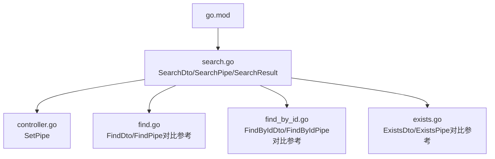
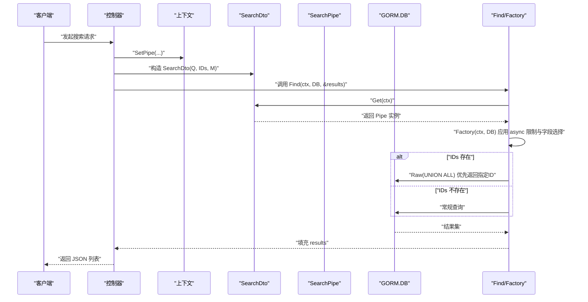
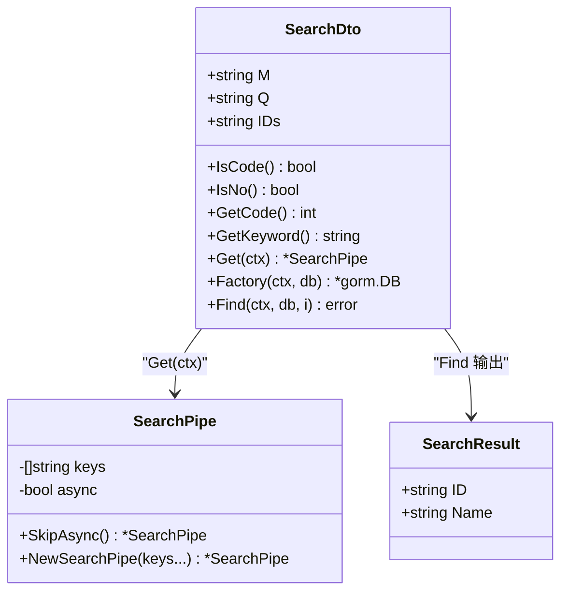

# Search 操作

<cite>
**本文引用的文件**
- [search.go](file://search.go)
- [controller.go](file://controller.go)
- [find.go](file://find.go)
- [find_by_id.go](file://find_by_id.go)
- [exists.go](file://exists.go)
- [go.mod](file://go.mod)
</cite>

## 目录
1. [简介](#简介)
2. [项目结构](#项目结构)
3. [核心组件](#核心组件)
4. [架构总览](#架构总览)
5. [详细组件分析](#详细组件分析)
6. [依赖关系分析](#依赖关系分析)
7. [性能考量](#性能考量)
8. [故障排查指南](#故障排查指南)
9. [结论](#结论)
10. [附录](#附录)

## 简介
本文件系统性地文档化 Search 操作模块，覆盖以下内容：
- SearchDto 的查询参数与辅助方法：M（查询模式）、Q（关键词）、IDs（优先ID列表），以及 IsCode、IsNo、GetCode、GetKeyword。
- SearchPipe 的异步模式与字段选择：async（异步模式）、keys（选择字段），以及 SkipAsync、NewSearchPipe（默认["id","name"]）。
- Factory 方法在异步模式下的结果数量限制（Limit 50）与字段选择。
- Find 方法的实现逻辑：当提供 IDs 时，通过 UNION ALL 将指定 ID 的结果置顶；否则执行普通查询。
- SearchResult 标准输出格式（ID、Name）。
- 完整示例：如何实现一个支持 ID 优先级排序的搜索 API。

## 项目结构
该模块位于独立文件中，围绕 SearchDto、SearchPipe 和 SearchResult 构建搜索能力，并通过 SetPipe 注入到请求上下文中，供后续查询工厂与执行器使用。

图表来源
- [search.go](file://search.go#L1-L111)
- [controller.go](file://controller.go#L1-L38)
- [find.go](file://find.go#L1-L154)
- [find_by_id.go](file://find_by_id.go#L1-L103)
- [exists.go](file://exists.go#L1-L66)
- [go.mod](file://go.mod#L1-L13)

章节来源
- [search.go](file://search.go#L1-L111)
- [controller.go](file://controller.go#L1-L38)
- [find.go](file://find.go#L1-L154)
- [find_by_id.go](file://find_by_id.go#L1-L103)
- [exists.go](file://exists.go#L1-L66)
- [go.mod](file://go.mod#L1-L13)

## 核心组件
- SearchDto：封装查询参数与意图解析方法。
- SearchPipe：封装查询行为配置（字段选择、异步模式）。
- Factory：将 Pipe 配置应用到数据库查询（异步模式 Limit 与字段选择）。
- Find：执行搜索，支持 IDs 优先级排序。
- SearchResult：标准搜索结果项（ID、Name）。

章节来源
- [search.go](file://search.go#L13-L111)

## 架构总览
Search 模块遵循“DTO + Pipe + Factory + 执行”的分层设计：
- DTO 负责接收与解析查询参数与意图。
- Pipe 负责声明式配置查询行为。
- Factory 将 Pipe 应用到 GORM 查询对象。
- Find 组合 Factory 并根据 IDs 决定是否使用 UNION ALL 进行优先级排序。

图表来源
- [search.go](file://search.go#L74-L102)
- [controller.go](file://controller.go#L26-L30)

## 详细组件分析

### SearchDto：查询参数与意图解析
- 字段
  - M：查询模式标记（例如简化字段用于异步返回场景）。
  - Q：关键词。
  - IDs：逗号分隔的优先 ID 列表。
- 辅助方法
  - IsCode：判断 Q 是否为至少 3 位数字。
  - IsNo：判断 Q 是否以 N-、B- 或 M- 开头。
  - GetCode：将 Q 转换为整数。
  - GetKeyword：为 Q 添加 SQL LIKE 通配符。
- 使用建议
  - 结合 IsCode/IsNo/GetCode 对 Q 做业务语义识别，决定匹配策略或过滤条件。
  - GetKeyword 可直接用于模糊匹配。

章节来源
- [search.go](file://search.go#L13-L44)

### SearchPipe：异步模式与字段选择
- 字段
  - keys：选择返回的字段，默认 ["id","name"]。
  - async：是否启用异步模式（前端场景）。
- 方法
  - SkipAsync：关闭异步模式限制。
  - NewSearchPipe(keys...string)：创建新 Pipe，若未传入 keys，则默认 ["id","name"]。
- 行为
  - 异步模式下，Factory 会自动设置 Limit 50。
  - Factory 总是应用 Select(keys)。

章节来源
- [search.go](file://search.go#L46-L73)
- [search.go](file://search.go#L79-L87)

### Factory：异步限制与字段选择
- 功能
  - 从上下文中取出 Pipe。
  - 若 Pipe.async 为真，则对查询设置 Limit 50。
  - 返回 do.Select(p.keys)，确保仅返回指定字段。
- 注意
  - 该方法不负责 WHERE 条件与排序，仅处理字段选择与异步限制。

章节来源
- [search.go](file://search.go#L79-L87)

### Find：优先 ID 排序与普通查询
- 逻辑
  - 若 IDs 非空：拆分 IDs，使用 Raw 语句通过 UNION ALL 将“ID 在 IDs 中”的记录置顶，其余记录按 Factory 的字段与限制进行查询。
  - 若 IDs 为空：直接使用 Factory 的查询条件执行 Find。
- 性能提示
  - UNION ALL 会增加一次子查询与合并成本，建议在 IDs 数量可控时使用。
  - 异步模式下已限制上限，避免一次性返回过多数据。

章节来源
- [search.go](file://search.go#L89-L102)

### SearchResult：标准输出格式
- 字段
  - ID：字符串型唯一标识。
  - Name：显示名称。
- 用途
  - 作为前端异步搜索的统一返回结构，便于 UI 展示与选择。

章节来源
- [search.go](file://search.go#L104-L111)

### 类图：Search 相关类型关系

图表来源
- [search.go](file://search.go#L13-L111)

## 依赖关系分析
- 上下文注入
  - SetPipe 将 Pipe 实例存入 context，供 SearchDto.Get 获取。
- 外部依赖
  - gorm.io/gorm：数据库 ORM。
  - 正则与字符串工具：用于 Q 的解析与 LIKE 匹配。
- 与其他模块的关系
  - FindDto/FindPipe 提供分页与排序能力，可作为对比参考，但 Search 模块专注于“快速异步搜索”与“ID 优先”。

图表来源
- [controller.go](file://controller.go#L26-L30)
- [search.go](file://search.go#L74-L102)

章节来源
- [controller.go](file://controller.go#L26-L30)
- [search.go](file://search.go#L74-L102)
- [go.mod](file://go.mod#L1-L13)

## 性能考量
- 异步模式 Limit 50：在 Factory 中强制限制结果数量，避免前端一次性渲染大量数据。
- 字段选择：仅 Select(keys) 返回必要字段，减少网络与序列化开销。
- UNION ALL：当 IDs 较多时，UNION ALL 会带来额外开销；建议 IDs 控制在合理范围。
- LIKE 匹配：GetKeyword 会添加通配符，模糊匹配可能影响索引效率；建议配合合适索引或在业务上先做 IsCode/IsNo 判断以缩小范围。

章节来源
- [search.go](file://search.go#L79-L102)

## 故障排查指南
- IDs 格式错误
  - 现象：Find 无法正确置顶指定 ID。
  - 排查：确认 IDs 为逗号分隔的字符串，且与模型主键类型一致。
- 关键词匹配异常
  - 现象：GetKeyword 生成的 LIKE 条件未命中预期。
  - 排查：检查 Q 是否包含特殊字符，或考虑先用 IsCode/IsNo 做分支处理。
- 异步模式限制未生效
  - 现象：返回结果超过 50。
  - 排查：确认 Pipe.async 为 true，且 Factory 已被调用。
- 字段选择不符合预期
  - 现象：返回字段过多或缺失。
  - 排查：确认 NewSearchPipe(keys...) 的 keys 设置，或默认 ["id","name"] 是否满足需求。

章节来源
- [search.go](file://search.go#L58-L73)
- [search.go](file://search.go#L79-L87)
- [search.go](file://search.go#L89-L102)

## 结论
Search 模块通过 SearchDto 与 SearchPipe 的组合，提供了轻量、可配置的搜索能力：
- 快速异步搜索：异步模式自动限制结果数量并精简字段。
- ID 优先级排序：通过 UNION ALL 将指定 ID 的结果置顶。
- 标准输出：统一的 SearchResult 结构，便于前端消费。
在实际使用中，建议结合业务对 Q 做 IsCode/IsNo 分支处理，以提升匹配准确性与性能。

## 附录

### 示例：实现支持 ID 优先级排序的搜索 API
- 步骤
  1) 在控制器中创建 SearchPipe（可自定义 keys，或使用默认 ["id","name"]）。
  2) 通过 SetPipe 将 Pipe 注入到请求上下文。
  3) 构造 SearchDto（设置 Q、IDs、M）。
  4) 调用 SearchDto.Find(ctx, db, &results) 执行查询。
  5) 返回 []SearchResult。
- 关键点
  - 当 IDs 非空时，Find 会自动将这些 ID 的记录置顶。
  - 异步模式下，Factory 会限制返回数量并仅返回 keys 指定字段。
- 参考路径
  - [NewSearchPipe](file://search.go#L58-L73)
  - [SetPipe](file://controller.go#L26-L30)
  - [SearchDto.Find](file://search.go#L89-L102)
  - [SearchResult](file://search.go#L104-L111)

章节来源
- [search.go](file://search.go#L58-L111)
- [controller.go](file://controller.go#L26-L30)