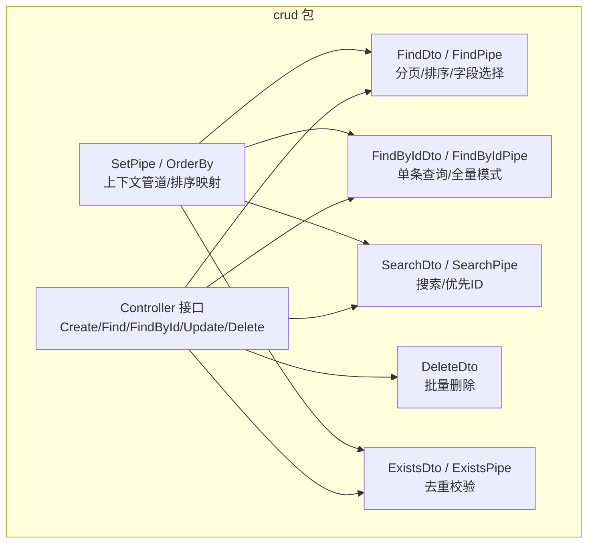
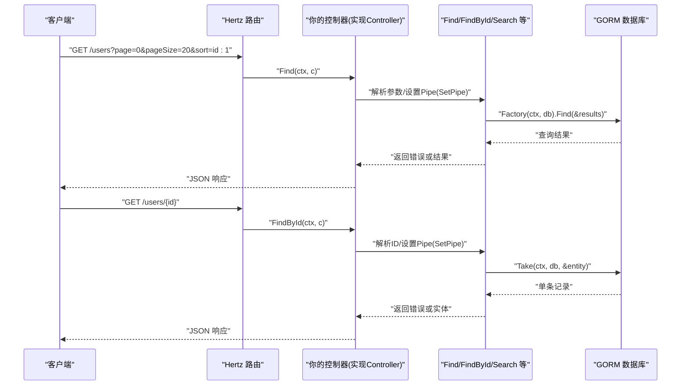
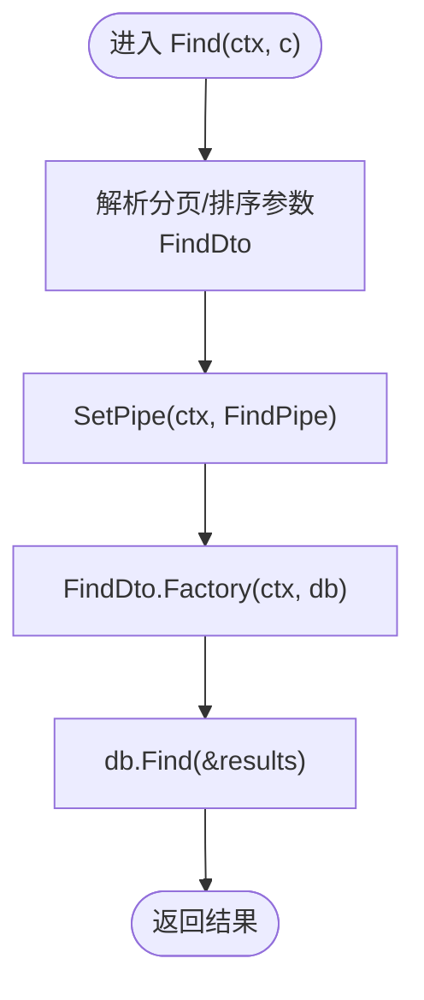
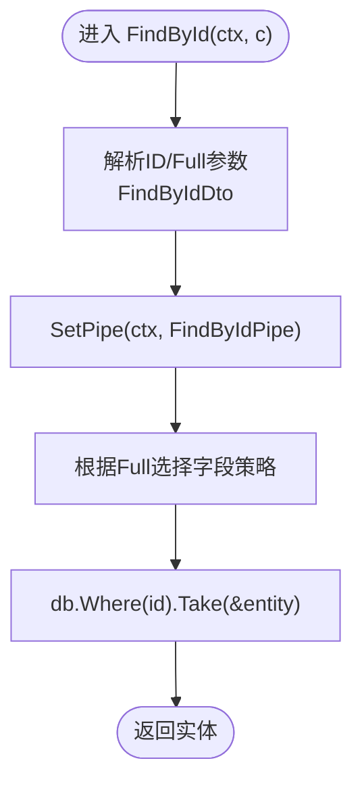
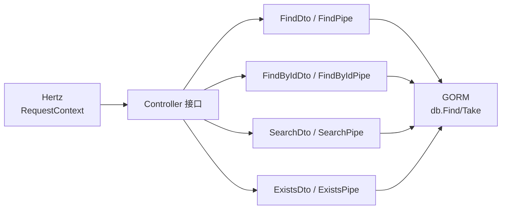

# 快速开始

<cite>
**本文引用的文件**
- [go.mod](file://go.mod)
- [controller.go](file://controller.go)
- [find.go](file://find.go)
- [find_by_id.go](file://find_by_id.go)
- [search.go](file://search.go)
- [delete.go](file://delete.go)
- [exists.go](file://exists.go)
</cite>

## 目录
1. [简介](#简介)
2. [项目结构](#项目结构)
3. [核心组件](#核心组件)
4. [架构总览](#架构总览)
5. [详细组件分析](#详细组件分析)
6. [依赖关系分析](#依赖关系分析)
7. [性能注意事项](#性能注意事项)
8. [故障排查指南](#故障排查指南)
9. [结论](#结论)
10. [附录：最小可运行示例清单](#附录最小可运行示例清单)

## 简介
本指南面向新手开发者，目标是在5分钟内完成一次“从零到一”的集成与验证：在新项目中通过 go.mod 引入依赖、定义一个实现 Controller 接口的结构体、注册 Hertz 路由、并调用 Find、FindById 等方法进行最小可运行测试。文中将逐项解释每一步的作用，并以“章节来源”和“图示来源”标注实现依据，确保你可以直接复制粘贴到你的项目中。

## 项目结构
该仓库提供一组围绕 Hertz 框架与 GORM 的通用 CRUD 工具集，核心包含：
- 控制器接口定义：用于统一 CRUD 入口
- 查询与分页工具：FindDto、FindPipe
- 单条查询工具：FindByIdDto、FindByIdPipe
- 搜索工具：SearchDto、SearchPipe
- 删除与存在性检查：DeleteDto、ExistsDto、ExistsPipe
- 上下文管道注入：SetPipe

图表来源
- [controller.go](file://controller.go#L11-L24)
- [find.go](file://find.go#L13-L154)
- [find_by_id.go](file://find_by_id.go#L9-L103)
- [search.go](file://search.go#L13-L111)
- [delete.go](file://delete.go#L3-L8)
- [exists.go](file://exists.go#L12-L66)

章节来源
- [go.mod](file://go.mod#L1-L13)
- [controller.go](file://controller.go#L11-L38)

## 核心组件
- Controller 接口：定义标准 CRUD 方法签名，供你的业务控制器实现。[接口定义路径](file://controller.go#L11-L24)
- 查询与分页（Find）：通过 FindDto 和 FindPipe 组合实现分页、排序、字段选择/排除、默认时间戳隐藏等能力。[数据对象与工厂路径](file://find.go#L13-L154)
- 单条查询（FindById）：通过 FindByIdDto 和 FindByIdPipe 实现按 ID 查询，支持普通模式与“全量模式”的字段选择策略。[数据对象与取数路径](file://find_by_id.go#L9-L103)
- 搜索（Search）：支持关键词搜索、异步模式限制、指定返回字段、优先展示已知 ID 的结果。[数据对象与工厂路径](file://search.go#L13-L111)
- 删除（Delete）：批量删除 DTO，包含 ids 列表。[数据对象路径](file://delete.go#L3-L8)
- 存在性检查（Exists）：对指定字段进行去重校验，受 ExistsPipe 限制允许的字段集合。[数据对象与校验路径](file://exists.go#L12-L66)
- 上下文管道（SetPipe / OrderBy）：通过 SetPipe 将 Pipe 配置注入到 context 中，供各查询方法读取；OrderBy 提供排序方向映射。[上下文注入与排序映射路径](file://controller.go#L26-L38)

章节来源
- [controller.go](file://controller.go#L11-L38)
- [find.go](file://find.go#L13-L154)
- [find_by_id.go](file://find_by_id.go#L9-L103)
- [search.go](file://search.go#L13-L111)
- [delete.go](file://delete.go#L3-L8)
- [exists.go](file://exists.go#L12-L66)

## 架构总览
下面的序列图展示了“最小可运行示例”的关键流程：客户端发起请求 -> Hertz 路由 -> 你的控制器实现 -> 使用 Find/FindById 执行查询 -> 返回结果。

图表来源
- [controller.go](file://controller.go#L11-L24)
- [find.go](file://find.go#L116-L154)
- [find_by_id.go](file://find_by_id.go#L76-L103)
- [search.go](file://search.go#L79-L111)

## 详细组件分析

### 步骤一：通过 go.mod 引入依赖
- 在你的新项目中，将本仓库作为模块引入。go.mod 中声明了模块名、Go 版本与间接依赖（如 gorm.io/gorm、github.com/cloudwego/hertz 等）。[模块与依赖声明路径](file://go.mod#L1-L13)
- 作用：确保你的项目能正确解析 crud 包及其内部对 Hertz/GORM 的依赖。

章节来源
- [go.mod](file://go.mod#L1-L13)

### 步骤二：定义一个实现 Controller 接口的结构体
- Controller 接口包含 Create、Find、FindById、Update、Delete 五个方法，分别处理资源的增删改查入口。[接口定义路径](file://controller.go#L11-L24)
- 作用：为你的业务控制器提供统一的方法签名，便于路由绑定与中间件复用。

章节来源
- [controller.go](file://controller.go#L11-L24)

### 步骤三：注册 Hertz 路由
- 你需要在 Hertz 中为你的控制器绑定路由，例如：
  - GET /users -> Find
  - GET /users/{id} -> FindById
- 这些路由会调用你控制器的对应方法，方法内部再使用 Find/FindById 等工具完成查询。

章节来源
- [controller.go](file://controller.go#L11-L24)

### 步骤四：最小可运行示例（Find）
- 目标：在控制器的 Find 方法中，解析分页与排序参数，设置 Pipe 并执行查询。
- 关键点：
  - 使用 FindDto 解析分页与排序参数（如页码、每页大小、排序规则）。[数据对象路径](file://find.go#L13-L23)
  - 使用 SetPipe 将 FindPipe 注入到 context，以便 Find.Factory 读取配置。[上下文注入路径](file://controller.go#L26-L30)
  - 使用 Find.Find 执行查询并将结果写入切片变量。[执行方法路径](file://find.go#L147-L154)

图表来源
- [find.go](file://find.go#L13-L154)
- [controller.go](file://controller.go#L26-L30)

章节来源
- [find.go](file://find.go#L13-L154)
- [controller.go](file://controller.go#L26-L30)

### 步骤五：最小可运行示例（FindById）
- 目标：在控制器的 FindById 方法中，解析 ID 与 full 参数，设置 Pipe 并执行单条查询。
- 关键点：
  - 使用 FindByIdDto 解析 ID 与 full 参数。[数据对象路径](file://find_by_id.go#L9-L16)
  - 使用 SetPipe 将 FindByIdPipe 注入到 context，以便 Take 读取配置。[上下文注入路径](file://controller.go#L26-L30)
  - 使用 Take(ctx, db, &entity) 获取单条记录。[取数方法路径](file://find_by_id.go#L76-L103)

图表来源
- [find_by_id.go](file://find_by_id.go#L76-L103)
- [controller.go](file://controller.go#L26-L30)

章节来源
- [find_by_id.go](file://find_by_id.go#L9-L103)
- [controller.go](file://controller.go#L26-L30)

### 可选：搜索与存在性检查
- 搜索（Search）：支持关键词、异步限制、字段选择、优先 ID 展示。[数据对象与工厂路径](file://search.go#L13-L111)
- 存在性检查（Exists）：对指定字段进行去重校验，受允许字段集合限制。[数据对象与校验路径](file://exists.go#L12-L66)

章节来源
- [search.go](file://search.go#L13-L111)
- [exists.go](file://exists.go#L12-L66)

## 依赖关系分析
- 外部依赖：
  - github.com/cloudwego/hertz：HTTP 框架，提供 RequestContext 等类型。[接口参数类型路径](file://controller.go#L11-L24)
  - gorm.io/gorm：ORM，提供数据库查询与事务能力。[查询方法路径](file://find.go#L147-L154)
- 内部依赖：
  - 各 DTO 与 Pipe 之间通过 context 传递配置，避免层层传参，提升可维护性。[上下文注入路径](file://controller.go#L26-L30)

图表来源
- [controller.go](file://controller.go#L11-L24)
- [find.go](file://find.go#L116-L154)
- [find_by_id.go](file://find_by_id.go#L76-L103)
- [search.go](file://search.go#L79-L111)
- [exists.go](file://exists.go#L36-L66)

章节来源
- [controller.go](file://controller.go#L11-L24)
- [find.go](file://find.go#L116-L154)
- [find_by_id.go](file://find_by_id.go#L76-L103)
- [search.go](file://search.go#L79-L111)
- [exists.go](file://exists.go#L36-L66)

## 性能注意事项
- 分页与排序：
  - FindDto 默认启用分页与排序，建议在高并发场景下合理设置 pageSize，避免一次性返回过多数据。[分页与排序路径](file://find.go#L13-L23)
  - Sort 支持多字段排序，注意数据库索引设计以降低排序成本。[排序工厂路径](file://find.go#L116-L145)
- 字段选择：
  - FindPipe/FindByIdPipe 支持 Select/Omit，尽量只返回前端需要的字段，减少网络与序列化开销。[字段选择路径](file://find.go#L103-L114)
- 搜索限制：
  - SearchPipe 默认限制异步模式返回数量，避免搜索接口成为性能瓶颈。[异步限制路径](file://search.go#L79-L87)

[本节为通用建议，不直接分析具体文件，故无章节来源]

## 故障排查指南
- 控制器未实现接口方法：
  - 确保你的结构体实现了 Create/Find/FindById/Update/Delete 五个方法。[接口定义路径](file://controller.go#L11-L24)
- 上下文管道未注入：
  - 未调用 SetPipe(ctx, pipe) 导致 Find/FindById 等方法无法读取配置。[上下文注入路径](file://controller.go#L26-L30)
- 查询结果为空：
  - 检查分页参数是否合理（page/pageSize），确认数据库中存在匹配数据。[分页计算路径](file://find.go#L25-L36)
- 单条查询失败：
  - 确认 ID 是否正确，Full 模式下的字段选择是否覆盖了必要字段。[取数路径](file://find_by_id.go#L76-L103)
- 搜索结果异常：
  - 检查 q/ids/m 参数是否符合预期，确认 SearchPipe 的 keys 设置是否满足前端展示需求。[工厂与查找路径](file://search.go#L79-L111)

章节来源
- [controller.go](file://controller.go#L11-L38)
- [find.go](file://find.go#L25-L36)
- [find_by_id.go](file://find_by_id.go#L76-L103)
- [search.go](file://search.go#L79-L111)

## 结论
通过以上步骤，你可以在5分钟内完成 go-crud 库的首次集成：引入依赖、实现 Controller 接口、注册 Hertz 路由，并使用 Find/FindById 完成最小可运行示例。后续可根据业务扩展 Search、Exists、Delete 等能力，逐步完善你的 CRUD 能力。

[本节为总结，不直接分析具体文件，故无章节来源]

## 附录：最小可运行示例清单
- 引入依赖：参考 [go.mod](file://go.mod#L1-L13)
- 实现 Controller 接口：参考 [controller.go](file://controller.go#L11-L24)
- 注册 Hertz 路由：绑定 GET /users -> Find，GET /users/{id} -> FindById
- Find 最小示例：
  - 解析参数：参考 [find.go](file://find.go#L13-L23)
  - 注入管道：参考 [controller.go](file://controller.go#L26-L30)
  - 执行查询：参考 [find.go](file://find.go#L147-L154)
- FindById 最小示例：
  - 解析参数：参考 [find_by_id.go](file://find_by_id.go#L9-L16)
  - 注入管道：参考 [controller.go](file://controller.go#L26-L30)
  - 执行取数：参考 [find_by_id.go](file://find_by_id.go#L76-L103)

章节来源
- [go.mod](file://go.mod#L1-L13)
- [controller.go](file://controller.go#L11-L38)
- [find.go](file://find.go#L13-L154)
- [find_by_id.go](file://find_by_id.go#L9-L103)