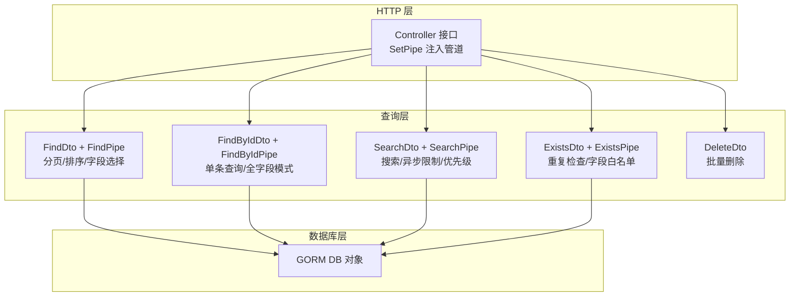
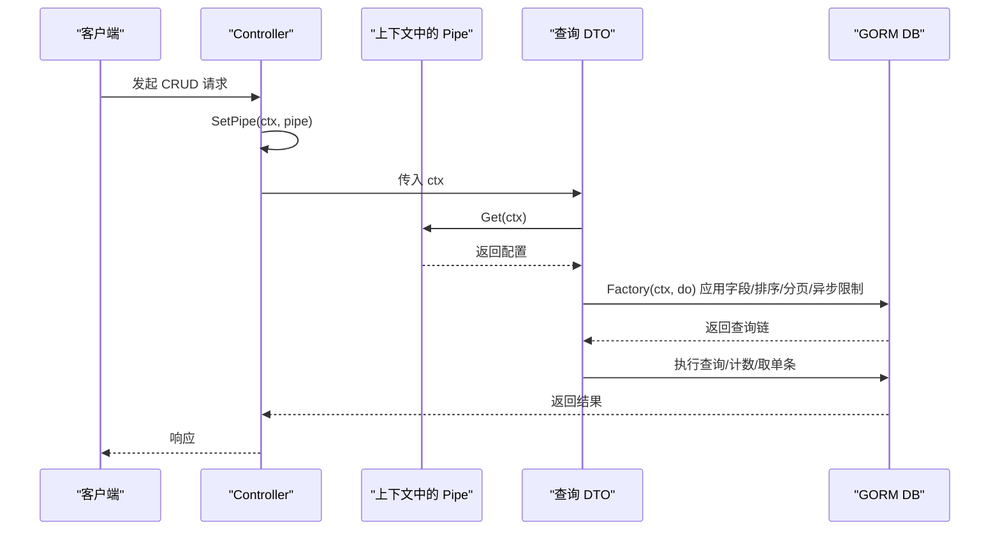
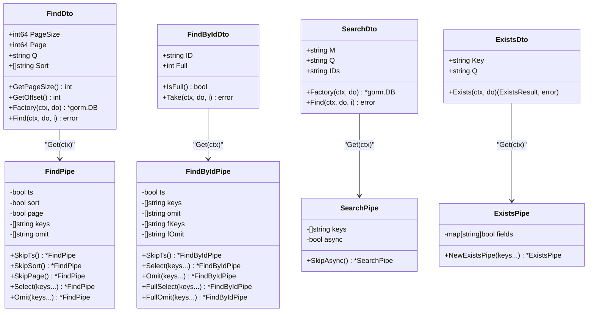
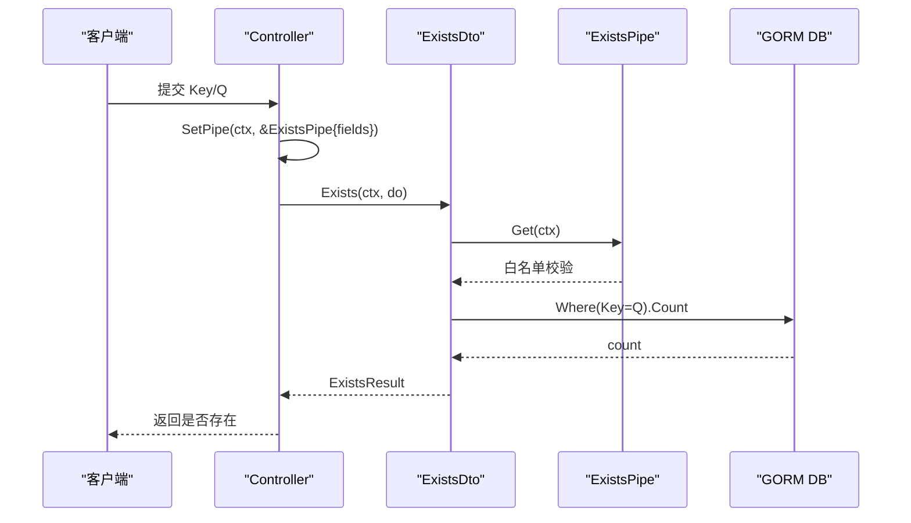
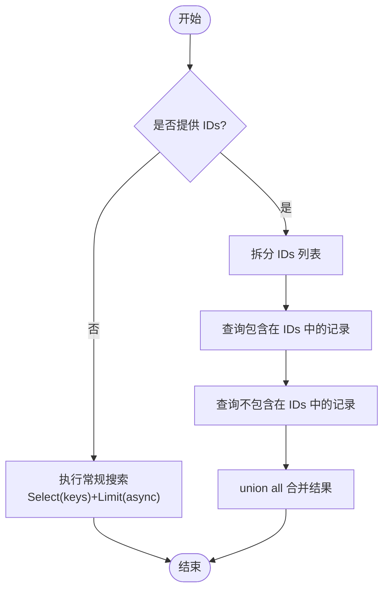
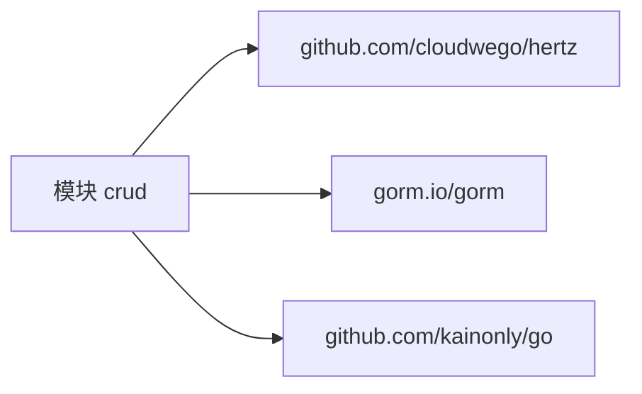

# 最佳实践

<cite>
**本文引用的文件**
- [controller.go](file://controller.go)
- [find.go](file://find.go)
- [find_by_id.go](file://find_by_id.go)
- [search.go](file://search.go)
- [exists.go](file://exists.go)
- [delete.go](file://delete.go)
- [go.mod](file://go.mod)
</cite>

## 目录
1. [简介](#简介)
2. [项目结构](#项目结构)
3. [核心组件](#核心组件)
4. [架构总览](#架构总览)
5. [详细组件分析](#详细组件分析)
6. [依赖分析](#依赖分析)
7. [性能考量](#性能考量)
8. [故障排查指南](#故障排查指南)
9. [结论](#结论)
10. [附录](#附录)

## 简介
本库提供基于 Hertz 框架与 GORM 的通用 CRUD 能力，围绕“管道（Pipe）”配置思想，将查询行为的字段选择、排序、分页、异步限制等能力解耦到独立的 Pipe 结构体中，便于在不同场景下灵活组合。本文档聚焦于以下高级主题：
- 如何设计 Pipe 结构体以支持复杂查询逻辑
- 在高并发场景下优化 GORM 查询性能
- 利用 Exists 功能防止数据重复的业务模式
- 通过 SearchPipe 实现 ID 优先级排序的搜索策略
- 批量删除操作的安全控制
- 基于现有实现提炼可复用的编码范式，并警示常见陷阱（如过度使用全字段模式导致性能下降）

## 项目结构
该仓库采用按职责拆分的文件组织方式，每个文件对应一类 CRUD 能力或通用工具：
- 控制器接口与上下文管道注入：controller.go
- 分页与筛选查询：find.go
- 单条记录查询（含“全字段模式”）：find_by_id.go
- 搜索查询与优先级排序：search.go
- 重复检查与白名单字段控制：exists.go
- 批量删除 DTO：delete.go
- 依赖声明：go.mod

图表来源
- [controller.go](file://controller.go#L11-L37)
- [find.go](file://find.go#L13-L153)
- [find_by_id.go](file://find_by_id.go#L9-L102)
- [search.go](file://search.go#L13-L110)
- [exists.go](file://exists.go#L12-L65)
- [delete.go](file://delete.go#L3-L7)

章节来源
- [controller.go](file://controller.go#L11-L37)
- [find.go](file://find.go#L13-L153)
- [find_by_id.go](file://find_by_id.go#L9-L102)
- [search.go](file://search.go#L13-L110)
- [exists.go](file://exists.go#L12-L65)
- [delete.go](file://delete.go#L3-L7)

## 核心组件
- 控制器接口与上下文管道注入
  - 定义标准 CRUD 方法签名，统一入口
  - 提供 SetPipe 将 Pipe 配置注入到请求上下文中，供各查询方法读取
- 查询 DTO 与 Pipe
  - FindDto/FindPipe：支持分页、排序、字段选择/排除、时间戳字段默认处理
  - FindByIdDto/FindByIdPipe：支持普通模式与“全字段模式”，分别控制字段选择/排除
  - SearchDto/SearchPipe：支持异步模式限制与字段选择；提供 ID 优先级合并查询
  - ExistsDto/ExistsPipe：通过白名单字段控制重复检查范围，避免任意字段注入
- 批量删除 DTO
  - DeleteDto：承载批量删除的 ID 列表

章节来源
- [controller.go](file://controller.go#L11-L37)
- [find.go](file://find.go#L13-L153)
- [find_by_id.go](file://find_by_id.go#L9-L102)
- [search.go](file://search.go#L13-L110)
- [exists.go](file://exists.go#L12-L65)
- [delete.go](file://delete.go#L3-L7)

## 架构总览
下图展示从控制器到具体查询实现的整体流程，以及 Pipe 如何贯穿各阶段。

图表来源
- [controller.go](file://controller.go#L26-L37)
- [find.go](file://find.go#L116-L153)
- [find_by_id.go](file://find_by_id.go#L76-L102)
- [search.go](file://search.go#L79-L110)
- [exists.go](file://exists.go#L47-L65)

## 详细组件分析

### 设计 Pipe 结构体以支持复杂查询逻辑
- 字段选择与排除
  - FindPipe/FindByIdPipe 支持 Select/Omit；当 Select 设置时，Omit 被忽略，确保显式白名单优先
  - FindByIdPipe 进一步区分普通模式与全字段模式下的字段选择/排除
- 排序与分页
  - FindPipe 支持 Sort 规则解析并映射到 SQL 排序方向；默认无 Sort 且开启时间戳时按创建时间倒序
  - FindDto 默认分页大小上限与偏移计算，避免超大页码导致资源浪费
- 异步限制与字段裁剪
  - SearchPipe 默认开启异步限制（限制返回数量），并允许自定义选择字段，满足前端快速渲染需求
- 上下文注入与获取
  - SetPipe 将 Pipe 写入上下文；各 DTO 通过 Get(ctx) 获取 Pipe，保证跨层传递与解耦

图表来源
- [find.go](file://find.go#L13-L153)
- [find_by_id.go](file://find_by_id.go#L9-L102)
- [search.go](file://search.go#L13-L110)
- [exists.go](file://exists.go#L12-L65)

章节来源
- [find.go](file://find.go#L61-L153)
- [find_by_id.go](file://find_by_id.go#L22-L102)
- [search.go](file://search.go#L46-L110)
- [exists.go](file://exists.go#L20-L65)

### 高并发场景下的 GORM 查询性能优化
- 合理设置分页参数
  - FindDto 默认最大页大小与偏移计算，避免一次性拉取过多数据
  - 建议在高并发场景下将 PageSize 控制在较小范围，结合前端分页滚动加载
- 限制查询字段
  - 使用 Select/Omit 显式指定字段，减少网络传输与序列化开销
  - SearchPipe 默认异步限制，适合高频搜索场景
- 排序与索引
  - FindPipe 支持多字段排序规则；建议对常用排序字段建立合适索引
  - 默认按创建时间倒序有助于热点数据的快速检索
- 减少全字段模式
  - FindByIdPipe 的全字段模式会暴露更多字段，可能带来额外网络与序列化成本
  - 仅在必要时启用 Full 模式，避免全局默认开启

章节来源
- [find.go](file://find.go#L13-L153)
- [find_by_id.go](file://find_by_id.go#L9-L102)
- [search.go](file://search.go#L46-L110)

### 利用 Exists 功能防止数据重复的业务模式
- 字段白名单控制
  - ExistsPipe 通过构造字段白名单，仅允许预设字段进行重复检查，避免任意字段注入风险
- 计数查询
  - Exists 通过 Count 统计匹配数量，返回布尔结果，适合幂等写入前的校验
- 使用建议
  - 在创建/更新前调用 Exists，结合业务事务，确保唯一性约束在应用层得到保障
  - 将 Key/Q 参数来自受控输入（如表单验证），避免用户直接传入任意字段名

图表来源
- [exists.go](file://exists.go#L12-L65)
- [controller.go](file://controller.go#L26-L37)

章节来源
- [exists.go](file://exists.go#L12-L65)
- [controller.go](file://controller.go#L26-L37)

### 通过 SearchPipe 实现 ID 优先级排序的搜索策略
- 优先级策略
  - 当 SearchDto 携带 IDs 参数时，先查询这些 ID 的记录，再查询其他记录，最后通过 union all 合并，使已知 ID 优先显示
- 异步限制
  - SearchPipe 默认限制返回数量，适合前端快速联想/搜索场景
- 字段选择
  - 可通过 SearchPipe.keys 自定义返回字段，满足轻量展示需求

图表来源
- [search.go](file://search.go#L89-L110)

章节来源
- [search.go](file://search.go#L13-L110)

### 批量删除操作的安全控制
- 输入约束
  - DeleteDto 仅包含 IDs 列表，避免误删或越权删除
- 建议的安全实践
  - 在执行批量删除前进行权限校验与存在性检查
  - 对外暴露的批量删除接口应限制每次删除的数量，防止滥用
  - 建议引入软删除或审计日志，便于回溯与恢复

章节来源
- [delete.go](file://delete.go#L3-L7)

## 依赖分析
- 外部依赖
  - Hertz：HTTP 框架
  - GORM：ORM 与查询链构建
  - kainonly/go：错误封装与工具函数
- 版本与兼容性
  - go 1.25
  - gorm.io/gorm v1.31.1

图表来源
- [go.mod](file://go.mod#L1-L12)

章节来源
- [go.mod](file://go.mod#L1-L12)

## 性能考量
- 字段裁剪优先
  - 仅选择需要的字段，避免全字段模式带来的网络与序列化压力
- 分页与限流
  - 合理设置 PageSize 与异步限制，降低数据库与网络负载
- 索引与排序
  - 对高频排序与过滤字段建立索引，减少全表扫描
- 并发连接池
  - 配置合适的数据库连接池大小，避免连接争用导致的排队延迟
- 缓存策略
  - 对热点查询结果进行缓存（如搜索结果），减少重复查询

## 故障排查指南
- 重复检查失败
  - 现象：Exists 返回错误提示字段不在白名单
  - 原因：Key 不在 ExistsPipe 允许列表
  - 处理：在 SetPipe 时正确初始化白名单字段
- 查询结果异常
  - 现象：分页/排序不符合预期
  - 原因：Sort 规则格式不正确或未设置，默认按创建时间倒序
  - 处理：检查 Sort 格式与 OrderBy 映射，或显式设置 SkipTs/SkipSort
- 搜索结果顺序异常
  - 现象：ID 优先级未生效
  - 原因：未提供 IDs 或 IDs 格式不正确
  - 处理：确认 IDs 为逗号分隔的合法字符串
- 批量删除无效
  - 现象：删除数量与预期不符
  - 处理：核对 DeleteDto 的 IDs 列表与权限校验逻辑

章节来源
- [exists.go](file://exists.go#L47-L65)
- [find.go](file://find.go#L116-L153)
- [search.go](file://search.go#L89-L110)
- [delete.go](file://delete.go#L3-L7)

## 结论
通过将查询行为抽象为可组合的 Pipe，本库实现了高度可配置与可扩展的 CRUD 能力。在实际工程中，建议：
- 以 Pipe 为中心设计查询策略，明确字段选择、排序、分页与异步限制
- 在高并发场景下严格控制字段与分页规模，配合索引与连接池优化
- 使用 Exists 的白名单机制保障幂等写入安全
- 采用 SearchPipe 的 ID 优先级策略提升用户体验
- 对批量删除实施安全控制与数量限制

## 附录
- 编码范式建议
  - 使用 SetPipe 注入 Pipe，DTO 通过 Get(ctx) 获取配置，保持清晰的职责边界
  - 优先使用 Select/Omit 显式字段，避免全字段模式
  - 对高频查询使用异步限制与分页，结合索引优化
  - 在写入前使用 Exists 进行重复检查，确保业务一致性
  - 批量删除接口需配合权限校验与审计日志