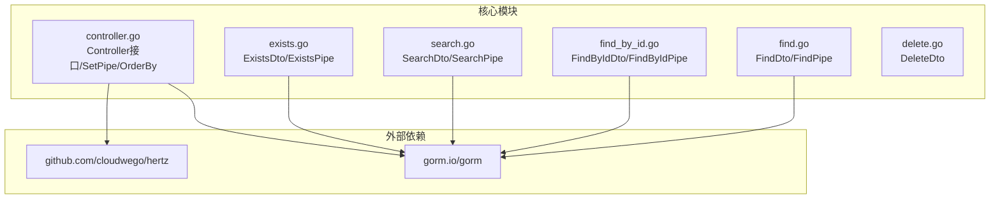
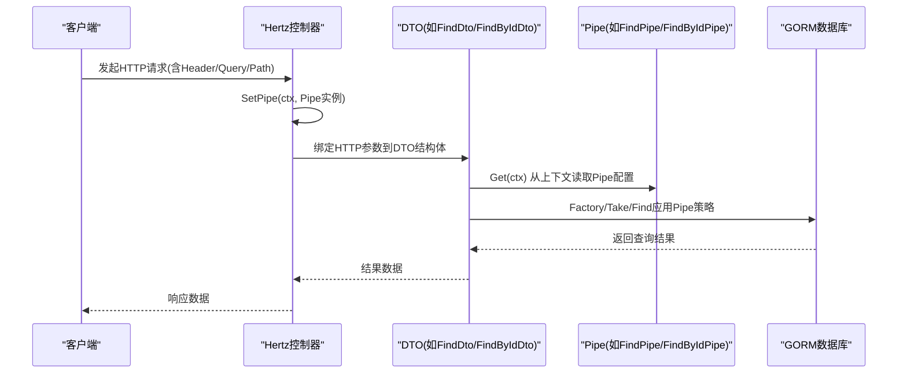
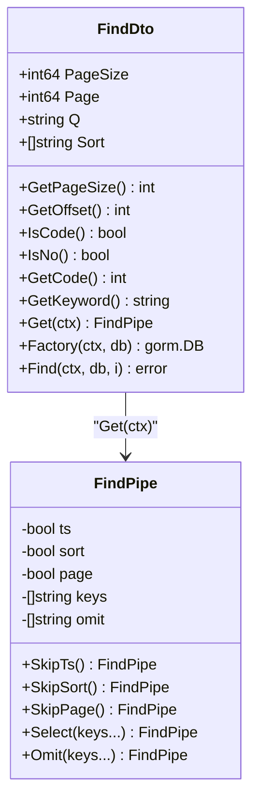
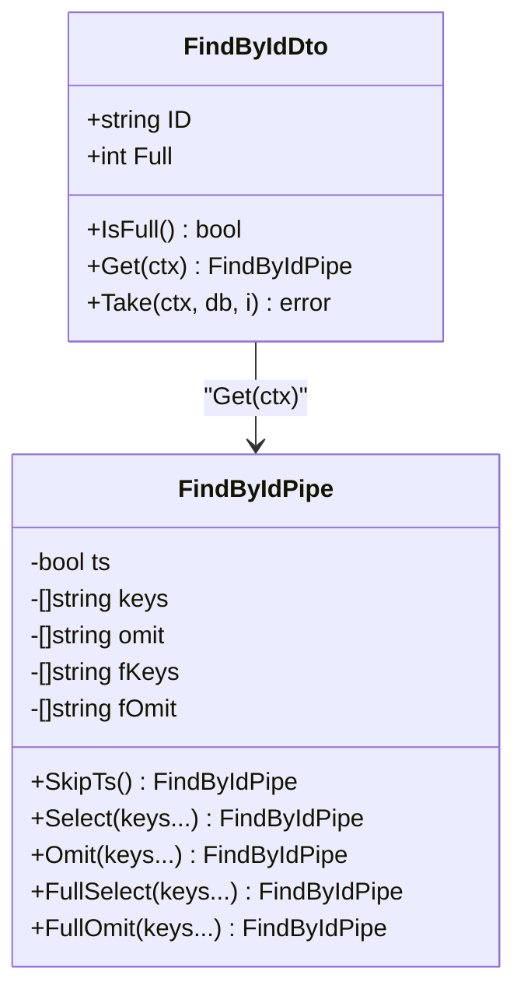
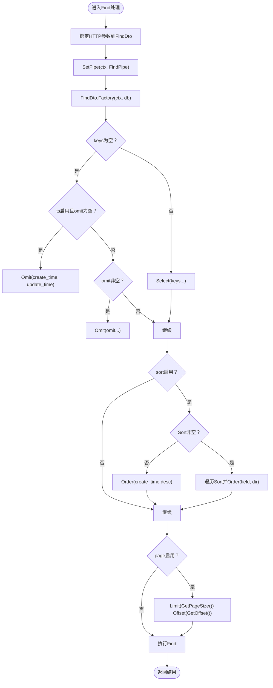
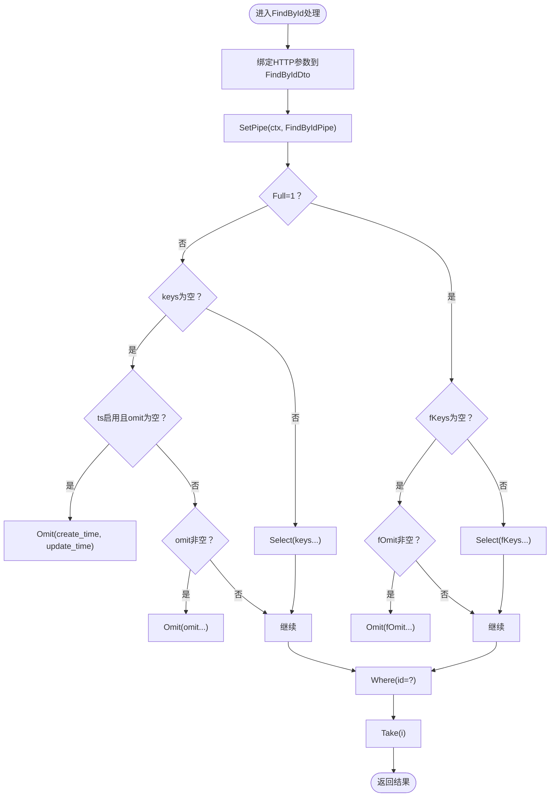
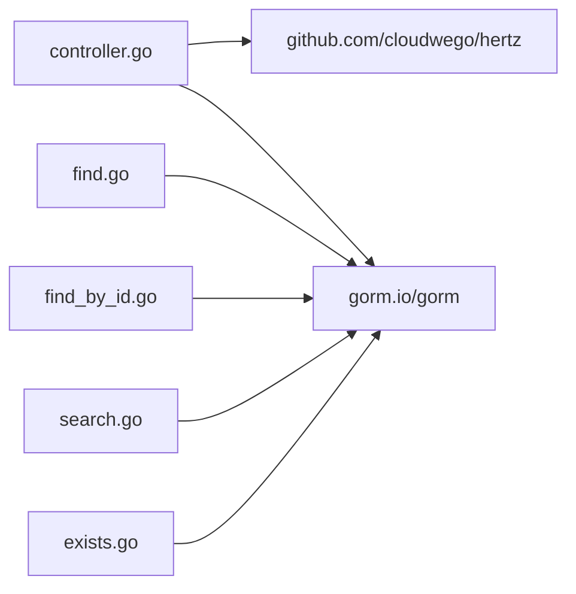

# 数据传输对象

<cite>
**本文引用的文件列表**
- [find.go](file://find.go)
- [find_by_id.go](file://find_by_id.go)
- [controller.go](file://controller.go)
- [search.go](file://search.go)
- [exists.go](file://exists.go)
- [delete.go](file://delete.go)
- [go.mod](file://go.mod)
</cite>

## 目录
1. [简介](#简介)
2. [项目结构](#项目结构)
3. [核心组件](#核心组件)
4. [架构总览](#架构总览)
5. [详细组件分析](#详细组件分析)
6. [依赖分析](#依赖分析)
7. [性能考虑](#性能考虑)
8. [故障排查指南](#故障排查指南)
9. [结论](#结论)
10. [附录](#附录)

## 简介
本文件系统性阐述go-crud库中数据传输对象（DTO）的设计与作用，重点聚焦以下两个DTO：
- FindDto：用于分页查询的通用DTO，包含页大小、页码、关键词、排序规则等字段，并通过HTTP头、查询参数进行绑定；同时提供GetPageSize、GetOffset、IsCode、IsNo、GetKeyword等辅助方法，封装请求解析与业务逻辑。
- FindByIdDto：用于按ID获取单条记录的DTO，包含路径参数ID与查询参数Full（是否开启“全量字段”模式），并提供IsFull方法与Take方法，结合Pipe配置驱动GORM查询。

此外，本文还说明DTO与Pipe的协作机制：通过SetPipe将Pipe配置注入到context中，DTO通过Get方法从上下文中提取Pipe配置，从而将请求参数与查询行为定制（字段选择、排除、排序、分页、时间戳处理等）解耦，实现类型安全与代码清晰。

## 项目结构
该仓库采用按功能模块划分的文件组织方式，每个文件对应一类DTO与其相关Pipe配置和工厂方法，便于复用与扩展。

图表来源
- [find.go](file://find.go#L1-L154)
- [find_by_id.go](file://find_by_id.go#L1-L103)
- [controller.go](file://controller.go#L1-L38)
- [search.go](file://search.go#L1-L110)
- [exists.go](file://exists.go#L1-L66)
- [delete.go](file://delete.go#L1-L8)
- [go.mod](file://go.mod#L1-L13)

章节来源
- [find.go](file://find.go#L1-L154)
- [find_by_id.go](file://find_by_id.go#L1-L103)
- [controller.go](file://controller.go#L1-L38)
- [go.mod](file://go.mod#L1-L13)

## 核心组件
- FindDto：分页查询DTO，字段绑定HTTP头与查询参数，提供分页与关键词解析辅助方法。
- FindPipe：FindDto的管道配置，控制字段选择/排除、排序、分页、时间戳处理等。
- FindByIdDto：按ID查询DTO，字段绑定路径与查询参数，提供全量模式判断与取数方法。
- FindByIdPipe：FindByIdDto的管道配置，支持普通模式与全量模式下的字段选择/排除。
- Controller接口与SetPipe：统一的控制器接口与上下文管道注入工具。
- OrderBy映射：将排序方向指示转换为SQL排序关键字。

章节来源
- [find.go](file://find.go#L1-L154)
- [find_by_id.go](file://find_by_id.go#L1-L103)
- [controller.go](file://controller.go#L1-L38)

## 架构总览
DTO与Pipe协作的整体流程如下：Hertz控制器在进入业务逻辑前，先通过SetPipe将Pipe配置写入context；随后在处理请求时，控制器使用对应DTO绑定HTTP参数，DTO再从context读取Pipe配置，最终将请求参数与Pipe策略组合，驱动GORM执行查询。

图表来源
- [controller.go](file://controller.go#L25-L38)
- [find.go](file://find.go#L116-L154)
- [find_by_id.go](file://find_by_id.go#L76-L103)

## 详细组件分析

### FindDto与FindPipe
- 字段与HTTP绑定
  - PageSize：通过HTTP头绑定，用于设置每页数量，默认最大值限制。
  - Page：通过HTTP头绑定，0基页码。
  - Q：通过查询参数绑定，作为过滤关键词。
  - Sort：通过查询参数绑定，数组格式，元素为“字段:方向”，方向由OrderBy映射转换。
- 辅助方法
  - GetPageSize：若未指定则返回默认最大值。
  - GetOffset：根据页码与页大小计算偏移。
  - IsCode/IsNo/GetCode：对Q进行模式识别与转换，便于快速分支处理。
  - GetKeyword：将Q包装为SQL LIKE通配符形式。
- Pipe配置
  - ts：是否默认排除时间戳字段。
  - sort：是否启用排序。
  - page：是否启用分页。
  - keys/omit：普通模式下选择或排除字段。
- 工厂方法与查询
  - Factory：根据Pipe与DTO参数组装GORM链式调用，包括字段选择/排除、排序、分页。
  - Find：执行查询并将结果写入目标切片。

图表来源
- [find.go](file://find.go#L1-L154)

章节来源
- [find.go](file://find.go#L1-L154)
- [controller.go](file://controller.go#L25-L38)

### FindByIdDto与FindByIdPipe
- 字段与HTTP绑定
  - ID：通过路径参数绑定，唯一标识资源。
  - Full：通过查询参数绑定，1表示开启“全量字段模式”，否则为普通模式。
- 辅助方法
  - IsFull：判断是否开启全量模式。
- Pipe配置
  - ts：默认开启时间戳处理。
  - keys/omit：普通模式下的字段选择/排除。
  - fKeys/fOmit：全量模式下的字段选择/排除。
- 取数方法
  - Take：根据Full状态选择不同字段策略，然后按ID取单条记录。

图表来源
- [find_by_id.go](file://find_by_id.go#L1-L103)

章节来源
- [find_by_id.go](file://find_by_id.go#L1-L103)
- [controller.go](file://controller.go#L25-L38)

### DTO与Pipe协作流程（以FindDto为例）

图表来源
- [find.go](file://find.go#L116-L154)

章节来源
- [find.go](file://find.go#L116-L154)

### DTO与Pipe协作流程（以FindByIdDto为例）

图表来源
- [find_by_id.go](file://find_by_id.go#L76-L103)

章节来源
- [find_by_id.go](file://find_by_id.go#L76-L103)

### 其他DTO参考（便于理解整体设计）
- SearchDto/SearchPipe：用于搜索场景，支持异步模式限制与优先级合并查询。
- ExistsDto/ExistsPipe：用于重复检查，限定允许的字段集合。
- DeleteDto：批量删除的ID列表。

章节来源
- [search.go](file://search.go#L1-L110)
- [exists.go](file://exists.go#L1-L66)
- [delete.go](file://delete.go#L1-L8)

## 依赖分析
- 外部依赖
  - Hertz：用于HTTP请求上下文与路由绑定。
  - GORM：用于数据库查询与链式构建。
- 内部依赖
  - Controller接口与SetPipe：为所有DTO提供统一的上下文管道注入能力。
  - OrderBy：将排序方向映射为SQL排序关键字。

图表来源
- [controller.go](file://controller.go#L1-L38)
- [find.go](file://find.go#L1-L154)
- [find_by_id.go](file://find_by_id.go#L1-L103)
- [search.go](file://search.go#L1-L110)
- [exists.go](file://exists.go#L1-L66)
- [go.mod](file://go.mod#L1-L13)

章节来源
- [go.mod](file://go.mod#L1-L13)
- [controller.go](file://controller.go#L1-L38)

## 性能考虑
- 分页与排序
  - 使用Factory集中处理Limit/Offset/Order，避免在控制器层重复拼装。
  - Sort数组逐项解析，建议限制长度与字段白名单，防止SQL注入与性能问题。
- 字段选择
  - keys优先于omit，减少网络与序列化开销；默认在ts启用时排除时间戳字段。
- 异步搜索
  - SearchPipe可限制返回条数，降低前端压力与数据库负载。
- 正则匹配
  - IsCode/IsNo使用预编译正则，注意在高频请求中缓存正则表达式以减少重复编译成本。

[本节为通用指导，不直接分析具体文件]

## 故障排查指南
- 请求参数未生效
  - 检查HTTP头与查询参数名称是否与DTO绑定标签一致（如PageSize/Page/Q/Sort/ID/Full）。
  - 确认控制器已通过SetPipe将Pipe实例注入context。
- 排序异常
  - 确认Sort格式为“字段:方向”，方向键需在OrderBy映射中存在。
- 分页不正确
  - 确认PageSize与Page的默认值逻辑符合预期；检查GetOffset计算是否与业务约定一致。
- 字段选择/排除无效
  - 若keys非空，则omit被忽略；确保只设置一个策略。
- 全量模式未生效
  - 确认Full=1且FindByIdPipe的fKeys/fOmit配置正确。

章节来源
- [find.go](file://find.go#L1-L154)
- [find_by_id.go](file://find_by_id.go#L1-L103)
- [controller.go](file://controller.go#L25-L38)

## 结论
通过DTO与Pipe的分离设计，go-crud库实现了请求参数解析、业务逻辑封装与数据库查询策略的清晰解耦。FindDto与FindByIdDto分别覆盖了“多条记录分页查询”和“单条记录按ID获取”的典型场景，配合SetPipe与Factory/Take/Find等方法，既保证了类型安全，又提升了代码可维护性与可测试性。建议在实际项目中：
- 在控制器入口统一注入Pipe配置；
- 将排序、分页、字段选择等策略集中在DTO的Factory/Take中；
- 对Sort与Q等输入进行白名单与长度限制，确保安全性与性能。

[本节为总结性内容，不直接分析具体文件]

## 附录

### 使用示例（Hertz控制器中绑定与使用DTO）
- 分页查询（FindDto）
  - 控制器在处理请求时，先通过SetPipe(ctx, NewFindPipe())注入Pipe配置，再将HTTP头与查询参数绑定到FindDto，最后调用FindDto.Find(ctx, db, &results)执行查询。
- 按ID查询（FindByIdDto）
  - 控制器同样先注入Pipe配置，将路径参数与查询参数绑定到FindByIdDto，再调用FindByIdDto.Take(ctx, db, &entity)获取单条记录。
- 关键点
  - DTO的Get(ctx)会从context中取出Pipe配置，确保查询策略与请求参数解耦。
  - 辅助方法（如GetPageSize/GetOffset/IsFull等）将常用业务逻辑内聚在DTO内部，简化控制器代码。

章节来源
- [controller.go](file://controller.go#L25-L38)
- [find.go](file://find.go#L116-L154)
- [find_by_id.go](file://find_by_id.go#L76-L103)