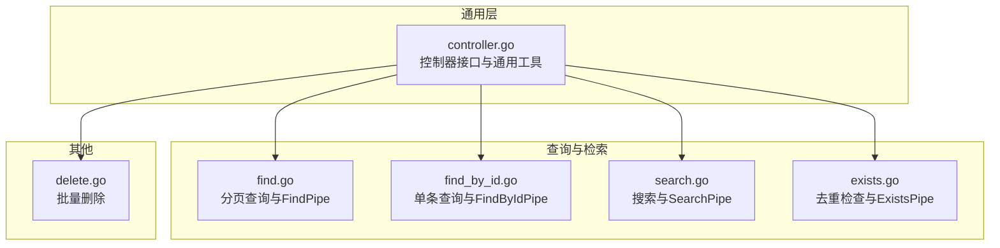
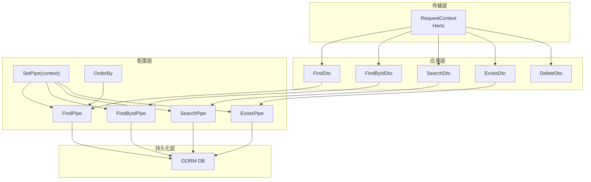
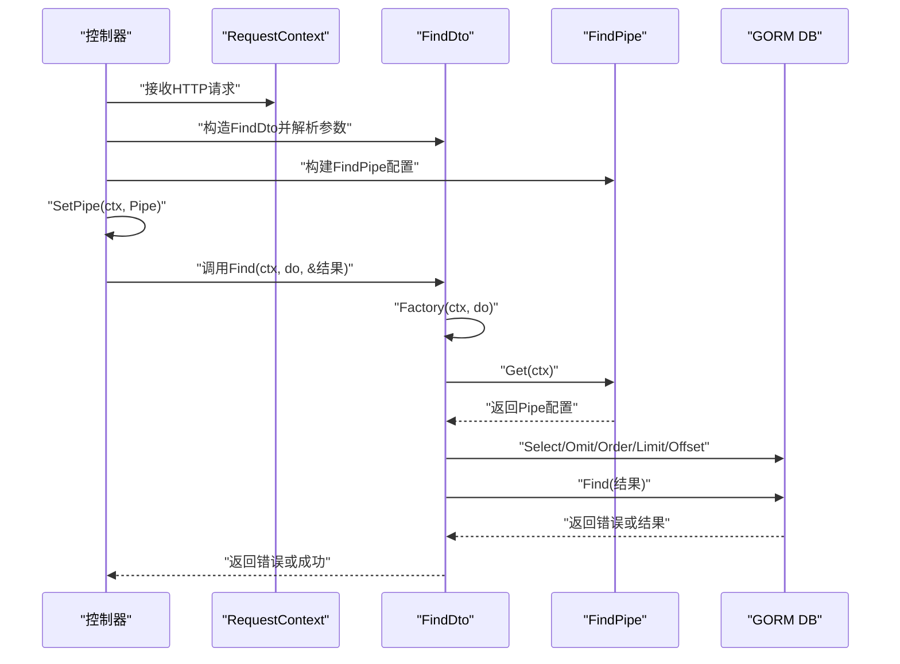
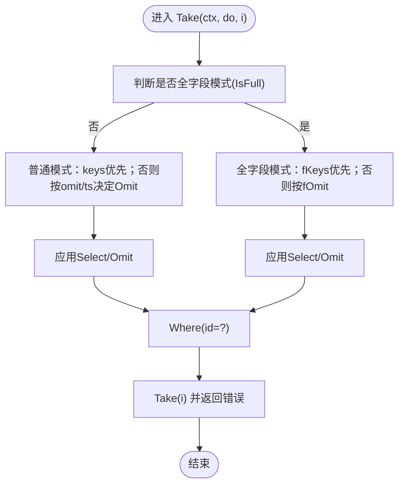
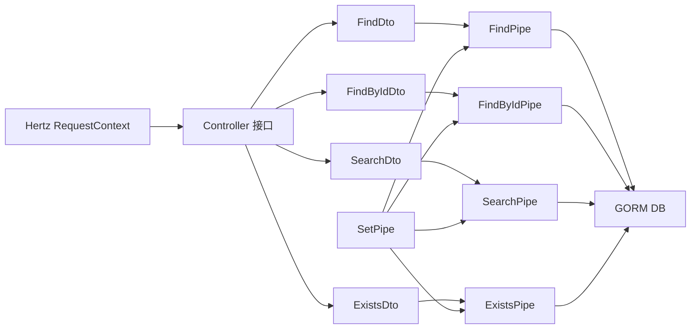

# 核心概念

<cite>
**本文引用的文件**
- [controller.go](file://controller.go)
- [find.go](file://find.go)
- [find_by_id.go](file://find_by_id.go)
- [search.go](file://search.go)
- [exists.go](file://exists.go)
- [delete.go](file://delete.go)
- [go.mod](file://go.mod)
</cite>

## 目录
1. [引言](#引言)
2. [项目结构](#项目结构)
3. [核心组件](#核心组件)
4. [架构总览](#架构总览)
5. [详细组件分析](#详细组件分析)
6. [依赖关系分析](#依赖关系分析)
7. [性能考量](#性能考量)
8. [故障排查指南](#故障排查指南)
9. [结论](#结论)

## 引言
本文件聚焦于go-crud库中两个关键设计模式：管道模式（Pipe Pattern）与数据传输对象（DTO）。我们将从“如何通过SetPipe与Pipe结构体（如FindPipe、FindByIdPipe）动态配置查询行为”入手，解释其如何实现关注点分离；同时结合find.go与find_by_id.go中的具体实现，阐明其执行流程。随后，我们阐述DTO在封装HTTP请求参数、类型安全校验与解耦传输层与数据层方面的价值，并以各操作对应的Dto结构体为例说明其协作方式。最后给出为何这种设计能提升灵活性与可维护性的理由。

## 项目结构
该仓库采用按功能分层的组织方式：
- 控制器接口与通用工具：controller.go
- 查询与检索相关：find.go、find_by_id.go、search.go、exists.go
- 批量删除：delete.go
- 依赖声明：go.mod

图表来源
- [controller.go](file://controller.go#L1-L38)
- [find.go](file://find.go#L1-L154)
- [find_by_id.go](file://find_by_id.go#L1-L103)
- [search.go](file://search.go#L1-L111)
- [exists.go](file://exists.go#L1-L66)
- [delete.go](file://delete.go#L1-L8)

章节来源
- [controller.go](file://controller.go#L1-L38)
- [find.go](file://find.go#L1-L154)
- [find_by_id.go](file://find_by_id.go#L1-L103)
- [search.go](file://search.go#L1-L111)
- [exists.go](file://exists.go#L1-L66)
- [delete.go](file://delete.go#L1-L8)

## 核心组件
- DTO（数据传输对象）
  - FindDto：封装分页查询的请求参数（页码、每页数量、关键词、排序），并提供工厂方法与查询执行方法。
  - FindByIdDto：封装按ID查询的请求参数（ID、是否全字段模式），并提供取数方法。
  - SearchDto：封装搜索请求参数（模式、关键词、优先ID列表），并提供工厂方法与查询执行方法。
  - ExistsDto：封装去重检查请求参数（键名、值），并提供检查方法。
  - DeleteDto：封装批量删除请求参数（ID列表）。
- Pipe（管道）
  - FindPipe：控制FindDto的字段选择、排除、排序、分页等行为。
  - FindByIdPipe：控制FindByIdDto的字段选择、排除、全字段模式下的字段选择与排除。
  - SearchPipe：控制SearchDto的字段选择与异步限制。
  - ExistsPipe：控制ExistsDto允许的字段集合。
- 通用工具
  - SetPipe：将Pipe配置存入context，供各DTO在运行时读取。
  - OrderBy：将排序方向映射为SQL关键字。

章节来源
- [find.go](file://find.go#L13-L154)
- [find_by_id.go](file://find_by_id.go#L9-L103)
- [search.go](file://search.go#L13-L111)
- [exists.go](file://exists.go#L12-L66)
- [delete.go](file://delete.go#L1-L8)
- [controller.go](file://controller.go#L26-L38)

## 架构总览
下图展示了“传输层（HTTP）—DTO—Pipe—GORM”的协作关系：HTTP请求参数由DTO解析与校验，Pipe作为可插拔的查询配置，最终由GORM执行数据库操作。

图表来源
- [controller.go](file://controller.go#L1-L38)
- [find.go](file://find.go#L13-L154)
- [find_by_id.go](file://find_by_id.go#L9-L103)
- [search.go](file://search.go#L13-L111)
- [exists.go](file://exists.go#L12-L66)

## 详细组件分析

### 管道模式（Pipe Pattern）详解
管道模式通过“配置对象（Pipe）+ 工厂方法（Factory）+ 执行方法（Find/Take/Exists/Find）”实现对查询行为的动态配置与组合，从而达到关注点分离与高内聚低耦合的目的。

- 关键要点
  - 配置对象（Pipe）：定义查询行为开关与字段策略（选择/排除/排序/分页/异步限制等）。
  - 工厂方法（Factory）：根据DTO与Pipe的组合，生成最终的GORM链式调用。
  - 执行方法：在Factory基础上执行查询或计数等操作。
  - 上下文注入：通过SetPipe将Pipe配置注入context，DTO在运行时读取。

- 典型流程（以FindDto/FindPipe为例）
  1) 控制器接收HTTP请求，创建FindDto并解析参数。
  2) 控制器调用SetPipe将FindPipe写入context。
  3) FindDto在Factory中读取Pipe配置，按需设置Select/Omit/Order/Limit/Offset。
  4) 最终调用Find执行查询并将结果写入目标切片。

图表来源
- [controller.go](file://controller.go#L26-L38)
- [find.go](file://find.go#L116-L154)

- 对比：FindByIdDto/FindByIdPipe
  - 区别在于FindByIdDto支持“全字段模式”，在Take中根据是否全字段分别应用不同的字段选择/排除策略。
  - FindByIdPipe新增了fKeys/fOmit用于全字段模式下的字段控制。

图表来源
- [find_by_id.go](file://find_by_id.go#L76-L103)

- 搜索与去重的管道
  - SearchPipe：默认仅选择指定字段，并可开启异步限制（限制返回条数）。
  - ExistsPipe：通过白名单限制允许检查的字段，避免任意字段被滥用。

章节来源
- [find.go](file://find.go#L61-L154)
- [find_by_id.go](file://find_by_id.go#L22-L103)
- [search.go](file://search.go#L46-L111)
- [exists.go](file://exists.go#L12-L66)
- [controller.go](file://controller.go#L26-L38)

### 数据传输对象（DTO）详解
DTO在本库中承担三类职责：
- 封装HTTP请求参数：通过标签（如query/path/header）将请求参数映射到结构体字段。
- 类型安全校验：借助外部校验器（vd标签）对字段进行范围与格式约束。
- 解耦传输层与数据层：通过Factory/Find/Take等方法屏蔽底层ORM细节，使业务逻辑只关心DTO与Pipe。

- FindDto
  - 字段：页码、每页数量、关键词、排序规则。
  - 能力：计算偏移与页大小、识别编码/编号模式、生成SQL LIKE关键词、工厂方法与查询执行。
  - 关联：FindPipe控制字段选择/排除、排序、分页。

- FindByIdDto
  - 字段：资源ID、是否全字段模式。
  - 能力：判断全字段模式、取单条记录。
  - 关联：FindByIdPipe控制字段选择/排除与全字段模式下的字段策略。

- SearchDto
  - 字段：模式、关键词、优先ID列表。
  - 能力：识别编码/编号模式、生成SQL LIKE关键词、工厂方法与查询执行（支持优先ID合并查询）。
  - 关联：SearchPipe控制字段选择与异步限制。

- ExistsDto
  - 字段：键名、值。
  - 能力：检查某字段是否存在。
  - 关联：ExistsPipe限制允许检查的字段集合。

- DeleteDto
  - 字段：ID列表。
  - 能力：封装批量删除请求参数。

章节来源
- [find.go](file://find.go#L13-L154)
- [find_by_id.go](file://find_by_id.go#L9-L103)
- [search.go](file://search.go#L13-L111)
- [exists.go](file://exists.go#L12-L66)
- [delete.go](file://delete.go#L1-L8)

### 管道与DTO的协作示例路径
以下路径展示了关键协作位置，便于对照源码理解：
- FindDto与FindPipe
  - 工厂方法与查询执行：[find.go](file://find.go#L116-L154)
  - 默认配置与开关方法：[find.go](file://find.go#L61-L115)
- FindByIdDto与FindByIdPipe
  - 取单条记录与字段策略：[find_by_id.go](file://find_by_id.go#L76-L103)
  - 默认配置与开关方法：[find_by_id.go](file://find_by_id.go#L22-L75)
- SearchDto与SearchPipe
  - 工厂方法与查询执行：[search.go](file://search.go#L79-L111)
  - 默认配置与开关方法：[search.go](file://search.go#L46-L78)
- ExistsDto与ExistsPipe
  - 去重检查与字段白名单：[exists.go](file://exists.go#L12-L66)
- 上下文注入与排序映射
  - 注入与读取：[controller.go](file://controller.go#L26-L38)

章节来源
- [find.go](file://find.go#L61-L154)
- [find_by_id.go](file://find_by_id.go#L22-L103)
- [search.go](file://search.go#L46-L111)
- [exists.go](file://exists.go#L12-L66)
- [controller.go](file://controller.go#L26-L38)

## 依赖关系分析
- 外部依赖
  - Hertz：RequestContext用于接收HTTP请求。
  - GORM：DB对象用于链式构建查询与执行。
  - kainonly/go：提供帮助函数（如错误包装）。
- 内部依赖
  - DTO依赖Pipe配置（通过context读取）。
  - DTO在Factory中组合Pipe与自身字段，最终生成GORM链。
  - SetPipe统一管理Pipe配置的注入与读取。

图表来源
- [controller.go](file://controller.go#L1-L38)
- [find.go](file://find.go#L13-L154)
- [find_by_id.go](file://find_by_id.go#L9-L103)
- [search.go](file://search.go#L13-L111)
- [exists.go](file://exists.go#L12-L66)
- [go.mod](file://go.mod#L1-L12)

章节来源
- [go.mod](file://go.mod#L1-L12)
- [controller.go](file://controller.go#L1-L38)

## 性能考量
- 分页与排序
  - FindDto默认启用排序与分页，建议在高频查询场景中合理设置PageSize与Sort，避免全表扫描。
- 字段选择与排除
  - 使用Select/Omit减少网络传输与序列化开销；在FindByIdPipe中区分普通模式与全字段模式，避免不必要的关联字段加载。
- 异步限制
  - SearchPipe默认限制返回条数，适合前端快速搜索场景；可通过SkipAsync关闭限制。
- 原生SQL优化
  - SearchDto在存在优先ID时使用union all合并查询，注意索引与IN子句规模，避免过大IN导致性能下降。

[本节为通用指导，不直接分析具体文件]

## 故障排查指南
- 参数校验失败
  - DTO字段带有校验标签，若输入不符合范围或格式，应在上层捕获并返回对应错误。
- 排序方向无效
  - OrderBy仅支持特定方向标识，若传入未知方向，排序可能不生效或报错。
- 字段白名单拒绝
  - ExistsDto若检查的Key不在ExistsPipe白名单中，会返回明确错误提示。
- 上下文未注入Pipe
  - 若Factory或Get读取不到context中的pipe，可能导致默认行为与预期不符，应确保SetPipe在控制器入口处正确调用。

章节来源
- [controller.go](file://controller.go#L26-L38)
- [find.go](file://find.go#L116-L154)
- [find_by_id.go](file://find_by_id.go#L76-L103)
- [search.go](file://search.go#L79-L111)
- [exists.go](file://exists.go#L41-L66)

## 结论
通过管道模式与DTO的协同，go-crud实现了：
- 关注点分离：传输层只负责参数解析，数据层只负责查询构建，业务逻辑只关心DTO与Pipe。
- 动态可配：SetPipe将查询行为抽象为可插拔配置，不同端（Web/移动端/后台）可按需定制字段、排序、分页与异步限制。
- 类型安全与解耦：DTO封装HTTP参数与校验，配合Pipe与GORM，降低耦合度，提升可测试性与可维护性。