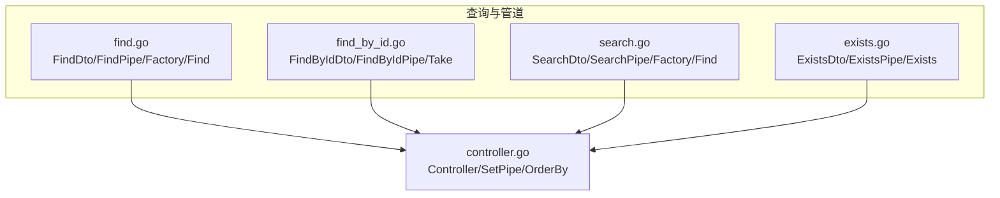
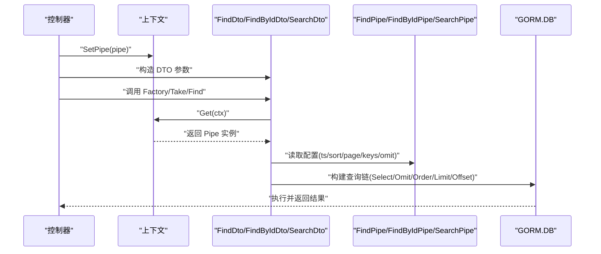
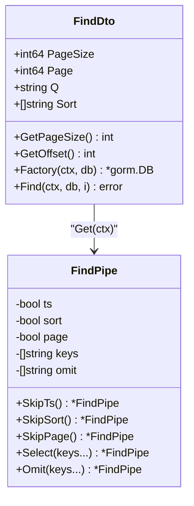
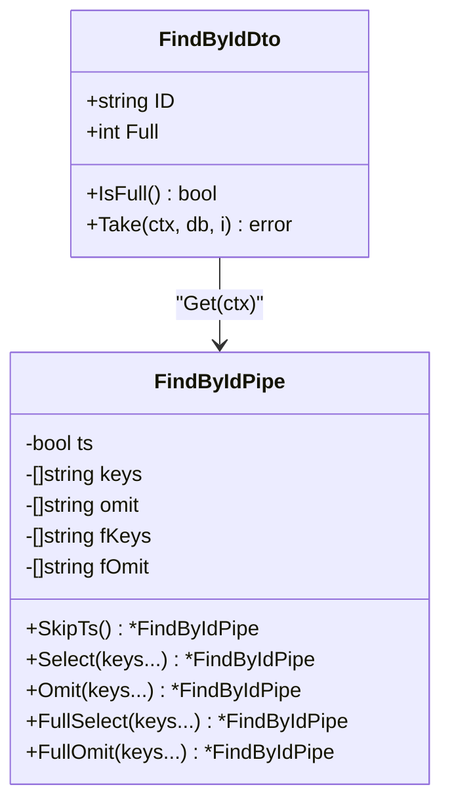
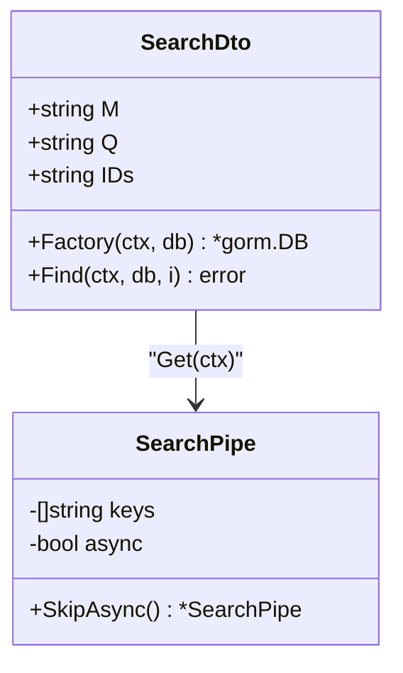
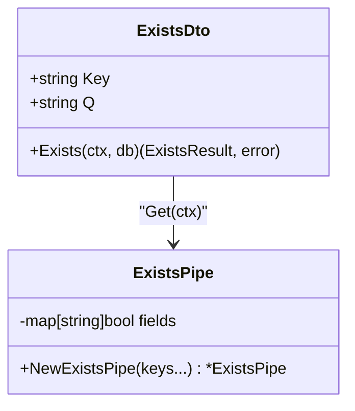
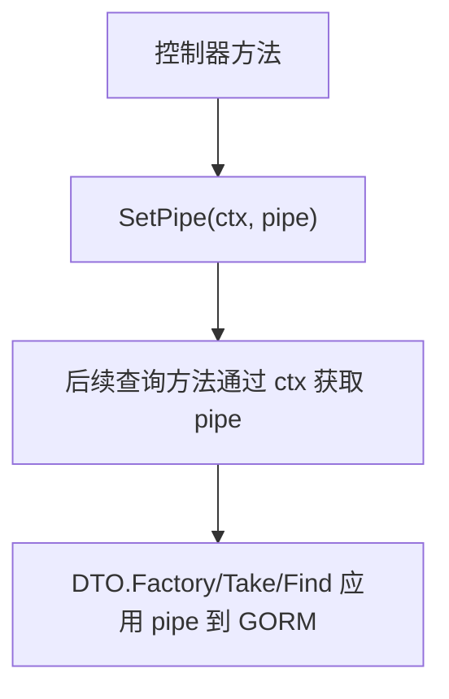
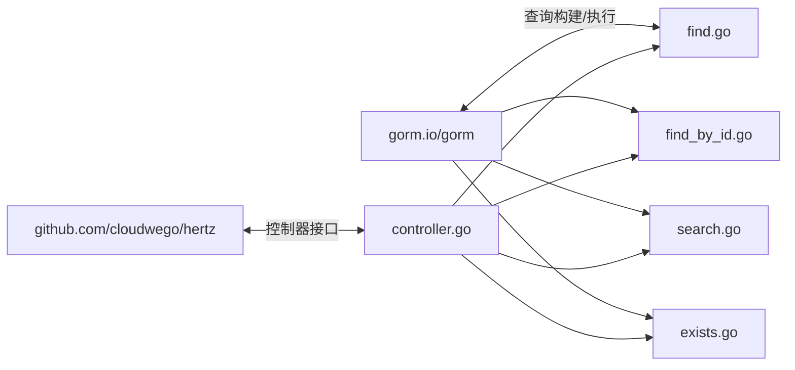

# 管道模式

<cite>
**本文引用的文件**
- [find.go](file://find.go)
- [find_by_id.go](file://find_by_id.go)
- [controller.go](file://controller.go)
- [search.go](file://search.go)
- [exists.go](file://exists.go)
- [delete.go](file://delete.go)
- [go.mod](file://go.mod)
</cite>

## 目录
1. [引言](#引言)
2. [项目结构](#项目结构)
3. [核心组件](#核心组件)
4. [架构总览](#架构总览)
5. [详细组件分析](#详细组件分析)
6. [依赖关系分析](#依赖关系分析)
7. [性能考量](#性能考量)
8. [故障排查指南](#故障排查指南)
9. [结论](#结论)
10. [附录](#附录)

## 引言
本文件围绕 go-crud 库中的“管道模式”进行系统化解析，重点阐释 FindPipe 与 FindByIdPipe 的结构与行为，以及它们如何通过字段（如 ts、sort、page、keys、omit 等）控制查询行为；结合 NewFindPipe 与 NewFindByIdPipe 的默认配置机制，说明 SkipTs、SkipSort、SkipPage、Select、Omit 等链式方法的工作原理及其对 GORM 查询的影响；并通过 find.go 中的 Factory 方法与 find_by_id.go 中的 Take 方法，展示管道配置如何在运行时从上下文（context）中获取并应用于数据库操作；最后给出在控制器中创建与自定义管道的实践建议，解释该模式如何实现关注点分离、提升代码可复用性与可测试性。

## 项目结构
仓库采用按功能模块划分的文件组织方式：
- find.go：多记录查询与分页、排序、字段选择/排除的管道与工厂方法
- find_by_id.go：单条记录查询（含“全量模式”）的管道与取值方法
- search.go：搜索查询的管道与工厂方法
- exists.go：存在性检查的管道与校验逻辑
- controller.go：控制器接口与上下文管道注入工具、排序方向映射
- delete.go：批量删除 DTO（用于对比）
- go.mod：依赖声明（包含 GORM）

图表来源
- [find.go](file://find.go#L1-L153)
- [find_by_id.go](file://find_by_id.go#L1-L102)
- [search.go](file://search.go#L1-L110)
- [exists.go](file://exists.go#L1-L66)
- [controller.go](file://controller.go#L1-L38)

章节来源
- [find.go](file://find.go#L1-L153)
- [find_by_id.go](file://find_by_id.go#L1-L102)
- [search.go](file://search.go#L1-L110)
- [exists.go](file://exists.go#L1-L66)
- [controller.go](file://controller.go#L1-L38)
- [go.mod](file://go.mod#L1-L13)

## 核心组件
- FindDto/FindPipe：多记录查询的 DTO 与管道，支持分页、排序、字段选择/排除、时间戳处理
- FindByIdDto/FindByIdPipe：单条记录查询的 DTO 与管道，支持普通模式与“全量模式”的字段选择/排除
- SearchDto/SearchPipe：搜索查询的 DTO 与管道，支持异步限制与字段选择
- ExistsDto/ExistsPipe：存在性检查的 DTO 与管道，限定允许检查的字段集合
- Controller/SetPipe/OrderBy：控制器接口、上下文管道注入工具、排序方向映射

章节来源
- [find.go](file://find.go#L1-L153)
- [find_by_id.go](file://find_by_id.go#L1-L102)
- [search.go](file://search.go#L1-L110)
- [exists.go](file://exists.go#L1-L66)
- [controller.go](file://controller.go#L1-L38)

## 架构总览
管道模式通过“DTO + 管道 + 工厂方法”的组合实现查询行为的可配置化与可复用化：
- DTO 负责承载请求参数（如分页、排序、关键词、ID 等）
- 管道负责描述查询行为（是否包含时间戳、是否排序、是否分页、字段选择/排除等）
- 工厂方法将管道配置应用到 GORM 查询链上
- 上下文用于在控制器与数据层之间传递管道实例

图表来源
- [controller.go](file://controller.go#L26-L38)
- [find.go](file://find.go#L116-L153)
- [find_by_id.go](file://find_by_id.go#L76-L102)
- [search.go](file://search.go#L79-L110)

## 详细组件分析

### FindPipe 与 FindDto：多记录查询管道
- 结构字段
  - ts：是否包含时间戳字段（默认开启）
  - sort：是否启用排序（默认开启）
  - page：是否启用分页（默认开启）
  - keys：显式选择的字段列表（设置后忽略 omit）
  - omit：需要排除的字段列表
- 默认配置
  - NewFindPipe 返回默认开启 ts、sort、page 的管道
- 链式方法
  - SkipTs：关闭时间戳处理
  - SkipSort：关闭排序
  - SkipPage：关闭分页
  - Select(keys...)：设置选择字段（覆盖 omit）
  - Omit(keys...)：设置排除字段
- 工厂方法 Factory
  - 字段选择优先级：keys > (omit 或默认排除时间戳)
  - 排序规则：若未指定 Sort 且 ts 开启，则按时间倒序；否则按 Sort 规则映射
  - 分页规则：按 DTO 的页大小与偏移计算
- 运行时从上下文获取管道
  - DTO.Get(ctx) 从上下文中取出管道实例

图表来源
- [find.go](file://find.go#L1-L153)

章节来源
- [find.go](file://find.go#L1-L153)

### FindByIdPipe 与 FindByIdDto：单条记录查询管道
- 结构字段
  - ts：是否包含时间戳字段（默认开启）
  - keys/fOmit：普通模式下的选择/排除
  - fKeys/fOmit：全量模式下的选择/排除
- 默认配置
  - NewFindByIdPipe 返回默认开启 ts 的管道
- 链式方法
  - SkipTs：关闭时间戳处理
  - Select(keys...)：普通模式选择字段
  - Omit(keys...)：普通模式排除字段
  - FullSelect(keys...)：全量模式选择字段
  - FullOmit(keys...)：全量模式排除字段
- 取值方法 Take
  - 普通模式：优先使用 keys；否则根据 omit/ts 决定是否排除时间戳；最后应用 omit
  - 全量模式：优先使用 fKeys；否则应用 fOmit
  - 最终附加 WHERE 条件并取单条记录

图表来源
- [find_by_id.go](file://find_by_id.go#L1-L102)

章节来源
- [find_by_id.go](file://find_by_id.go#L1-L102)

### SearchPipe 与 SearchDto：搜索查询管道
- 结构字段
  - keys：默认 ["id","name"]，可通过 NewSearchPipe 自定义
  - async：是否启用异步限制（默认开启）
- 链式方法
  - SkipAsync：关闭异步限制
  - NewSearchPipe(keys...)：自定义 keys，默认 ["id","name"]
- 工厂方法 Factory
  - 若 async 开启，限制返回数量
  - 统一 Select(keys)
- Find
  - 支持优先返回已知 ID 的记录（通过 UNION ALL 实现）

图表来源
- [search.go](file://search.go#L1-L110)

章节来源
- [search.go](file://search.go#L1-L110)

### ExistsPipe 与 ExistsDto：存在性检查管道
- 结构字段
  - ExistsPipe：以 map 记录允许检查的字段集合
- 工厂方法
  - NewExistsPipe(keys...)：初始化允许字段集合
  - Exists(ctx, db)：仅当 Key 在允许集合内时才执行检查

图表来源
- [exists.go](file://exists.go#L1-L66)

章节来源
- [exists.go](file://exists.go#L1-L66)

### 控制器接口与上下文管道注入
- Controller 接口：定义标准 CRUD 方法
- SetPipe(ctx, i)：将管道实例存入上下文键值对
- OrderBy：将排序方向映射为 SQL 关键字

图表来源
- [controller.go](file://controller.go#L1-L38)

章节来源
- [controller.go](file://controller.go#L1-L38)

## 依赖关系分析
- 外部依赖
  - gorm.io/gorm：ORM 查询构建与执行
  - github.com/cloudwego/hertz：HTTP 框架（用于控制器接口）
- 内部耦合
  - 所有查询方法均依赖上下文中的管道实例
  - DTO 与管道之间通过 Get(ctx) 解耦
  - 工厂方法统一将管道配置转换为 GORM 查询链

图表来源
- [go.mod](file://go.mod#L1-L13)
- [find.go](file://find.go#L1-L153)
- [find_by_id.go](file://find_by_id.go#L1-L102)
- [search.go](file://search.go#L1-L110)
- [exists.go](file://exists.go#L1-L66)
- [controller.go](file://controller.go#L1-L38)

章节来源
- [go.mod](file://go.mod#L1-L13)

## 性能考量
- 字段选择优先级
  - 显式 Select(keys) 会覆盖 Omit，减少网络传输与序列化开销
  - 默认排除时间戳可降低响应体积，但需注意业务是否需要
- 排序与分页
  - Factory 会在无显式排序时按时间倒序兜底，避免无序结果导致的前端不稳定
  - 分页通过 Limit/Offset 控制，建议配合索引优化
- 异步搜索限制
  - SearchPipe.async 默认开启，限制返回数量，提升前端交互体验
- 存在性检查
  - ExistsPipe 限制允许字段，避免不必要的扫描与计数

[本节为通用指导，不直接分析具体文件]

## 故障排查指南
- 上下文未注入管道
  - 现象：调用 Get(ctx) 返回空指针或类型断言失败
  - 处理：确保在控制器入口处调用 SetPipe(ctx, pipe)
- 排序方向映射错误
  - 现象：排序方向不符合预期
  - 处理：确认 Sort 参数格式为 "field:direction"，其中 direction 对应 OrderBy 的键
- 字段选择冲突
  - 现象：Select 与 Omit 同时设置导致行为异常
  - 处理：Select 会覆盖 Omit；若需排除字段，请仅使用 Omit
- 单条查询未命中
  - 现象：Take 返回空结果
  - 处理：确认 ID 是否正确，以及管道是否误用了全量模式字段选择

章节来源
- [controller.go](file://controller.go#L26-L38)
- [find.go](file://find.go#L116-L153)
- [find_by_id.go](file://find_by_id.go#L76-L102)
- [search.go](file://search.go#L79-L110)
- [exists.go](file://exists.go#L36-L66)

## 结论
go-crud 通过“DTO + 管道 + 工厂方法 + 上下文”的组合，实现了查询行为的可配置化与可复用化。FindPipe 与 FindByIdPipe 将字段选择、排除、排序、分页、时间戳处理等能力以链式方法暴露，配合 New*Pipe 的默认配置与 Factory/Take/Find 的统一应用，使控制器无需关心底层查询细节，只需注入合适的管道即可获得一致的行为。该模式有效实现了关注点分离，提升了代码的可维护性、可测试性与扩展性。

[本节为总结，不直接分析具体文件]

## 附录

### 实际使用示例（步骤说明）
以下为在控制器中创建与自定义管道的实践步骤（不包含具体代码内容）：
- 创建上下文并注入管道
  - 使用 SetPipe(ctx, pipe) 将管道实例写入上下文
- 定义查询 DTO 并填充参数
  - 例如：分页参数、排序规则、关键词等
- 应用管道到查询
  - 多记录查询：调用 FindDto.Factory(ctx, db)，再执行 Find
  - 单条查询：调用 FindByIdDto.Take(ctx, db, i)
  - 搜索查询：调用 SearchDto.Factory(ctx, db)，再执行 Find
- 自定义管道
  - 通过 NewFindPipe/NewFindByIdPipe/NewSearchPipe 初始化默认配置
  - 使用 SkipTs/SkipSort/SkipPage/Select/Omit/FullSelect/FullOmit 等链式方法调整行为
- 注意事项
  - Select 会覆盖 Omit
  - 全量模式与普通模式的字段选择互不影响
  - 排序方向需遵循 OrderBy 映射

章节来源
- [controller.go](file://controller.go#L26-L38)
- [find.go](file://find.go#L116-L153)
- [find_by_id.go](file://find_by_id.go#L76-L102)
- [search.go](file://search.go#L79-L110)