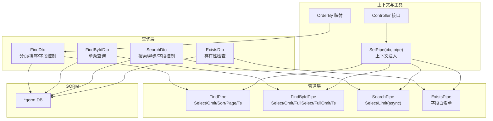
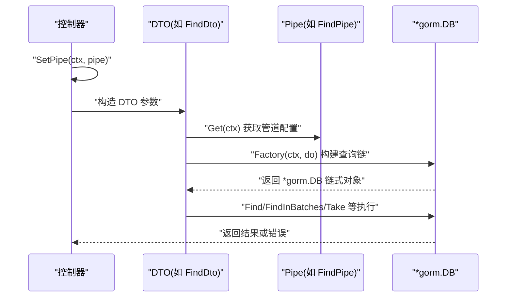
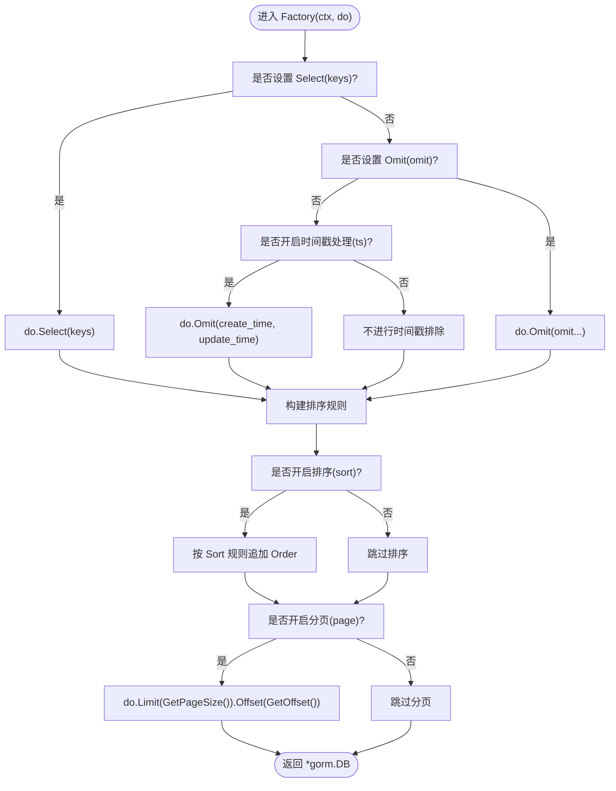
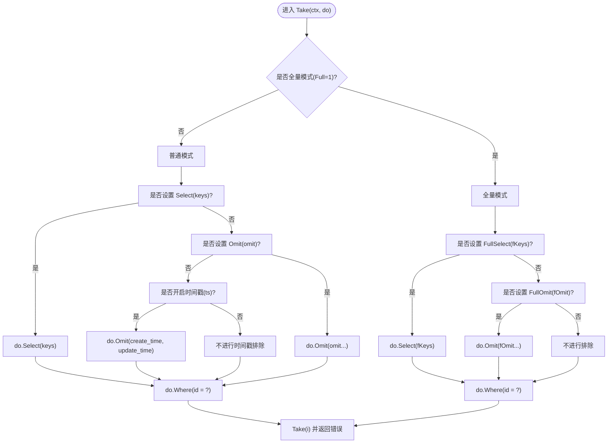
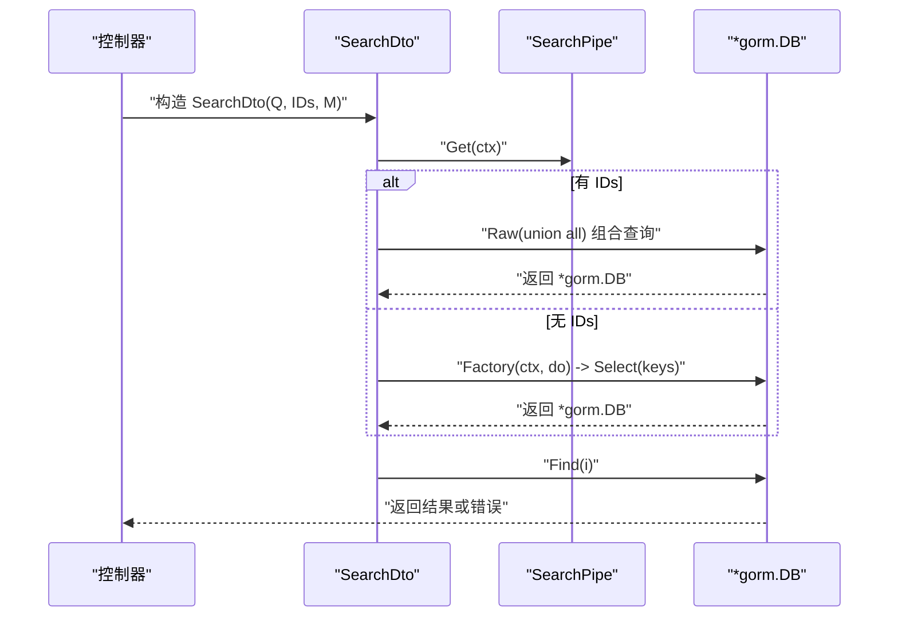
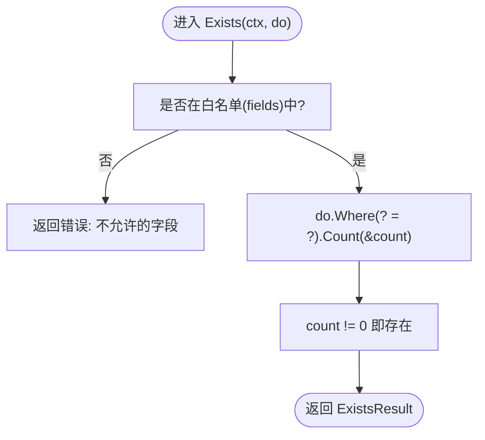
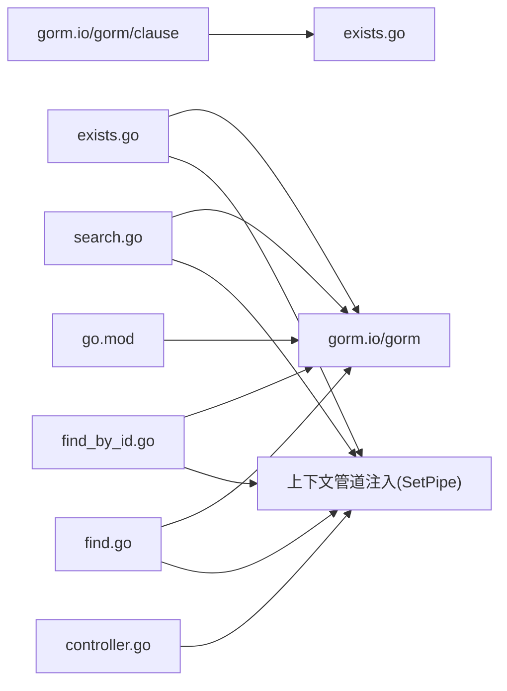

# 与GORM集成

<cite>
**本文引用的文件列表**
- [find.go](file://find.go)
- [find_by_id.go](file://find_by_id.go)
- [search.go](file://search.go)
- [exists.go](file://exists.go)
- [controller.go](file://controller.go)
- [delete.go](file://delete.go)
- [go.mod](file://go.mod)
</cite>

## 目录
1. [简介](#简介)
2. [项目结构](#项目结构)
3. [核心组件](#核心组件)
4. [架构总览](#架构总览)
5. [详细组件分析](#详细组件分析)
6. [依赖关系分析](#依赖关系分析)
7. [性能考量](#性能考量)
8. [故障排查指南](#故障排查指南)
9. [结论](#结论)
10. [附录](#附录)

## 简介
本文件面向希望将 go-crud 库与 GORM ORM 深度集成的开发者，系统阐述如何通过 DTO（数据传输对象）与管道配置（Pipe）在运行时构建 GORM 查询链，实现分页、排序、字段选择/排除、关键字检索、存在性检查等通用查询能力。重点解析 find.go 中的 FindDto.Factory 与 Find 方法如何接收 *gorm.DB 实例并应用分页、排序、字段选择/排除等逻辑；同时给出 GORM 模型（struct）设计建议，确保字段标签与数据库映射符合 crud 规则；并说明在 FindById、Search、Exists 等操作中 GORM 查询的构建过程及事务与连接传递方式。最后提供常见陷阱与调试建议，帮助快速定位问题。

## 项目结构
该仓库采用按功能模块划分的文件组织方式：
- find.go：分页查询 DTO 与工厂方法，支持字段选择/排除、排序、分页
- find_by_id.go：单条记录查询 DTO 与取值方法，支持普通模式与“全量模式”的字段选择/排除
- search.go：搜索 DTO 与工厂方法，支持异步限制与字段选择，以及优先级合并
- exists.go：存在性检查 DTO 与管道，限定允许检查的字段键
- controller.go：控制器接口与上下文管道注入工具、排序方向映射
- delete.go：批量删除 DTO（用于对比）
- go.mod：声明依赖 gorm.io/gorm

图表来源
- [find.go](file://find.go#L13-L153)
- [find_by_id.go](file://find_by_id.go#L9-L102)
- [search.go](file://search.go#L13-L110)
- [exists.go](file://exists.go#L12-L65)
- [controller.go](file://controller.go#L11-L37)

章节来源
- [find.go](file://find.go#L13-L153)
- [find_by_id.go](file://find_by_id.go#L9-L102)
- [search.go](file://search.go#L13-L110)
- [exists.go](file://exists.go#L12-L65)
- [controller.go](file://controller.go#L11-L37)
- [go.mod](file://go.mod#L1-L12)

## 核心组件
- FindDto：封装分页、关键词、排序规则，提供 Factory 构建查询链与 Find 执行查询
- FindPipe：定义字段选择/排除、排序开关、分页开关、时间戳字段处理策略
- FindByIdDto：封装单条记录查询参数（ID、Full），提供 Take 取值
- FindByIdPipe：定义普通模式与全量模式下的字段选择/排除策略
- SearchDto：封装搜索参数（M、Q、IDs），提供 Factory 与 Find
- SearchPipe：定义默认字段集与异步限制
- ExistsDto：封装键名与查询值，提供 Exists 检查
- ExistsPipe：字段白名单，限定可检查字段
- Controller 接口与 SetPipe 工具：统一控制器入口与上下文管道注入
- OrderBy 映射：将“1/-1”映射为 SQL 排序方向

章节来源
- [find.go](file://find.go#L13-L153)
- [find_by_id.go](file://find_by_id.go#L9-L102)
- [search.go](file://search.go#L13-L110)
- [exists.go](file://exists.go#L12-L65)
- [controller.go](file://controller.go#L11-L37)

## 架构总览
下图展示了从控制器到 DTO、再到 GORM 的调用链路与数据流。所有查询均通过 *gorm.DB 实例在运行时动态拼装，避免硬编码 SQL，提升可维护性与可扩展性。

图表来源
- [controller.go](file://controller.go#L26-L37)
- [find.go](file://find.go#L116-L153)
- [find_by_id.go](file://find_by_id.go#L76-L102)
- [search.go](file://search.go#L79-L110)
- [exists.go](file://exists.go#L47-L65)

## 详细组件分析

### FindDto 与 FindPipe：分页、排序、字段选择/排除
- 字段选择/排除优先级
  - 若设置了 Select(keys)，则忽略 Omit(omit)
  - 否则若未设置 Omit 且开启时间戳处理，则默认排除 create_time、update_time
  - 若设置了 Omit(omit)，则按 omit 列表排除
- 排序规则
  - 默认使用 OrderBy 映射将“1/-1”转换为 SQL 方向
  - 当 Sort 为空且开启时间戳处理时，默认按 create_time 降序
- 分页规则
  - 通过 GetPageSize 与 GetOffset 计算 Limit 与 Offset
- 执行流程
  - Factory(ctx, do) 返回已装配好 Select/Omit/Order/Limit/Offset 的 *gorm.DB
  - Find(ctx, do, i) 调用 Find(i) 并返回错误

图表来源
- [find.go](file://find.go#L116-L145)
- [controller.go](file://controller.go#L32-L37)

章节来源
- [find.go](file://find.go#L13-L153)
- [controller.go](file://controller.go#L32-L37)

### FindByIdDto 与 FindByIdPipe：单条记录查询
- 普通模式与全量模式
  - 普通模式：Normal -> Select(keys)/Omit(omit) 或默认时间戳排除
  - 全量模式：Full=1 -> FullSelect(fKeys)/FullOmit(fOmit)
- 条件过滤
  - 使用 Where(id = ?) 进行精确匹配
- 执行流程
  - Take(ctx, do, i) 在不同模式下应用字段策略后，调用 Take(i) 并返回错误

图表来源
- [find_by_id.go](file://find_by_id.go#L76-L102)

章节来源
- [find_by_id.go](file://find_by_id.go#L9-L102)

### SearchDto 与 SearchPipe：搜索与优先级合并
- 字段选择
  - 默认 keys = ["id","name"]，可通过 NewSearchPipe(keys...) 自定义
  - 异步模式下默认限制 50 条（SkipAsync 可关闭）
- 关键字与优先级
  - 支持 IDs 参数，将已知 ID 的结果置顶，其余按常规搜索
  - 使用 Raw 联合查询实现优先级合并
- 执行流程
  - Factory(ctx, do) 设置 Limit(async) 与 Select(keys)
  - Find(ctx, do, i) 在有 IDs 时走联合查询，否则直接 Find

图表来源
- [search.go](file://search.go#L79-L110)

章节来源
- [search.go](file://search.go#L13-L110)

### ExistsDto 与 ExistsPipe：存在性检查
- 字段白名单
  - 仅允许在 ExistsPipe 中显式声明的字段参与检查
- 执行流程
  - 通过 Where(? = ?) 使用 clause.Column 动态列名绑定，Count 计数判断是否存在

图表来源
- [exists.go](file://exists.go#L47-L65)

章节来源
- [exists.go](file://exists.go#L12-L65)

## 依赖关系分析
- 外部依赖
  - gorm.io/gorm：提供 *gorm.DB 与查询链式 API
  - gorm.io/gorm/clause：提供列名安全绑定
- 内部耦合
  - DTO 与 Pipe 通过上下文共享，SetPipe(ctx, pipe) 将管道注入到请求上下文中
  - OrderBy 映射贯穿排序方向转换
  - SearchDto 与 FindDto 均依赖 *gorm.DB 进行查询构建与执行

图表来源
- [go.mod](file://go.mod#L1-L12)
- [controller.go](file://controller.go#L26-L37)
- [find.go](file://find.go#L13-L153)
- [find_by_id.go](file://find_by_id.go#L9-L102)
- [search.go](file://search.go#L13-L110)
- [exists.go](file://exists.go#L12-L65)

章节来源
- [go.mod](file://go.mod#L1-L12)
- [controller.go](file://controller.go#L26-L37)

## 性能考量
- 分页与排序
  - 合理设置 PageSize，避免过大导致内存压力与慢查询
  - 排序字段应建立索引，避免 create_time 排序带来的全表扫描
- 字段选择
  - 优先使用 Select(keys) 精准投影，减少网络与序列化开销
  - 避免 Omit 大字段（如长文本、二进制），必要时拆表或延迟加载
- 搜索与联合查询
  - Search 的异步限制有助于前端体验，但需注意 IDs 列表长度与 IN 子句上限
  - 联合查询在大集合上可能产生临时表，建议对 IDs 建立索引
- 存在性检查
  - Exists 仅做 Count 判断，建议对被检查字段建立唯一/非空索引

[本节为通用性能建议，无需特定文件来源]

## 故障排查指南
- 数据库连接未初始化
  - 现象：执行查询时报错或 panic
  - 排查：确认 *gorm.DB 实例已正确初始化并传入 DTO 方法
  - 参考路径：[find.go](file://find.go#L147-L153)、[find_by_id.go](file://find_by_id.go#L76-L102)、[search.go](file://search.go#L79-L110)、[exists.go](file://exists.go#L47-L65)
- 模型字段未正确映射
  - 现象：Select/Omit/Order 报字段不存在或映射不一致
  - 排查：确保 GORM 模型 struct 的字段名与数据库列名一致，或使用标签指定列名
  - 参考路径：[find.go](file://find.go#L116-L145)、[find_by_id.go](file://find_by_id.go#L76-L102)、[search.go](file://search.go#L79-L110)
- 排序方向无效
  - 现象：Sort 未生效或报错
  - 排查：确认 Sort 规则格式为 "field:direction"，direction 使用 "1/-1"，OrderBy 映射正常
  - 参考路径：[controller.go](file://controller.go#L32-L37)、[find.go](file://find.go#L131-L140)
- 分页参数越界
  - 现象：PageSize 超限或 Offset 异常
  - 排查：PageSize 最大 1000，Page 与 PageSize 计算的 Offset 应为正数
  - 参考路径：[find.go](file://find.go#L16-L31、#L33-L36、#L141-L145)
- 存在性检查字段不在白名单
  - 现象：返回“不允许的字段”错误
  - 排查：在创建 ExistsPipe 时显式声明允许检查的字段
  - 参考路径：[exists.go](file://exists.go#L20-L46、#L47-L65)
- 上下文管道未注入
  - 现象：Get(ctx) 返回空指针或行为异常
  - 排查：确保在控制器入口调用 SetPipe(ctx, pipe) 注入管道
  - 参考路径：[controller.go](file://controller.go#L26-L31)

章节来源
- [find.go](file://find.go#L13-L153)
- [find_by_id.go](file://find_by_id.go#L76-L102)
- [search.go](file://search.go#L79-L110)
- [exists.go](file://exists.go#L20-L65)
- [controller.go](file://controller.go#L26-L37)

## 结论
go-crud 通过 DTO 与 Pipe 的组合，在运行时将 HTTP 请求参数与 GORM 查询链解耦，实现了高度可配置的分页、排序、字段选择/排除、搜索与存在性检查能力。开发者只需在控制器中注入合适的 Pipe，并将 *gorm.DB 实例传入 DTO 方法，即可获得一致、可维护、可扩展的查询行为。遵循本文的模型设计建议与调试要点，可有效避免常见陷阱，提升开发效率与系统稳定性。

[本节为总结性内容，无需特定文件来源]

## 附录

### 如何设计 GORM 模型以兼容 crud 规则
- 字段命名与标签
  - 字段名与数据库列名保持一致，或使用标签指定列名
  - 对于时间戳字段，建议命名为 create_time/update_time，以便默认排除
- 排序字段
  - 为常用排序字段建立索引，避免全表扫描
- 大字段处理
  - 长文本、二进制等大字段建议使用 Select(keys) 排除，或拆表延迟加载
- 搜索字段
  - 为搜索字段建立索引，提高 LIKE 查询性能（必要时考虑全文索引）

[本节为通用实践建议，无需特定文件来源]

### 事务处理与数据库连接传递
- 事务传递
  - 将同一事务内的 *gorm.DB 实例传入所有 DTO 方法，保证一致性
  - 在控制器中获取 db.WithContext(ctx) 并贯穿整个请求生命周期
- 连接池与并发
  - 确保 *gorm.DB 实例来自同一连接池，避免跨连接状态不一致
  - 控制器层通过上下文传递 db.WithContext(ctx)，避免全局变量

[本节为通用实践建议，无需特定文件来源]