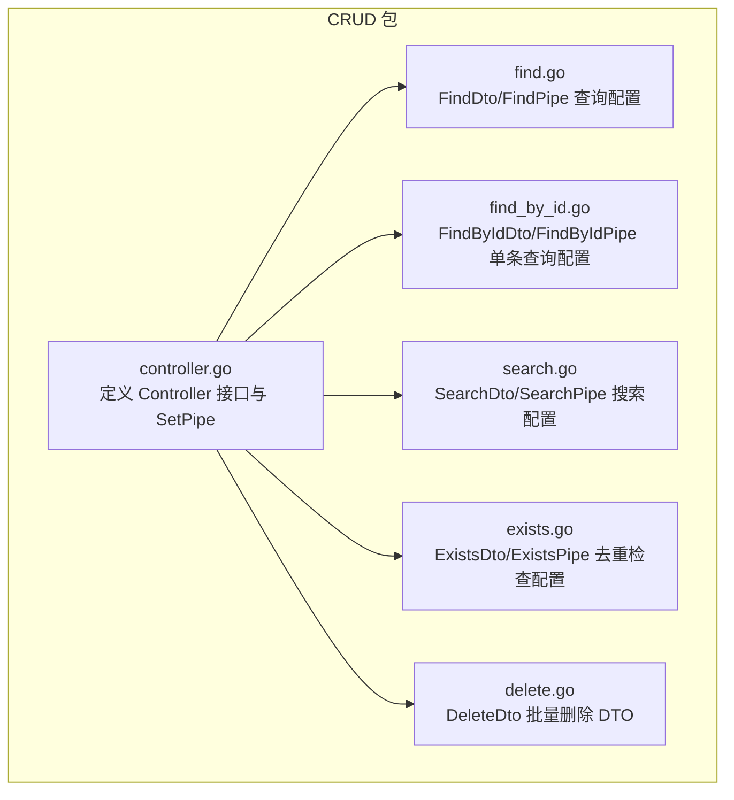
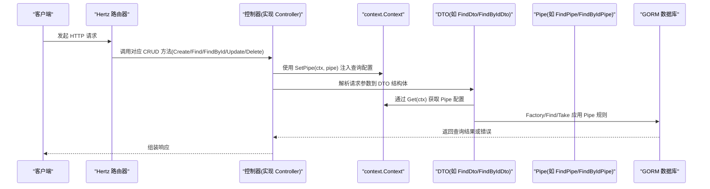
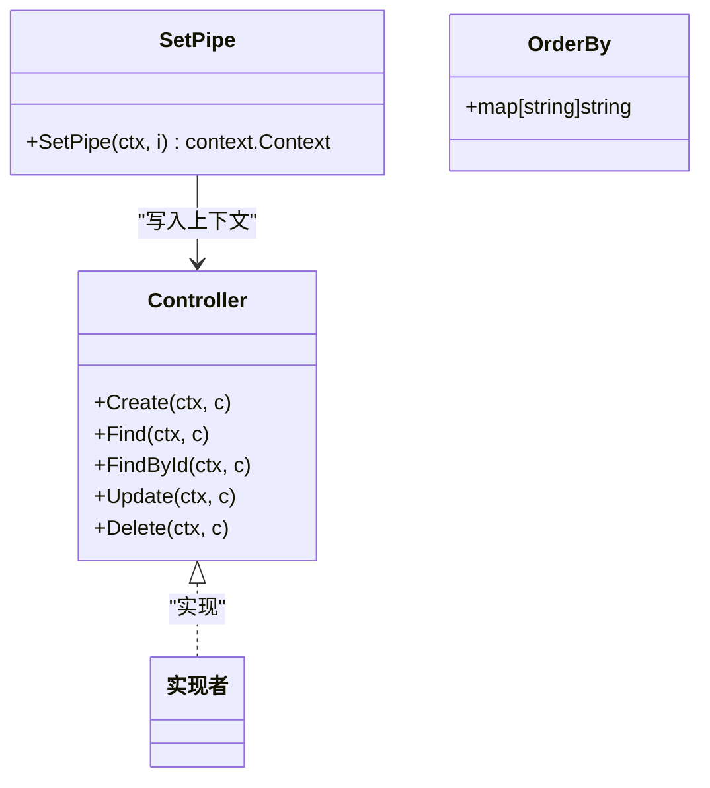
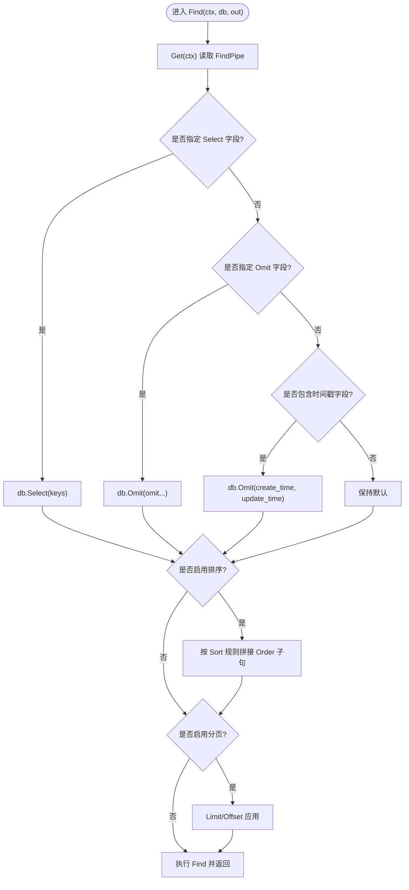
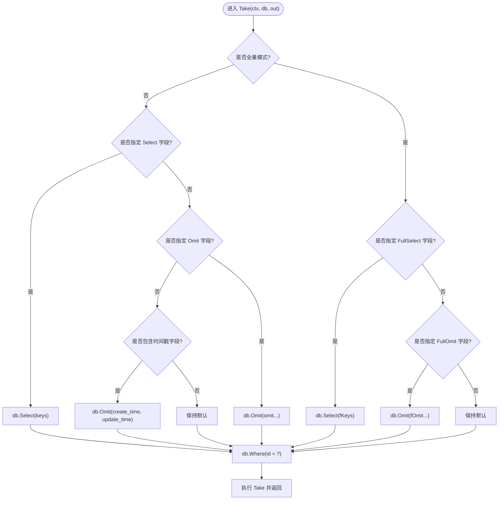
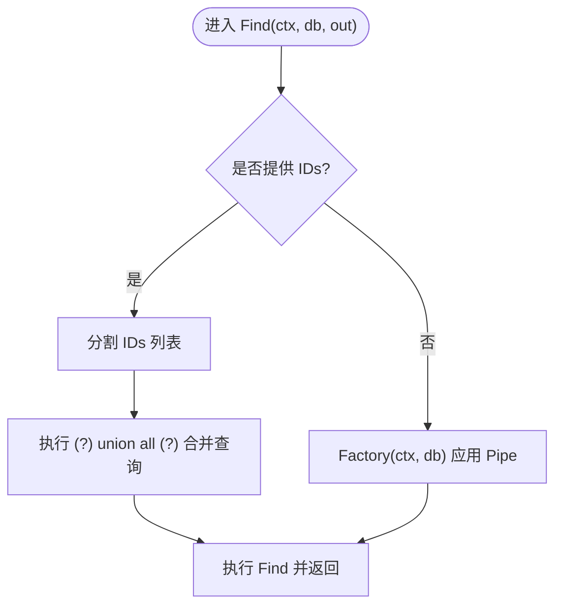
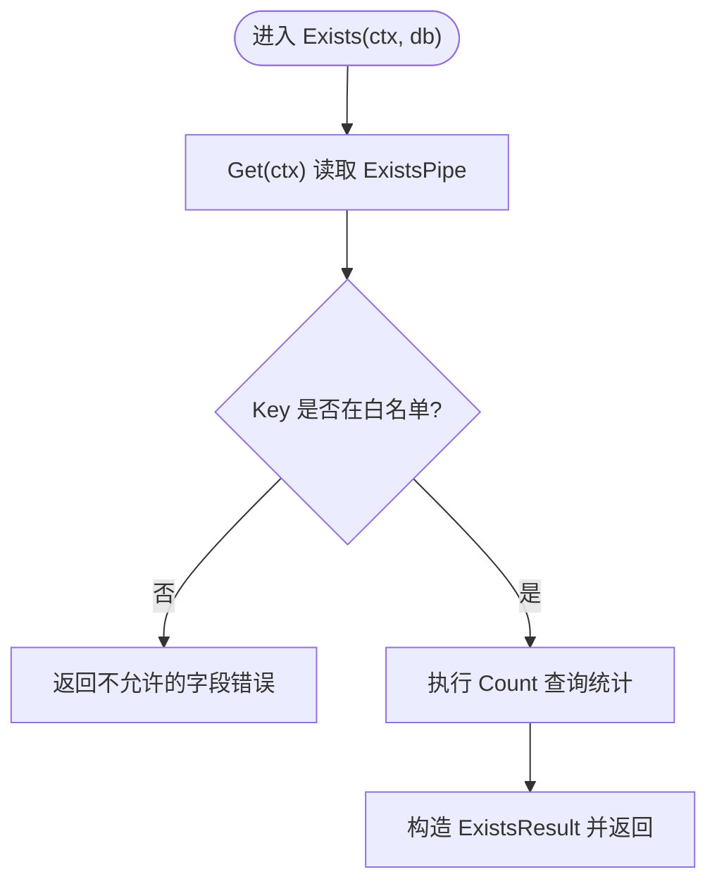

# 与Hertz集成

<cite>
**本文引用的文件**
- [controller.go](file://controller.go)
- [find.go](file://find.go)
- [find_by_id.go](file://find_by_id.go)
- [delete.go](file://delete.go)
- [exists.go](file://exists.go)
- [search.go](file://search.go)
- [go.mod](file://go.mod)
</cite>

## 目录
1. [简介](#简介)
2. [项目结构](#项目结构)
3. [核心组件](#核心组件)
4. [架构总览](#架构总览)
5. [详细组件分析](#详细组件分析)
6. [依赖关系分析](#依赖关系分析)
7. [性能考量](#性能考量)
8. [故障排查指南](#故障排查指南)
9. [结论](#结论)
10. [附录：完整集成示例步骤](#附录完整集成示例步骤)

## 简介
本文件面向希望在 Hertz Web 框架中快速构建通用 CRUD 能力的开发者，系统性讲解如何：
- 定义实现 Controller 接口的控制器结构体
- 将控制器方法映射到 HTTP 路由
- 在请求链路中通过 SetPipe 注入查询配置（如 FindPipe、FindByIdPipe、SearchPipe、ExistsPipe）
- 使用 context.Context 和 app.RequestContext 进行上下文传递
- 处理常见集成问题（如上下文键“pipe”未设置导致的运行时 panic）

本指南以仓库现有代码为依据，不直接粘贴具体代码内容，仅提供路径定位与流程说明，便于读者对照源码理解。

## 项目结构
该仓库采用按功能模块组织的文件结构，围绕 CRUD 通用能力拆分出多个数据传输对象（DTO）与管道（Pipe）配置，配合 Controller 接口统一入口，形成清晰的职责边界。

图表来源
- [controller.go](file://controller.go#L1-L38)
- [find.go](file://find.go#L1-L154)
- [find_by_id.go](file://find_by_id.go#L1-L103)
- [search.go](file://search.go#L1-L111)
- [exists.go](file://exists.go#L1-L66)
- [delete.go](file://delete.go#L1-L8)

章节来源
- [controller.go](file://controller.go#L1-L38)
- [go.mod](file://go.mod#L1-L13)

## 核心组件
- Controller 接口：定义标准 CRUD 方法签名，接收 context.Context 与 *app.RequestContext，用于统一处理 HTTP 请求。
- SetPipe：向 context 中写入键值为“pipe”的查询配置对象，供后续 DTO 的 Get(ctx) 方法读取。
- 各类 DTO 与 Pipe：
  - FindDto/FindPipe：分页、排序、字段选择/排除、时间戳处理等
  - FindByIdDto/FindByIdPipe：单条记录查询，支持普通模式与“全量模式”
  - SearchDto/SearchPipe：关键字搜索，支持异步限制与字段选择
  - ExistsDto/ExistsPipe：重复检查，限定允许检查的字段集合
  - DeleteDto：批量删除的标识列表

章节来源
- [controller.go](file://controller.go#L11-L38)
- [find.go](file://find.go#L13-L154)
- [find_by_id.go](file://find_by_id.go#L9-L103)
- [search.go](file://search.go#L13-L111)
- [exists.go](file://exists.go#L12-L66)
- [delete.go](file://delete.go#L3-L8)

## 架构总览
下图展示了从 HTTP 请求进入，到控制器方法执行、再到数据库查询的端到端流程。重点体现 context 上下文传递与“pipe”配置注入的作用点。

图表来源
- [controller.go](file://controller.go#L26-L30)
- [find.go](file://find.go#L70-L73)
- [find_by_id.go](file://find_by_id.go#L31-L34)
- [search.go](file://search.go#L74-L77)
- [exists.go](file://exists.go#L36-L39)

## 详细组件分析

### Controller 接口与上下文传递
- 接口方法签名统一使用 context.Context 与 *app.RequestContext，便于在中间件、控制器、DTO 之间传递上下文信息。
- SetPipe(ctx, pipe) 将“pipe”配置写入 context，后续各 DTO 的 Get(ctx) 可安全读取。

图表来源
- [controller.go](file://controller.go#L11-L38)

章节来源
- [controller.go](file://controller.go#L11-L38)

### Find/FindPipe：分页、排序、字段控制
- FindDto 提供分页、过滤、排序等参数解析；FindPipe 控制是否启用时间戳、排序、分页，以及字段选择/排除策略。
- Factory(ctx, db) 将 Pipe 配置应用到 gorm.DB，再由 Find(ctx, db, out) 执行查询。

图表来源
- [find.go](file://find.go#L61-L114)
- [find.go](file://find.go#L116-L154)

章节来源
- [find.go](file://find.go#L13-L154)

### FindById/FindByIdPipe：单条记录查询与全量模式
- FindByIdDto 支持通过路径参数获取 ID，并通过查询参数切换“全量模式”。
- FindByIdPipe 在普通模式与全量模式分别支持不同的字段选择/排除策略。

图表来源
- [find_by_id.go](file://find_by_id.go#L22-L74)
- [find_by_id.go](file://find_by_id.go#L76-L103)

章节来源
- [find_by_id.go](file://find_by_id.go#L9-L103)

### Search/SearchPipe：关键字搜索与优先级合并
- SearchDto 支持模式、关键字与已存在 ID 列表，SearchPipe 控制字段选择与异步限制。
- Find(ctx, db, out) 若提供 IDs，则先对这些 ID 的记录进行优先级合并，再与剩余结果合并。

图表来源
- [search.go](file://search.go#L46-L72)
- [search.go](file://search.go#L74-L87)
- [search.go](file://search.go#L89-L102)

章节来源
- [search.go](file://search.go#L13-L111)

### Exists/ExistsPipe：重复检查与字段白名单
- ExistsDto 通过 Key 与 Q 参数进行去重检查，ExistsPipe 限定允许检查的字段集合。
- Get(ctx) 读取 ExistsPipe，若 Key 不在白名单内则返回错误。

图表来源
- [exists.go](file://exists.go#L20-L40)
- [exists.go](file://exists.go#L47-L66)

章节来源
- [exists.go](file://exists.go#L12-L66)

### Delete/DTO：批量删除
- DeleteDto 仅包含待删除的 ID 列表，控制器在 Delete(ctx, c) 中读取该列表并执行批量删除逻辑。

章节来源
- [delete.go](file://delete.go#L3-L8)

## 依赖关系分析
- 外部依赖：Hertz 的 app.RequestContext、GORM 的 *gorm.DB、以及第三方工具库（如 kainonly/go 的帮助库）。
- 内部耦合：所有 DTO 的 Get(ctx) 方法均依赖 SetPipe(ctx, pipe) 注入的“pipe”，形成统一的查询配置通道。

图表来源
- [controller.go](file://controller.go#L26-L30)
- [find.go](file://find.go#L70-L73)
- [find_by_id.go](file://find_by_id.go#L31-L34)
- [search.go](file://search.go#L74-L77)
- [exists.go](file://exists.go#L36-L39)

章节来源
- [go.mod](file://go.mod#L5-L12)
- [controller.go](file://controller.go#L11-L38)

## 性能考量
- 分页与排序：FindPipe 默认启用分页与排序，建议在大数据量场景下合理设置 PageSize 与 Sort 规则，避免全表扫描。
- 字段选择：优先使用 Select/Omit 明确返回字段，减少网络与序列化开销。
- 异步搜索：SearchPipe 默认限制返回数量，适合前端搜索场景；如需放宽，可调用 SkipAsync。
- 全量模式：FindByIdPipe 的全量模式可能返回较多字段，应谨慎使用并在业务层控制范围。

## 故障排查指南
- 运行时 panic：上下文键“pipe”未设置
  - 现象：在 DTO 的 Get(ctx) 调用时发生类型断言失败或空指针异常。
  - 原因：控制器未在请求处理前调用 SetPipe(ctx, pipe) 注入配置。
  - 解决方案：在每个 CRUD 方法入口处，确保先创建并注入对应的 Pipe 实例（如 NewFindPipe/NewFindByIdPipe/NewSearchPipe/NewExistsPipe），再进行后续查询。
  - 参考路径：
    - [controller.go](file://controller.go#L26-L30)
    - [find.go](file://find.go#L70-L73)
    - [find_by_id.go](file://find_by_id.go#L31-L34)
    - [search.go](file://search.go#L74-L77)
    - [exists.go](file://exists.go#L36-L39)

- 字段白名单错误：Exists 检查 Key 不在白名单
  - 现象：Exists(ctx, db) 返回不允许的字段错误。
  - 原因：未通过 NewExistsPipe(keys...) 正确初始化允许字段集合。
  - 解决方案：在控制器中创建 ExistsPipe 并传入允许的字段名列表，再注入上下文。
  - 参考路径：
    - [exists.go](file://exists.go#L25-L40)
    - [exists.go](file://exists.go#L47-L66)

- 排序方向映射：OrderBy 映射规则
  - 现象：排序方向不符合预期。
  - 原因：Sort 参数中的方向值与 OrderBy 映射不一致。
  - 解决方案：遵循“1”升序、“-1”降序的约定，或根据需要扩展映射。
  - 参考路径：
    - [controller.go](file://controller.go#L32-L37)
    - [find.go](file://find.go#L131-L139)

## 结论
通过统一的 Controller 接口与 SetPipe 上下文注入机制，本项目实现了对 Hertz 路由系统的轻量集成。结合各类 DTO 与 Pipe 的组合，可以灵活地控制查询行为，满足不同业务场景下的 CRUD 需求。集成时务必在控制器方法入口处正确注入“pipe”，避免运行时 panic；同时注意字段白名单与排序方向的约定，确保查询结果符合预期。

## 附录：完整集成示例步骤
以下步骤基于仓库现有组件，指导你从零开始完成一次完整的 Hertz 集成：
1. 定义控制器结构体并实现 Controller 接口
   - 参考路径：[controller.go](file://controller.go#L11-L24)
2. 在每个 CRUD 方法中：
   - 创建并注入对应的 Pipe 实例（如 NewFindPipe/NewFindByIdPipe/NewSearchPipe/NewExistsPipe）
   - 使用 SetPipe(ctx, pipe) 将配置写入 context
   - 参考路径：[controller.go](file://controller.go#L26-L30)
3. 在控制器内部：
   - 将 app.RequestContext 的参数解析到相应 DTO（如 FindDto/FindByIdDto/SearchDto/ExistsDto）
   - 通过 DTO.Get(ctx) 读取 Pipe 配置
   - 调用 DTO.Factory/Find/Take 等方法生成并执行查询
   - 参考路径：[find.go](file://find.go#L70-L73), [find.go](file://find.go#L116-L154)
   - 参考路径：[find_by_id.go](file://find_by_id.go#L31-L34), [find_by_id.go](file://find_by_id.go#L76-L103)
   - 参考路径：[search.go](file://search.go#L74-L77), [search.go](file://search.go#L89-L102)
   - 参考路径：[exists.go](file://exists.go#L36-L39), [exists.go](file://exists.go#L47-L66)
4. 将控制器方法绑定到 Hertz 路由
   - 在 Hertz 路由器上注册对应 HTTP 方法与路径，回调中调用控制器的 CRUD 方法
   - 参考路径：[controller.go](file://controller.go#L11-L24)
5. 常见问题与修复
   - 确保每个请求都调用了 SetPipe(ctx, pipe)，否则 Get(ctx) 将触发 panic
   - 对 Exists 检查，确保 NewExistsPipe(keys...) 中包含允许的字段
   - 参考路径：[controller.go](file://controller.go#L26-L30), [exists.go](file://exists.go#L25-L40)