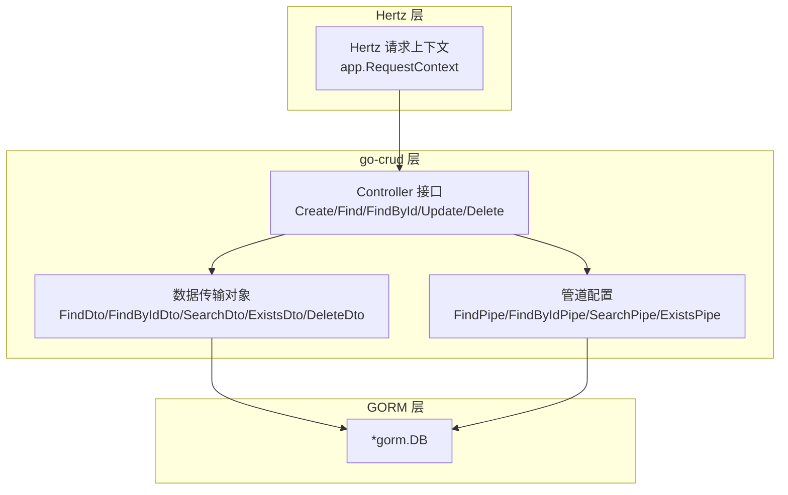
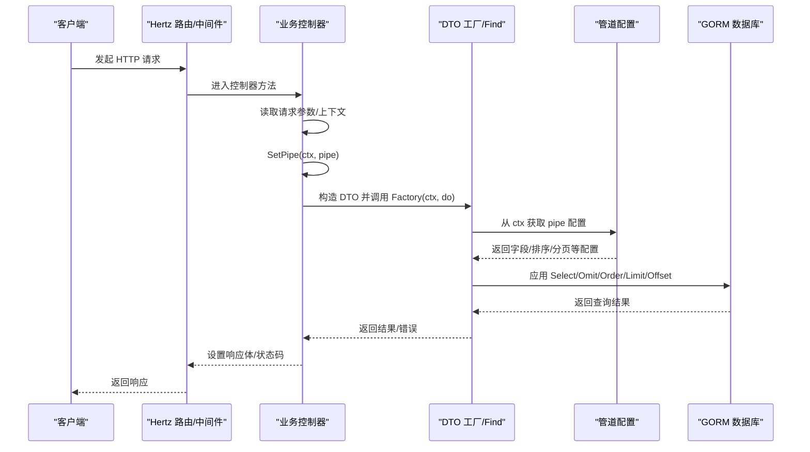
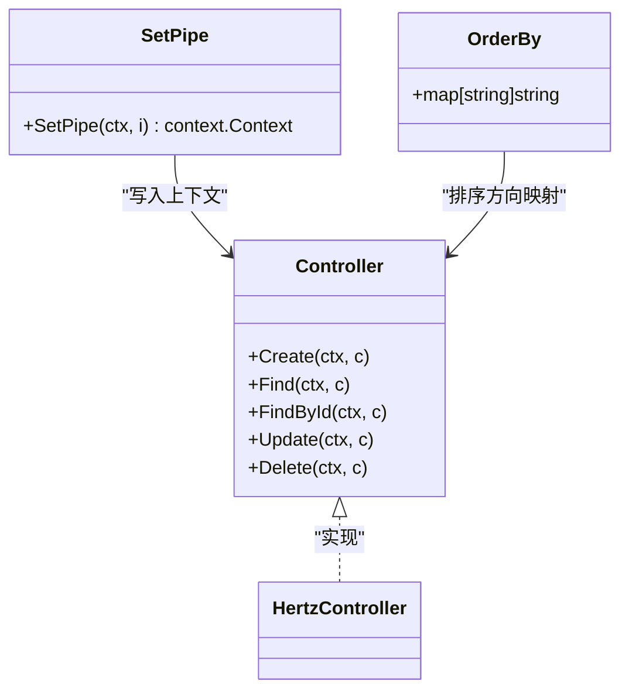
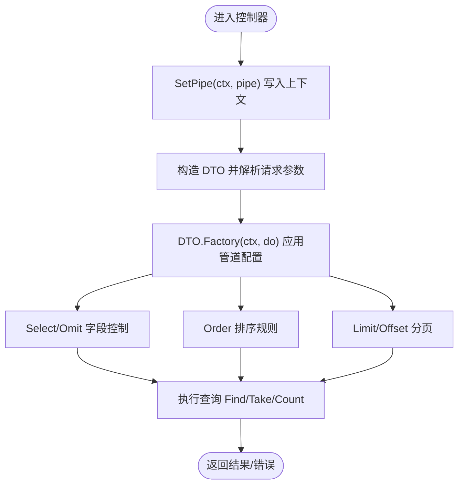
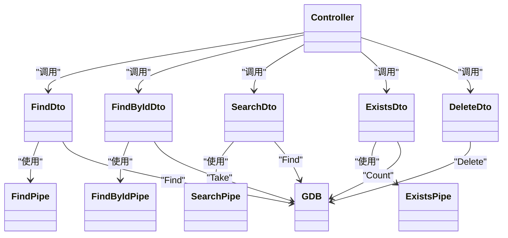
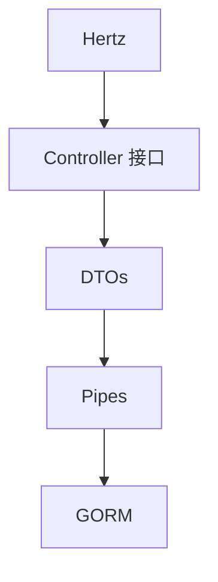

# 集成指南

<cite>
**本文引用的文件**
- [controller.go](file://controller.go)
- [find.go](file://find.go)
- [find_by_id.go](file://find_by_id.go)
- [exists.go](file://exists.go)
- [search.go](file://search.go)
- [delete.go](file://delete.go)
- [go.mod](file://go.mod)
</cite>

## 目录
1. [简介](#简介)
2. [项目结构](#项目结构)
3. [核心组件](#核心组件)
4. [架构总览](#架构总览)
5. [详细组件分析](#详细组件分析)
6. [依赖关系分析](#依赖关系分析)
7. [性能考虑](#性能考虑)
8. [故障排查指南](#故障排查指南)
9. [结论](#结论)
10. [附录：完整集成示例与最佳实践](#附录完整集成示例与最佳实践)

## 简介
本指南面向希望在实际应用中集成 go-crud 库的开发者，重点说明如何将该库与 Hertz 框架和 GORM ORM 无缝结合：
- 在“与 Hertz 集成”部分，讲解如何将实现 Controller 接口的控制器注册到 Hertz 路由系统、处理上下文传递与中间件兼容性问题，并以 controller.go 中的接口定义为实现依据。
- 在“与 GORM 集成”部分，解释库内部如何通过 GORM 执行数据库查询（如 find.go 中的 Find 方法调用 db.Scopes），并指导用户如何配置模型以适配 CRUD 操作。
- 提供完整的集成步骤、常见错误（如上下文键缺失）及其解决方案。

## 项目结构
go-crud 是一个专注于通用 CRUD 能力的库，围绕 Hertz 的请求上下文与 GORM 的数据库操作进行抽象，提供统一的数据传输对象（DTO）与管道（Pipe）配置能力，便于在业务控制器中快速完成查询、分页、排序、字段选择等通用逻辑。

图表来源
- [controller.go](file://controller.go#L11-L24)
- [find.go](file://find.go#L13-L23)
- [find_by_id.go](file://find_by_id.go#L9-L15)
- [search.go](file://search.go#L13-L21)
- [exists.go](file://exists.go#L12-L18)
- [delete.go](file://delete.go#L3-L7)

章节来源
- [controller.go](file://controller.go#L11-L37)
- [find.go](file://find.go#L13-L23)
- [find_by_id.go](file://find_by_id.go#L9-L15)
- [search.go](file://search.go#L13-L21)
- [exists.go](file://exists.go#L12-L18)
- [delete.go](file://delete.go#L3-L7)

## 核心组件
- Controller 接口：定义标准 CRUD 入口，参数包含 Hertz 的请求上下文与请求上下文指针，便于在控制器中直接读取请求参数、设置响应体与状态码。
- 数据传输对象（DTO）：封装查询参数（分页、排序、关键词、过滤）、提供便捷方法（如计算偏移量、生成模糊匹配关键字、判断编码/编号格式等）。
- 管道（Pipe）：通过上下文注入，控制查询行为（字段选择/排除、排序、分页、异步限制、时间戳处理等），并在工厂方法中应用到 GORM 查询链。
- 上下文工具：SetPipe 将管道配置写入请求上下文；OrderBy 映射排序方向字符串到 SQL 关键字。

章节来源
- [controller.go](file://controller.go#L11-L37)
- [find.go](file://find.go#L13-L23)
- [find.go](file://find.go#L61-L114)
- [find.go](file://find.go#L116-L153)
- [find_by_id.go](file://find_by_id.go#L22-L33)
- [find_by_id.go](file://find_by_id.go#L50-L74)
- [find_by_id.go](file://find_by_id.go#L76-L102)
- [search.go](file://search.go#L46-L71)
- [search.go](file://search.go#L74-L87)
- [search.go](file://search.go#L89-L110)
- [exists.go](file://exists.go#L20-L39)
- [exists.go](file://exists.go#L47-L66)
- [delete.go](file://delete.go#L3-L7)

## 架构总览
下图展示了从 Hertz 控制器到 DTO/管道再到 GORM 的调用链路，以及上下文键“pipe”的贯穿使用。

图表来源
- [controller.go](file://controller.go#L25-L30)
- [find.go](file://find.go#L116-L153)
- [find_by_id.go](file://find_by_id.go#L76-L102)
- [search.go](file://search.go#L89-L110)
- [exists.go](file://exists.go#L47-L66)

## 详细组件分析

### 与 Hertz 集成
- 实现 Controller 接口：业务控制器需实现 Create/Find/FindById/Update/Delete 方法，参数类型与 controller.go 中的接口定义一致，确保能直接使用 Hertz 的 app.RequestContext 读取路径/查询/头信息与写入响应。
- 注册路由：在 Hertz 中将控制器方法注册到对应 HTTP 方法与路径，例如 GET /users 对应 Find，GET /users/:id 对应 FindById，POST /users 对应 Create，PUT /users 对应 Update，DELETE /users 对应 Delete。
- 处理上下文传递：
  - 在进入控制器方法前，先通过 SetPipe(ctx, pipe) 将管道配置写入上下文，以便后续 DTO 的 Factory/Get 能正确读取。
  - 若使用中间件，请确保中间件不覆盖或删除上下文中的“pipe”键；若必须重写上下文，应在重写后重新注入 pipe。
- 中间件兼容性：
  - 由于 DTO/管道均依赖 ctx.Value("pipe")，请避免在中间件中无条件清空或替换 context，否则会导致查询失败或行为异常。
  - 如需全局中间件，建议仅在必要时修改上下文，且保留必要的键值。

图表来源
- [controller.go](file://controller.go#L11-L37)

章节来源
- [controller.go](file://controller.go#L11-L37)

### 与 GORM 集成
- 查询入口与上下文键：
  - DTO 的 Factory(ctx, do) 会从 ctx.Value("pipe") 读取管道配置，再将字段选择、排序、分页等规则应用到 gorm.DB 链式调用。
  - 因此，务必在控制器中先 SetPipe(ctx, pipe)，再调用 DTO 的工厂方法。
- 常见查询场景：
  - 分页查询：FindDto 通过 Header 参数 x-page 与 x-pagesize 控制分页，Factory 自动计算 Limit/Offset。
  - 字段选择与排除：FindPipe/FindByIdPipe/SearchPipe 支持 Select/Omit 或 FullSelect/FullOmit，优先级按各 DTO 的规则实现。
  - 排序：支持多字段排序，OrderBy 将字符串方向映射为 SQL 方向。
  - 异步搜索限制：SearchPipe 默认限制返回条数，可通过 SkipAsync 取消。
- 模型适配建议：
  - 若启用默认时间戳字段排除（如 create_time/update_time），请确保模型字段命名与之匹配，或在管道中显式 Omit/Select。
  - 使用 JSON 标签时，注意与前端字段名保持一致；如需隐藏敏感字段，可在管道中 Omit。
  - 对于关联查询，可使用 Full 模式（FindByIdDto.Full）配合 FindByIdPipe 的 FullSelect/FullOmit 控制返回字段。

图表来源
- [find.go](file://find.go#L116-L153)
- [find_by_id.go](file://find_by_id.go#L76-L102)
- [search.go](file://search.go#L89-L110)
- [exists.go](file://exists.go#L47-L66)

章节来源
- [find.go](file://find.go#L116-L153)
- [find_by_id.go](file://find_by_id.go#L76-L102)
- [search.go](file://search.go#L89-L110)
- [exists.go](file://exists.go#L47-L66)

### 组件关系与职责
- Controller：负责路由绑定、参数解析、上下文注入与响应输出。
- DTO：负责参数校验与查询构建（含分页、排序、关键词处理等）。
- Pipe：负责查询行为的可配置化（字段选择、排除、排序、分页、异步限制、时间戳处理等）。
- GORM：执行最终的数据库操作。

图表来源
- [controller.go](file://controller.go#L11-L24)
- [find.go](file://find.go#L13-L23)
- [find.go](file://find.go#L61-L114)
- [find.go](file://find.go#L116-L153)
- [find_by_id.go](file://find_by_id.go#L9-L15)
- [find_by_id.go](file://find_by_id.go#L22-L33)
- [find_by_id.go](file://find_by_id.go#L76-L102)
- [search.go](file://search.go#L13-L21)
- [search.go](file://search.go#L46-L71)
- [search.go](file://search.go#L89-L110)
- [exists.go](file://exists.go#L12-L18)
- [exists.go](file://exists.go#L20-L39)
- [exists.go](file://exists.go#L47-L66)
- [delete.go](file://delete.go#L3-L7)

## 依赖关系分析
- 外部依赖：
  - Hertz：用于请求上下文与路由绑定。
  - GORM：用于数据库查询与模型操作。
- 内部耦合：
  - DTO 与 Pipe 之间通过上下文键“pipe”解耦，避免直接依赖，提升可测试性与灵活性。
  - Controller 与 DTO/管道之间通过接口与上下文交互，便于替换不同实现。

图表来源
- [go.mod](file://go.mod#L5-L12)

章节来源
- [go.mod](file://go.mod#L5-L12)

## 性能考虑
- 分页与排序：
  - 合理设置 x-pagesize 与 x-page，避免一次性返回过多数据；对常用排序字段建立索引。
- 字段选择：
  - 使用 Select/Omit 精准控制返回字段，减少网络与序列化开销。
- 异步搜索限制：
  - SearchPipe 默认限制返回数量，避免前端异步场景下的高负载查询。
- 上下文与链式调用：
  - 在中间件中尽量避免频繁创建新 context，减少不必要的复制与分配。

## 故障排查指南
- 常见错误一：上下文键缺失
  - 现象：调用 DTO 的 Factory/Get 时读取不到 pipe，导致查询行为不符合预期。
  - 原因：未在控制器中先 SetPipe(ctx, pipe)。
  - 解决：在进入控制器方法后立即调用 SetPipe(ctx, pipe)，确保后续 DTO 能从 ctx.Value("pipe") 正确读取。
  - 参考路径：[controller.go](file://controller.go#L25-L30)

- 常见错误二：排序方向无效
  - 现象：sort 参数未生效或报错。
  - 原因：排序方向字符串不在支持集合内。
  - 解决：使用“1”表示升序，“-1”表示降序，OrderBy 会将其映射为 SQL 关键字。
  - 参考路径：[controller.go](file://controller.go#L32-L37)

- 常见错误三：字段选择/排除冲突
  - 现象：Select 与 Omit 同时设置导致字段控制异常。
  - 原因：Select 优先级高于 Omit。
  - 解决：在同一模式下只使用一种策略；如需全量字段，显式清空另一策略。
  - 参考路径：[find.go](file://find.go#L116-L145), [find_by_id.go](file://find_by_id.go#L50-L74)

- 常见错误四：重复检查字段未允许
  - 现象：Exists 检查时报错提示字段不允许。
  - 原因：未在 ExistsPipe 中显式允许该字段。
  - 解决：在构造 ExistsPipe 时传入允许字段列表。
  - 参考路径：[exists.go](file://exists.go#L20-L39), [exists.go](file://exists.go#L47-L66)

- 常见错误五：中间件覆盖上下文
  - 现象：中间件重写 context 后，DTO 无法读取 pipe。
  - 原因：中间件未保留“pipe”键。
  - 解决：在重写 context 后重新注入 SetPipe(ctx, pipe)。
  - 参考路径：[controller.go](file://controller.go#L25-L30)

章节来源
- [controller.go](file://controller.go#L25-L37)
- [find.go](file://find.go#L116-L145)
- [find_by_id.go](file://find_by_id.go#L50-L74)
- [exists.go](file://exists.go#L20-L39)
- [exists.go](file://exists.go#L47-L66)

## 结论
通过将 Controller 接口与 DTO/管道体系结合，go-crud 为 Hertz + GORM 应用提供了标准化的 CRUD 能力。遵循上下文键“pipe”的约定、合理配置管道与 DTO 参数，即可在不牺牲灵活性的前提下，快速实现分页、排序、字段控制与重复检查等通用功能。

## 附录：完整集成示例与最佳实践
以下为集成步骤与要点，不直接展示代码内容，具体实现请参考相应源文件路径。

- 步骤一：准备数据库连接与模型
  - 初始化 GORM 数据库连接，确保模型字段命名与默认时间戳字段一致，或在管道中显式 Omit/Select。
  - 参考路径：[go.mod](file://go.mod#L5-L12)

- 步骤二：定义业务控制器并实现 Controller 接口
  - 在控制器方法中读取请求参数（路径/查询/头），并通过 SetPipe(ctx, pipe) 注入管道配置。
  - 参考路径：[controller.go](file://controller.go#L11-L24), [controller.go](file://controller.go#L25-L30)

- 步骤三：在控制器中使用 DTO 与管道
  - 分页查询：构造 FindDto，调用其 Factory(ctx, do) 并执行 Find。
  - 单条查询：构造 FindByIdDto，调用其 Take(ctx, do, &model)。
  - 搜索查询：构造 SearchDto，调用其 Find(ctx, do, &results)。
  - 重复检查：构造 ExistsDto，调用其 Exists(ctx, do)。
  - 参考路径：[find.go](file://find.go#L116-L153), [find_by_id.go](file://find_by_id.go#L76-L102), [search.go](file://search.go#L89-L110), [exists.go](file://exists.go#L47-L66)

- 步骤四：路由注册与中间件
  - 将控制器方法注册到 Hertz 路由；如使用中间件，请确保保留“pipe”上下文键。
  - 参考路径：[controller.go](file://controller.go#L11-L24)

- 最佳实践
  - 为高频查询字段建立索引，优化排序与分页性能。
  - 使用 Select/Omit 精准控制返回字段，降低网络与序列化成本。
  - 在 SearchPipe 中根据前端需求调整异步限制与字段选择。
  - 对于关联数据，使用 FindByIdDto.Full 与 FindByIdPipe 的 FullSelect/FullOmit 控制返回字段。