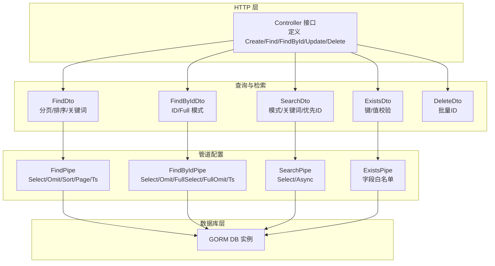
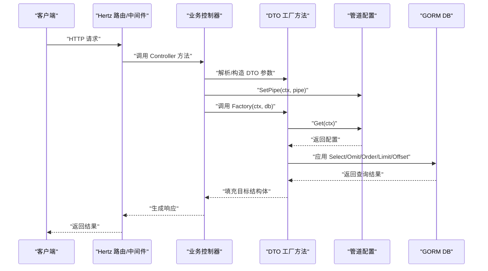
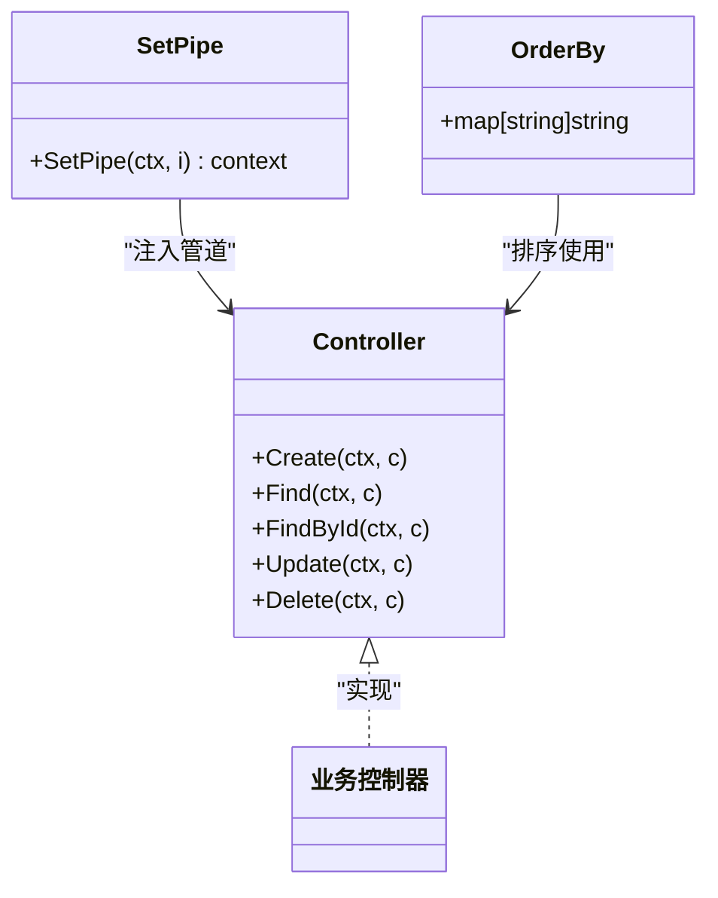
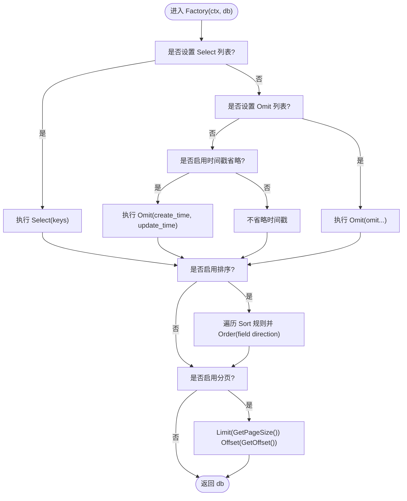
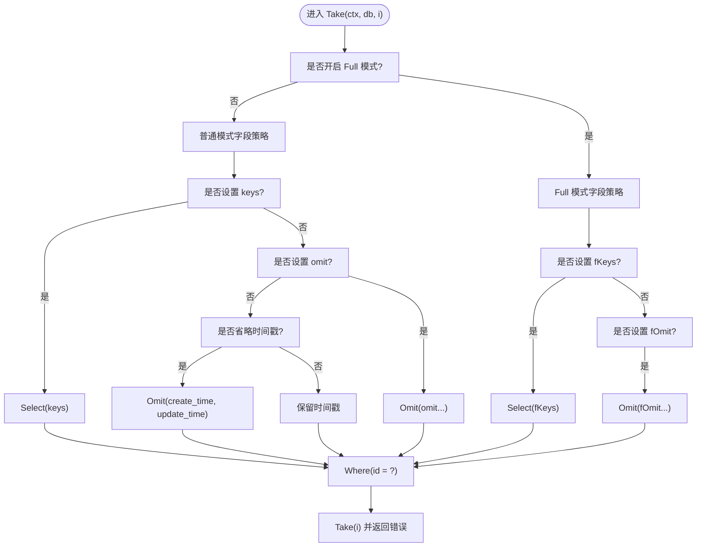
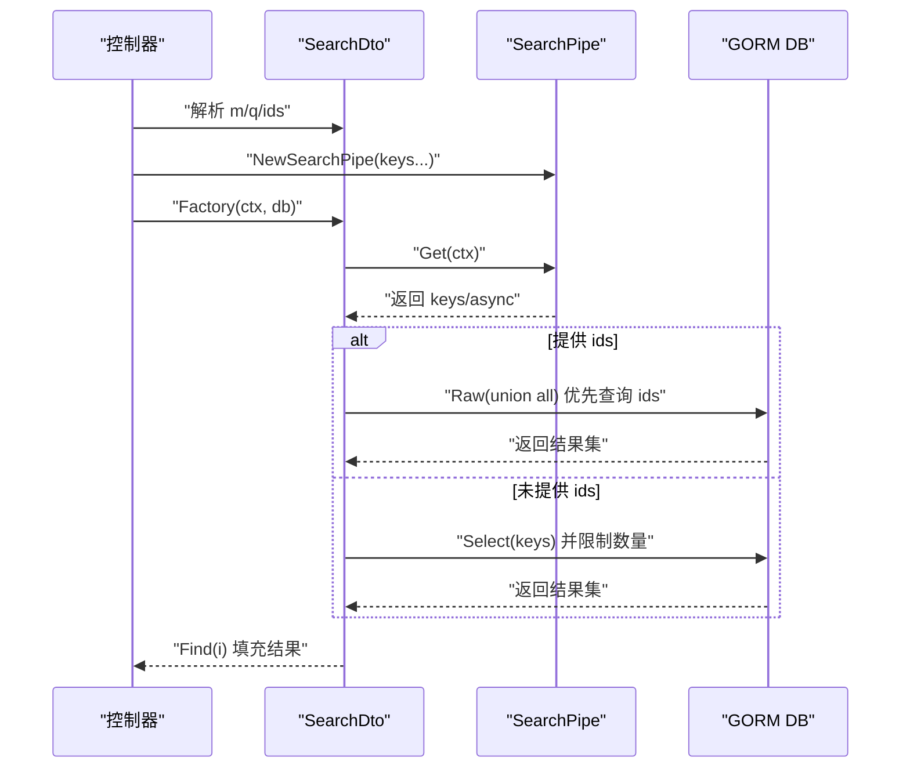
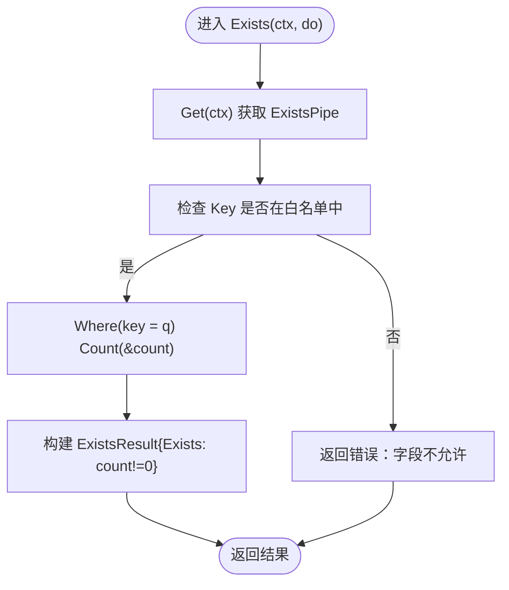
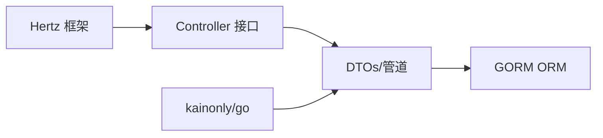

# 项目概述

<cite>
**本文引用的文件列表**
- [controller.go](file://controller.go)
- [find.go](file://find.go)
- [find_by_id.go](file://find_by_id.go)
- [search.go](file://search.go)
- [exists.go](file://exists.go)
- [delete.go](file://delete.go)
- [go.mod](file://go.mod)
</cite>

## 目录
1. [引言](#引言)
2. [项目结构](#项目结构)
3. [核心组件](#核心组件)
4. [架构总览](#架构总览)
5. [详细组件分析](#详细组件分析)
6. [依赖关系分析](#依赖关系分析)
7. [性能考量](#性能考量)
8. [故障排查指南](#故障排查指南)
9. [结论](#结论)
10. [附录](#附录)

## 引言
本项目是一个基于 Hertz 框架与 GORM 的通用 CRUD 操作库，旨在通过标准化接口与可配置的“管道-过滤器”模式，快速构建一致、可维护且高性能的 RESTful API。它通过数据传输对象（DTO）与上下文中的“管道”配置，将 HTTP 层与数据库层解耦，使控制器仅关注请求处理流程，而查询行为由管道统一控制，从而降低重复代码、提升可测试性与可扩展性。

## 项目结构
项目采用按功能域划分的模块化组织方式，每个功能模块对应一组 DTO、管道配置与查询工厂方法，形成清晰的职责边界：
- 控制器接口：定义标准 CRUD 入口，供具体业务控制器实现
- 查询与检索：Find、FindById、Search、Exists 等功能模块
- 批量删除：DeleteDto
- 管道配置：各模块的 Pipe 结构体用于声明式地定制查询行为
- 上下文注入：SetPipe 将管道实例注入到请求上下文中，供各模块读取

图表来源
- [controller.go](file://controller.go#L11-L24)
- [find.go](file://find.go#L13-L23)
- [find_by_id.go](file://find_by_id.go#L9-L15)
- [search.go](file://search.go#L13-L21)
- [exists.go](file://exists.go#L12-L18)
- [delete.go](file://delete.go#L3-L7)
- [find.go](file://find.go#L61-L68)
- [find_by_id.go](file://find_by_id.go#L22-L29)
- [search.go](file://search.go#L46-L51)
- [exists.go](file://exists.go#L20-L23)

章节来源
- [controller.go](file://controller.go#L11-L24)
- [find.go](file://find.go#L13-L23)
- [find_by_id.go](file://find_by_id.go#L9-L15)
- [search.go](file://search.go#L13-L21)
- [exists.go](file://exists.go#L12-L18)
- [delete.go](file://delete.go#L3-L7)

## 核心组件
- 控制器接口：统一定义 Create/Find/FindById/Update/Delete 方法签名，便于在 Hertz 中以一致的方式绑定路由与中间件
- DTO 与管道：通过结构体字段与工厂方法，将查询参数与行为配置分离，支持链式配置与上下文传递
- 上下文注入：SetPipe 将管道实例存入 context，避免在各层之间显式传参，保持接口简洁
- 排序映射：OrderBy 将字符串方向映射为 SQL 排序关键字，统一排序语义

章节来源
- [controller.go](file://controller.go#L11-L24)
- [controller.go](file://controller.go#L26-L30)
- [controller.go](file://controller.go#L32-L37)
- [find.go](file://find.go#L13-L23)
- [find.go](file://find.go#L61-L68)
- [find_by_id.go](file://find_by_id.go#L22-L29)
- [search.go](file://search.go#L46-L51)
- [exists.go](file://exists.go#L20-L23)

## 架构总览
该库遵循“接口抽象 + 数据传输对象 + 管道-过滤器”的架构风格：
- 接口抽象：Controller 定义统一入口，屏蔽 HTTP 框架细节
- DTO 职责：封装请求参数与行为提示，如分页、排序、字段选择等
- 管道-过滤器：Pipe 对象声明式地组合查询行为（字段选择、排除、排序、分页、异步限制等），通过 Factory 应用到 GORM 链式调用
- 上下文传递：SetPipe 将 Pipe 注入 context，各模块通过 Get(ctx) 获取配置，实现无侵入扩展

图表来源
- [controller.go](file://controller.go#L26-L30)
- [find.go](file://find.go#L116-L145)
- [find_by_id.go](file://find_by_id.go#L76-L102)
- [search.go](file://search.go#L79-L102)
- [exists.go](file://exists.go#L36-L45)

## 详细组件分析

### 控制器接口与上下文管道
- 角色定位：Controller 定义标准 CRUD 入口，业务控制器只需实现这些方法即可接入 Hertz 路由
- 上下文注入：SetPipe 将任意管道实例存入 context，后续各模块通过 Get(ctx) 获取
- 排序映射：OrderBy 提供方向到 SQL 关键字的映射，保证排序规则的一致性

图表来源
- [controller.go](file://controller.go#L11-L24)
- [controller.go](file://controller.go#L26-L30)
- [controller.go](file://controller.go#L32-L37)

章节来源
- [controller.go](file://controller.go#L11-L24)
- [controller.go](file://controller.go#L26-L30)
- [controller.go](file://controller.go#L32-L37)

### 分页查询（FindDto 与 FindPipe）
- 功能要点：
  - 分页参数：页码与每页大小，支持默认值与上限
  - 关键词匹配：支持通配符包装与数字/编号识别
  - 字段选择：支持 Select 与 Omit；默认在未指定时省略时间戳字段
  - 排序：支持多字段排序，方向映射到 SQL
  - 分页：根据页码与大小计算偏移并设置 Limit
- 管道能力：SkipTs/SkipSort/SkipPage/Select/Omit 组合，灵活控制查询行为

图表来源
- [find.go](file://find.go#L116-L145)
- [find.go](file://find.go#L61-L68)
- [find.go](file://find.go#L70-L73)
- [find.go](file://find.go#L75-L83)
- [find.go](file://find.go#L85-L101)
- [find.go](file://find.go#L103-L114)
- [find.go](file://find.go#L131-L144)

章节来源
- [find.go](file://find.go#L13-L23)
- [find.go](file://find.go#L25-L36)
- [find.go](file://find.go#L38-L48)
- [find.go](file://find.go#L50-L59)
- [find.go](file://find.go#L61-L68)
- [find.go](file://find.go#L70-L73)
- [find.go](file://find.go#L75-L83)
- [find.go](file://find.go#L85-L101)
- [find.go](file://find.go#L103-L114)
- [find.go](file://find.go#L116-L145)
- [find.go](file://find.go#L147-L154)

### 单条记录查询（FindByIdDto 与 FindByIdPipe）
- 功能要点：
  - 支持普通模式与 Full 模式，分别应用不同的字段选择策略
  - 默认省略时间戳字段（可通过 SkipTs 关闭）
  - 支持 Select/Omit 与 FullSelect/FullOmit 的组合
- 查询流程：根据 Full 标志选择普通或 Full 的字段策略，最终按 ID 条件查询

图表来源
- [find_by_id.go](file://find_by_id.go#L76-L102)
- [find_by_id.go](file://find_by_id.go#L22-L29)
- [find_by_id.go](file://find_by_id.go#L31-L34)
- [find_by_id.go](file://find_by_id.go#L36-L42)
- [find_by_id.go](file://find_by_id.go#L44-L48)
- [find_by_id.go](file://find_by_id.go#L50-L61)
- [find_by_id.go](file://find_by_id.go#L63-L74)
- [find_by_id.go](file://find_by_id.go#L76-L99)

章节来源
- [find_by_id.go](file://find_by_id.go#L9-L15)
- [find_by_id.go](file://find_by_id.go#L17-L21)
- [find_by_id.go](file://find_by_id.go#L22-L29)
- [find_by_id.go](file://find_by_id.go#L31-L34)
- [find_by_id.go](file://find_by_id.go#L36-L42)
- [find_by_id.go](file://find_by_id.go#L44-L48)
- [find_by_id.go](file://find_by_id.go#L50-L61)
- [find_by_id.go](file://find_by_id.go#L63-L74)
- [find_by_id.go](file://find_by_id.go#L76-L102)

### 搜索（SearchDto 与 SearchPipe）
- 功能要点：
  - 支持模式（m）与关键词（q），以及优先 ID（ids）的排序策略
  - 默认仅选择 id 与 name 字段，并限制异步模式下的返回数量
  - 当提供 ids 时，先查询这些 ID 的结果，再与剩余结果做联合查询，确保优先展示
- 管道能力：Select(keys)/SkipAsync 控制字段与异步限制

图表来源
- [search.go](file://search.go#L13-L21)
- [search.go](file://search.go#L46-L51)
- [search.go](file://search.go#L58-L72)
- [search.go](file://search.go#L74-L77)
- [search.go](file://search.go#L79-L87)
- [search.go](file://search.go#L89-L102)
- [search.go](file://search.go#L104-L111)

章节来源
- [search.go](file://search.go#L13-L21)
- [search.go](file://search.go#L23-L45)
- [search.go](file://search.go#L46-L51)
- [search.go](file://search.go#L58-L72)
- [search.go](file://search.go#L74-L77)
- [search.go](file://search.go#L79-L87)
- [search.go](file://search.go#L89-L102)
- [search.go](file://search.go#L104-L111)

### 存在性检查（ExistsDto 与 ExistsPipe）
- 功能要点：
  - 通过白名单字段控制允许的重复检查字段，避免任意列被用于存在性判断
  - 使用 Count 统计匹配数量，返回布尔结果
- 管道能力：NewExistsPipe(keys...) 构建字段白名单

图表来源
- [exists.go](file://exists.go#L12-L18)
- [exists.go](file://exists.go#L20-L23)
- [exists.go](file://exists.go#L25-L34)
- [exists.go](file://exists.go#L36-L39)
- [exists.go](file://exists.go#L41-L45)
- [exists.go](file://exists.go#L47-L66)

章节来源
- [exists.go](file://exists.go#L12-L18)
- [exists.go](file://exists.go#L20-L23)
- [exists.go](file://exists.go#L25-L34)
- [exists.go](file://exists.go#L36-L39)
- [exists.go](file://exists.go#L41-L45)
- [exists.go](file://exists.go#L47-L66)

### 批量删除（DeleteDto）
- 功能要点：
  - 通过 JSON 数组 ids 表示待删除的资源标识集合
  - 可配合业务控制器进行权限校验与事务控制

章节来源
- [delete.go](file://delete.go#L3-L7)

## 依赖关系分析
- 外部依赖：
  - Hertz：HTTP 框架，提供 RequestContext 与路由绑定
  - GORM：ORM 框架，提供链式查询与数据库交互
  - kainonly/go：辅助工具包，提供错误封装等能力
- 内部模块耦合：
  - 控制器接口与各 DTO/管道解耦，通过 context 传递配置
  - 各模块内部通过 Get(ctx) 读取管道配置，避免跨模块参数传递
  - 管道对象仅影响查询行为，不改变控制器方法签名

图表来源
- [go.mod](file://go.mod#L5-L12)
- [controller.go](file://controller.go#L8-L9)
- [exists.go](file://exists.go#L7-L7)
- [find.go](file://find.go#L10-L10)
- [find_by_id.go](file://find_by_id.go#L6-L6)
- [search.go](file://search.go#L10-L10)

章节来源
- [go.mod](file://go.mod#L5-L12)

## 性能考量
- 分页与限制：
  - Find 默认最大页大小与偏移计算，避免一次性加载过多数据
  - Search 在异步模式下限制返回数量，减轻前端压力
- 字段选择：
  - 默认省略时间戳字段，减少网络传输与序列化开销
  - 支持 Select/Omit 精准控制字段，避免 N+1 与冗余字段
- 排序与索引：
  - 排序规则通过 OrderBy 映射，建议在数据库层面为常用排序字段建立索引
- 原生 SQL：
  - Search 在提供 ids 时使用 union all，优先返回已知 ID，需确保相关字段有索引以优化性能

[本节为通用性能建议，无需特定文件来源]

## 故障排查指南
- 字段白名单错误：
  - 现象：存在性检查返回字段不允许的错误
  - 排查：确认 ExistsPipe 白名单是否包含 Key
  - 参考路径：[exists.go](file://exists.go#L25-L34)，[exists.go](file://exists.go#L47-L66)
- 排序方向异常：
  - 现象：排序方向不符合预期
  - 排查：确认 Sort 字段格式与方向值是否符合 OrderBy 映射
  - 参考路径：[find.go](file://find.go#L131-L139)，[controller.go](file://controller.go#L32-L37)
- 分页参数越界：
  - 现象：分页大小超过上限或页码为负数
  - 排查：检查 DTO 的页大小与页码约束
  - 参考路径：[find.go](file://find.go#L16-L19)
- 搜索结果为空：
  - 现象：Search 返回空集
  - 排查：确认 keys 是否包含 id/name 或自定义字段；检查 ids 参数与数据库数据一致性
  - 参考路径：[search.go](file://search.go#L58-L72)，[search.go](file://search.go#L89-L102)

章节来源
- [exists.go](file://exists.go#L25-L34)
- [exists.go](file://exists.go#L47-L66)
- [find.go](file://find.go#L16-L19)
- [find.go](file://find.go#L131-L139)
- [controller.go](file://controller.go#L32-L37)
- [search.go](file://search.go#L58-L72)
- [search.go](file://search.go#L89-L102)

## 结论
本项目通过“接口 + DTO + 管道”的组合，将 RESTful API 的通用逻辑标准化，显著降低了重复开发成本并提升了可维护性。借助 Hertz 的轻量与 GORM 的强大，系统在保证易用性的同时具备良好的扩展性。对于初学者，建议从 Controller 接口与 Find/FindById/Search 的基本用法入手；对于高级开发者，可在现有管道基础上扩展新的 Pipe 类型与工厂方法，以满足更复杂的查询需求。

[本节为总结性内容，无需特定文件来源]

## 附录
- 技术选型权衡：
  - Hertz：轻量、高性能、生态成熟，适合高并发场景
  - GORM：链式 API、插件丰富、迁移友好，适配多种数据库
  - kainonly/go：提供基础工具与错误封装，减少样板代码
- 典型应用场景：
  - 管理后台：列表分页、关键词搜索、字段选择
  - 数据导入：存在性检查与批量删除
  - 前端联动：异步搜索与优先级排序

[本节为概念性内容，无需特定文件来源]